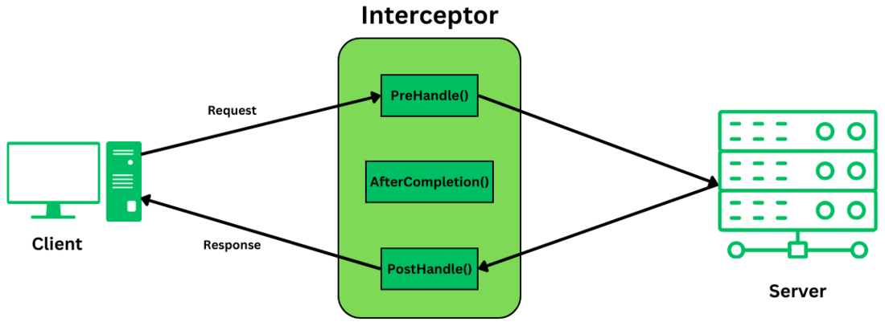

# Java, Spring Boot, JPA & Microservices Interview Questions  

## 1. Spring Boot application works internally?
Understanding how a **Spring Boot application works internally** is crucial for mastering backend development. Here's a detailed explanation of the internal workflow when a Spring Boot application starts and runs.

### 1. **Spring Boot Application Entry Point**

Every Spring Boot application starts from a class annotated with:

```java
@SpringBootApplication
public class MyApplication {
    public static void main(String[] args) {
        SpringApplication.run(MyApplication.class, args);
    }
}
```

#### `@SpringBootApplication` is a meta-annotation:
- Combines:
  - `@Configuration` – marks the class as a configuration class.
  - `@EnableAutoConfiguration` – enables Spring Boot's auto-configuration mechanism.
  - `@ComponentScan` – enables component scanning in the package and sub-packages.

### 2. **`SpringApplication.run()` Method**

This is the core of Spring Boot's startup process.

```java
SpringApplication.run(MyApplication.class, args);
```

Internally, it performs the following:

- **Creates a `SpringApplication` instance**
- **Sets up default configurations**
- **Starts logging system**
- **Loads application properties** (`application.yml` or `application.properties`)
- **Determines web application type** (Servlet, Reactive, or None)
- **Prepares the application context**

### 3. **ApplicationContext Initialization**

Spring Boot uses either:
- `AnnotationConfigServletWebServerApplicationContext` for web apps.
- `AnnotationConfigApplicationContext` for non-web apps.

It:
- Loads all `@Component`, `@Service`, `@Repository`, and `@Controller` beans.
- Applies any custom `@Configuration` classes.
- Processes `@Autowired`, `@Value`, and `@ComponentScan`.

### 4. **Auto-Configuration**

- Triggered by `@EnableAutoConfiguration`.
- Spring Boot scans `spring.factories` for `AutoConfiguration` classes.
- Based on the classpath (e.g., if `spring-boot-starter-web` is found), it automatically configures:
  - Embedded Tomcat
  - DispatcherServlet
  - Jackson for JSON, etc.

### 5. **Embedded Server Startup**

If it's a web application:
- Spring Boot starts an **embedded server** like **Tomcat**, **Jetty**, or **Undertow**.
- Registers a **DispatcherServlet** to handle all incoming HTTP requests.

### 6. **Application Ready**

Once the ApplicationContext is fully initialized and all beans are ready:
- `CommandLineRunner` and `ApplicationRunner` beans are executed.
- Logs: `"Started MyApplication in X seconds"`

#### Summary

Here's the high-level sequence:

1. Run `main()` → `SpringApplication.run()`
2. Bootstraps Spring context
3. Loads auto-configurations and beans
4. Starts embedded web server
5. Application is ready to serve requests

#### Example

If you have this controller:

```java
@RestController
public class HelloController {
    @GetMapping("/hello")
    public String hello() {
        return "Hello, Spring Boot!";
    }
}
```

Spring Boot auto-configures everything:
- Starts Tomcat
- Registers this controller as a bean
- Maps `/hello` endpoint

You just run the app and hit `http://localhost:8080/hello`.

## 1.1 Spring Boot Application Workflow

Here's a step-by-step breakdown of how a Spring Boot application initializes and processes requests:

1. **Application Entry Point**:
   - The application starts with the `main` method in a class annotated with `@SpringBootApplication`.
   - This annotation combines `@Configuration`, `@EnableAutoConfiguration`, and `@ComponentScan`.

2. **SpringApplication.run()**:
   - Invoking `SpringApplication.run()` bootstraps the application.
   - It sets up the default configuration, starts the Spring application context, and performs class path scans. 

3. **ApplicationContext Initialization**:
   - Spring Boot determines the type of `ApplicationContext` to create based on the application type (web, reactive, etc.).
   - It initializes the context, loading all beans and configurations. 

4. **Auto-Configuration**:
   - Based on the dependencies present, Spring Boot auto-configures beans and settings.
   - For instance, if `spring-boot-starter-web` is present, it sets up an embedded web server.

5. **Embedded Server Startup**:
   - If it's a web application, an embedded server like Tomcat is started.
   - The `DispatcherServlet` is registered to handle incoming HTTP requests.

6. **Request Handling**:
   - Incoming requests are routed through the `DispatcherServlet`.
   - They are then dispatched to appropriate controllers, services, and repositories.

7. **Response Generation**:
   - Controllers process the requests and return responses, which are sent back to the client.

### Diagram: Spring Boot Application Architecture


### Layered Architecture Breakdown

Spring Boot applications typically follow a layered architecture: 

1. **Presentation Layer**:
   - Handles HTTP requests and responses.
   - Contains controllers annotated with `@RestController` or `@Controller`.

2. **Business Layer**:
   - Contains business logic.
   - Services are annotated with `@Service`.

3. **Persistence Layer**:
   - Handles data access.
   - Repositories are annotated with `@Repository` and often extend Spring Data JPA interfaces. 

4. **Database Layer**:
   - The actual database where data is stored.
   - Can be relational (e.g., MySQL, PostgreSQL) or NoSQL (e.g., MongoDB). 

This structured approach ensures a clear separation of concerns, making the application more maintainable and scalable.

## 1.2 `@SpringBootApplication` Annotation in Spring Boot

The `@SpringBootApplication` annotation is a **composite annotation** in Spring Boot that combines three other annotations:  

1. **`@Configuration`**  
   - Marks the class as a configuration class.  
   - Allows defining beans using `@Bean` annotated methods.  

2. **`@EnableAutoConfiguration`**  
   - Enables **Spring Boot’s auto-configuration mechanism**.  
   - Automatically configures beans based on the classpath dependencies.  

3. **`@ComponentScan`**  
   - Enables **component scanning**.  
   - Automatically discovers and registers Spring beans within the package and its sub-packages.  

#### **Purpose of `@SpringBootApplication`**  
- Marks the **main class** of a Spring Boot application.  
- Simplifies the setup by reducing the need for manual configuration.  
- Provides a **concise way** to bootstrap a Spring Boot application.  

## 1.3 Class level annotation in spring boot
In Spring Boot, class-level annotations are used to define configurations, components, and behaviors at the class level. Here are some commonly used class-level annotations:
### 1. `@RestController`
   - Used in Spring MVC to define a RESTful controller.
   ```java
   @RestController
   public class MyController {
       @GetMapping("/hello")
       public String hello() {
           return "Hello, World!";
       }
   }
   ```
### 2. `@Controller`
   - Marks a class as a Spring MVC controller (typically used with views like Thymeleaf).
   ```java
   @Controller
   public class MyController {
       @GetMapping("/home")
       public String home() {
           return "home";
       }
   }
   ```
### 3. `@Service`
   - Marks a class as a service component in the business layer.
   ```java
   @Service
   public class MyService {
       public String process() {
           return "Processing data";
       }
   }
   ```
### 4. `@Repository`
   - Indicates a DAO (Data Access Object) and enables exception translation.
   ```java
   @Repository
   public class MyRepository {
       // Data access logic
   }
   ```

### 5. `@Component`
   - Generic stereotype for any Spring-managed component.
   ```java
   @Component
   public class MyComponent {
       public void execute() {
           System.out.println("Executing component logic");
       }
   }
   ```
### 6. `@Configuration`
   - Marks a class as a source of Spring bean definitions.
   ```java
   @Configuration
   public class AppConfig {
       @Bean
       public MyService myService() {
           return new MyService();
       }
   }
   ```

### 7. `@SpringBootApplication`
   - Combination of `@Configuration`, `@EnableAutoConfiguration`, and `@ComponentScan`.
   ```java
   @SpringBootApplication
   public class MyApplication {
       public static void main(String[] args) {
           SpringApplication.run(MyApplication.class, args);
       }
   }
   ```

### 8. `@EnableScheduling`
   - Enables scheduling for running scheduled tasks.
   ```java
   @Configuration
   @EnableScheduling
   public class SchedulerConfig {
   }
   ```
These annotations help configure and organize a Spring Boot application efficiently.


### Refs:
1. [Understanding the internal processes when a Spring Boot ... - Medium](https://medium.com/%40tuananhbk1996/understanding-the-internal-processes-when-a-spring-boot-application-begins-d906a8f71ce2?utm_source=chatgpt.com)

2. ([Spring Boot Startup Process - Dev Skill Builder](https://www.devskillbuilder.com/spring-boot-startup-process-dc851f670c42?utm_source=chatgpt.com))

3. ([The startup process of the Spring Boot application. - ResearchGate](https://www.researchgate.net/figure/The-startup-process-of-the-Spring-Boot-application_fig4_355936643?utm_source=chatgpt.com))

4. ([Spring Boot – Architecture | GeeksforGeeks](https://www.geeksforgeeks.org/spring-boot-architecture/?utm_source=chatgpt.com))

5. ([How Spring Boot Application Works Internally? | GeeksforGeeks](https://www.geeksforgeeks.org/how-spring-boot-application-works-internally/?utm_source=chatgpt.com))

---
## 2. How to disable auto-configuration in Spring Boot?
### Understanding Auto-Configuration
Spring Boot's auto-configuration automatically configures your application based on the dependencies it finds on the classpath. This significantly reduces the amount of manual configuration you need to write. However, in some cases, you might want to disable auto-configuration and take full control of your application's configuration.

### Methods to Disable Auto-Configuration
There are several ways to disable auto-configuration. Here are the most common and recommended methods:

#### 1. Using `@SpringBootApplication` Exclusion
- The `@SpringBootApplication` annotation is a convenience annotation that combines @Configuration, `@EnableAutoConfiguration`, and `@ComponentScan`.
- You can exclude specific auto-configuration classes using the `exclude` or `excludeName` attributes of `@SpringBootApplication`.
- This is the most common and recommended way to disable specific auto-configurations.

#### Example:
```java
import org.springframework.boot.autoconfigure.SpringBootApplication;
import org.springframework.boot.autoconfigure.jdbc.DataSourceAutoConfiguration;
import org.springframework.boot.autoconfigure.orm.jpa.HibernateJpaAutoConfiguration;

@SpringBootApplication(exclude = {DataSourceAutoConfiguration.class, HibernateJpaAutoConfiguration.class})
public class MyApplication {
    public static void main(String[] args) {
        SpringApplication.run(MyApplication.class, args);
    }
}
```

- #### Explanation:
  - `DataSourceAutoConfiguration.class`: Excludes the auto-configuration for `DataSource`, preventing Spring Boot from automatically configuring a database connection.
  - `HibernateJpaAutoConfiguration.class`: Excludes the auto-configuration for Spring Data JPA (Hibernate), preventing Spring Boot from setting up JPA.
  - Add any other auto-configuration classes you want to exclude to the exclude array.
  
#### 2.  Using `@EnableAutoConfiguration` Exclusion
- If you're not using `@SpringBootApplication`, you might be using `@EnableAutoConfiguration` directly. You can use the same `exclude` or `excludeName` attributes with `@EnableAutoConfiguration` as well.

#### Example:
```java
import org.springframework.boot.autoconfigure.EnableAutoConfiguration;
import org.springframework.context.annotation.Configuration;
import org.springframework.context.annotation.ComponentScan;
import org.springframework.boot.autoconfigure.jdbc.DataSourceAutoConfiguration;
import org.springframework.boot.autoconfigure.orm.jpa.HibernateJpaAutoConfiguration;
import org.springframework.boot.SpringApplication;

@Configuration
@ComponentScan
@EnableAutoConfiguration(exclude = {DataSourceAutoConfiguration.class, HibernateJpaAutoConfiguration.class})
public class MyApplication {
    public static void main(String[] args) {
        SpringApplication.run(MyApplication.class, args);
    }
}
```
- #### Explanation: 
  - This example is very similar to the first one, but it uses `@EnableAutoConfiguration` directly.  The exclude attribute works the same way.
  
#### 3.  Disabling All Auto-Configuration
- You can disable all auto-configuration by setting `spring.autoconfigure.exclude` property.
- This is generally not recommended because it requires you to configure everything manually, which defeats the purpose of Spring Boot. It's usually better to exclude only the auto-configurations you don't want.

#### application.properties (or application.yml):
```
spring.autoconfigure.exclude=*
```
#### Explanation:
- `spring.autoconfigure.exclude=*`: The asterisk "*" excludes all auto-configuration classes.

#### Gradle Configuration (build.gradle)
- The Gradle configuration is primarily about managing your dependencies.  You don't typically configure auto-configuration exclusions directly in `build.gradle`. The exclusions are done in your Java code using the `@SpringBootApplication` or `@EnableAutoConfiguration` annotations, as shown in the examples above.
- Your `build.gradle` file will include the necessary Spring Boot dependencies:
```gradle.properties
plugins {
    id 'org.springframework.boot' version '3.2.3' // Use the latest version
    id 'io.spring.dependency-management' version '1.1.4'
    id 'java'
}

group = 'com.example'
version = '0.0.1-SNAPSHOT'
sourceCompatibility = '17'  // Or 11, 21, etc.

repositories {
    mavenCentral()
}

dependencies {
    implementation 'org.springframework.boot:spring-boot-starter-web'
    // Add other dependencies as needed (e.g., for data, security, etc.)
    testImplementation 'org.springframework.boot:spring-boot-starter-test'
}

test {
    useJUnitPlatform()
}
```

#### Explanation:
- `plugins`: Configures the Spring Boot and dependency management plugins.
- `dependencies`: Declares the dependencies your project needs.  
- `spring-boot-starter-web` is a common starter for web applications. You'll add other starters or dependencies as needed (e.g., for Spring Data JPA if you're working with a database, but remember to exclude `DataSourceAutoConfiguration` and `HibernateJpaAutoConfiguration` if you want to configure it yourself).
- `useJUnitPlatform()`: Configures the testing framework.

#### Important Considerations
- **Identify the Correct Auto-Configuration Class**: To exclude a specific auto-configuration, you need to know its fully qualified class name.  You can usually find this in the Spring Boot documentation or by examining the stack trace when auto-configuration fails.
- **Minimum Exclusion Principle**: Exclude only the auto-configurations you _really_ don't need. Let Spring Boot handle the rest. This makes your application configuration simpler and more maintainable.
- **Order of Operations**: Spring Boot processes exclusions defined in `@SpringBootApplication` or `@EnableAutoConfiguration` before those defined in `spring.autoconfigure.exclude`.
- **Spring Boot Starters**: Be mindful of Spring Boot Starters. Starters are convenient dependency bundles, but they bring in auto-configurations. If you exclude an auto-configuration, ensure you're providing the necessary configuration yourself.  For example, if you exclude `DataSourceAutoConfiguration`, you'll need to create your own `DataSource` bean.
- **Documentation**: Document clearly which auto-configurations you've excluded and why.  This will help other developers (and yur future self) understand the application's configuration.

---
## 3. Creating an Immutable Class in Java  
An **immutable class** in Java is a class whose instances cannot be modified once they are created. This means that the state of an immutable object remains constant throughout its lifetime. Immutable classes are beneficial for various reasons, including thread-safety, simplicity, and predictability.

### Key Principles of Immutability

To create an immutable class in Java, follow these principles:
1. **Declare the class as final**: This prevents other classes from extending it.
2. **Make all fields private and final**: This ensures that the fields cannot be modified after the object is created.
3. **Provide a parameterized constructor**: Initialize all fields through the constructor.
4. **Do not provide setter methods**: This prevents modification of the fields.
5. **Perform deep copies for mutable fields**: Ensure that mutable fields are not exposed directly. If the class contains references to mutable objects, create and return a copy in getter methods to **prevent external modification** of the internal state

### Example of an Immutable Class
Here is an example of an immutable class in Java:
```java
import java.util.HashMap;
import java.util.Map;

public final class Student {
    private final String name;
    private final int regNo;
    private final Map<String, String> metadata;
    private final String[] hobbies; // Example of a mutable object

    public Student(String name, int regNo, Map<String, String> metadata) {
        this.name = name;
        this.regNo = regNo;
        // Perform a deep copy of the metadata map
        Map<String, String> tempMap = new HashMap<>();
        for (Map.Entry<String, String> entry : metadata.entrySet()) {
            tempMap.put(entry.getKey(), entry.getValue());
        }
        this.metadata = tempMap;
        // Defensive copy for mutable object
        this.hobbies = hobbies.clone();
    }

    public String getName() {
        return name;
    }

    public int getRegNo() {
        return regNo;
    }

    public Map<String, String> getMetadata() {
        // Return a deep copy of the metadata map
        Map<String, String> tempMap = new HashMap<>();
        for (Map.Entry<String, String> entry : this.metadata.entrySet()) {
        tempMap.put(entry.getKey(), entry.getValue());
        }
        return tempMap;
    }

    // Defensive copy for mutable object in getter method
    public String[] getHobbies() {
        return hobbies.clone();
    }
}
```
In this example, the `Student` class is immutable because:
- The class is declared as `final`.
- All fields are `private` and `final`.
- There are no setter methods.
- The `constructor` performs a deep copy of the `metadata` map.
- The `getMetadata` method returns a deep copy of the `metadata` map.

### Benefits of Immutable Classes
- Immutable classes offer several advantages:
  - **Thread-safety**: Immutable objects are inherently thread-safe since their state cannot be changed after creation.
  - **Simplicity**: Immutable objects are easier to construct, test, and use.
  - **Predictability**: Immutable objects guarantee that their state will not change, making them more predictable.
  - **Cacheability**: Immutable objects can be safely cached without worrying about state changes.
  - **Security:** Prevents accidental or malicious modification of sensitive data.  
  - **Functional Programming:** Immutability is a core principle of functional programming, making code easier to understand and debug.
  - **Example** – `String` Class

---
## 3.1 `String` Class:  
   - The `String` class in Java is immutable. Once a `String` object is created, its value cannot be changed.
In Java, the term "immutable" means that once a String object is created, its content cannot be changed. This implies that any operation that appears to modify a String actually creates a new String object with the modified content, leaving the original String unchanged.

### Elaboration:
- **_No In-Place Modification_**: Unlike mutable objects (like StringBuffer or StringBuilder), you cannot directly alter the internal character array of a String object once it's been initialized.
- **_New Object Creation_**: When you try to modify a String (e.g., by concatenating or using methods like substring), the Java runtime creates a new String object containing the desired changes. The original String object remains unchanged.  
- **_Memory Efficiency and Thread Safety_**: Immutability is crucial for memory management and thread safety. Because String objects are immutable, they can be shared across threads without synchronization concerns, as their value will never change unexpectedly.  
- **_String Pool_**: Immutability also allows for the implementation of the String pool, where the JVM caches String objects with the same content. This can save memory by reusing the same object when multiple String variables refer to the same value.

### Example:
```java
String str1 = "Hello";
String str2 = str1 + " World";
System.out.println(str1); // Output: Hello (str1 remains unchanged)
System.out.println(str2); // Output: Hello World (str2 is a new string)
```

## 3.2 String Immutability in Java Explained
Here's an explanation of String immutability in Java, using your example:
```java
String s = "A";
s = "B";
System.out.println(s);
```
**Understanding the Code**
### 1. `String s = "A";`
- This line creates a String object in memory containing the character "A".
- The variable s is a reference that stores the memory address of this String object.

### 2. `s = "B";`
- This line does not change the existing String object that contains "A".
- Instead, it creates a new String object in memory containing the character "B".
- The reference s is then updated to store the memory address of this new String object.
- The original String object ("A") still exists in memory, but there are no more references pointing to it.  It will eventually be garbage collected by the JVM.

### 3. `System.out.println(s)`;
- This line prints the value of s, which is now the memory address of the String object containing "B".  So, the output is "B".

---
## 3.3 How String Immutability Works
- **_Strings are Objects:_** In Java, String is a class, and string literals (like "A" and "B") are instances of that class (String objects).
- **_Memory Allocation:_** When you create a string, the JVM allocates a block of memory to store the sequence of characters.Immutable Nature: The key point is that once a String object is created, its internal state (the character sequence) cannot be changed.  Any operation that appears to modify a string (e.g., concatenation, substring) actually creates a new String object with the modified content. The original String object remains unchanged.
- **_No Setter Methods:_** The String class doesn't provide any methods to directly change the characters within an existing String object. You can't do something like `s.changeCharacter(0, 'C')`.

**Visual Representation**
Here's a simplified visual representation of what happens in memory:

_Initial State_:
```java
Memory:
[ "A" ]  <-- String object 1
   ^
   |
s:  -------
```
After `s = "B";`
```java
Memory:
[ "A" ]  <-- String object 1 (no longer referenced)
[ "B" ]  <-- String object 2
   ^
   |
s:  -------
``` 

By following these principles and practices, you can create robust and reliable immutable classes in Java. This approach helps in writing cleaner, safer, and more maintainable code.

---
## 4. Validation in Spring Boot  
Spring Boot provides robust support for validating data, especially in the context of handling web requests and ensuring data integrity.  The primary mechanism for validation in Spring Boot is through the use of the Bean Validation API (JSR-380), with Hibernate Validator being the most commonly used implementation.

### Key Concepts and Components

**1. Bean Validation API (JSR-380)**:A specification that defines a set of annotations for expressing constraints on Java objects.These annotations specify rules for validating the data within the fields of a class.

**2. Hibernate Validator:** The reference implementation of the Bean Validation API.Provides a concrete implementation of the validation annotations and the validation engine.Spring Boot automatically integrates with Hibernate Validator when it's included in your project.

**3. Validation Annotations:** Annotations used to specify validation constraints on fields.
- Some common annotations include:
  - `@NotNull`:  The field cannot be null.
  - `@NotEmpty`:  The field cannot be null or empty (for strings, collections, maps).
  - `@NotBlank`: The field cannot be null or blank (for strings).
  - `@Size`: The field size (for strings, collections, maps) must be within the specified range.
  - `@Min`, `@Max`: The field value must be within the specified range (for numbers).
  - `@Email`: The field must be a valid email address.
  - `@Pattern`: The field must match the specified regular expression.
  - `@Valid`: Used to trigger validation on a nested object.

**4. `@Valid` Annotation:** This annotation is crucial for triggering the validation process.When applied to a method parameter (e.g., in a controller), it tells Spring Boot to validate the object against the constraints defined by the validation annotations.

**5. BindingResult:** An interface that holds the result of a validation.In a Spring MVC controller, a `BindingResult` parameter can be included next to the `@Valid` parameter to access any validation errors.

**6. `@Validated` Annotation:** A class-level annotation that tells Spring to enable validation of @Constraint annotations defined on method parameters.

## 4.1 How Validation Works in Spring Boot
* **_Define Constraints:_** 
Add validation annotations to the fields of the class you want to validate (e.g., a data transfer object (DTO) or an entity).
* **_Trigger Validation:_**
In your controller or service layer, annotate the parameter you want to validate with the `@Valid` annotation.
* **_Handle Validation Results:_**
  * If validation succeeds, the program proceeds normally. 
  * If validation fails, Spring Boot throws a `MethodArgumentNotValidException` (for request body validation in controllers) or a `ConstraintViolationException` (for method parameter validation with `@Validated`).
* **_Error Handling:_**
You can handle these exceptions to customize the response sent to the client (e.g., return a JSON object with error messages).  Spring provides mechanisms like `@ExceptionHandler` and `@RestControllerAdvice` for this.

**Example**
```java
import jakarta.validation.constraints.Email;
import jakarta.validation.constraints.NotBlank;
import jakarta.validation.constraints.Size;
import lombok.Data;

@Data
public class UserRequest {
    @NotBlank(message = "Name is required")
    @Size(min = 2, max = 50, message = "Name must be between 2 and 50 characters")
    private String name;

    @NotBlank(message = "Email is required")
    @Email(message = "Invalid email format")
    private String email;

    @NotBlank(message = "Password is required")
    @Size(min = 8, message = "Password must be at least 8 characters")
    private String password;
}

import org.springframework.http.HttpStatus;
import org.springframework.http.ResponseEntity;
import org.springframework.validation.annotation.Validated;
import org.springframework.validation.BindingResult;
import org.springframework.web.bind.MethodArgumentNotValidException;
import org.springframework.web.bind.annotation.*;
import org.springframework.web.bind.annotation.RestController;
import java.util.HashMap;
import java.util.Map;

@RestController
@Validated
public class UserController {

    @PostMapping("/users")
    public ResponseEntity<?> createUser(@Valid @RequestBody UserRequest userRequest, BindingResult result) {
        if (result.hasErrors()) {
            // Manual error handling (not recommended for typical cases)
            Map<String, String> errors = new HashMap<>();
            result.getFieldErrors().forEach(error ->
                    errors.put(error.getField(), error.getDefaultMessage())
            );
            return ResponseEntity.badRequest().body(errors);
        }
        // Process the valid user data
        return ResponseEntity.status(HttpStatus.CREATED).body("User created successfully");
    }

    // Global exception handler for MethodArgumentNotValidException
    @ExceptionHandler(MethodArgumentNotValidException.class)
    @ResponseStatus(HttpStatus.BAD_REQUEST)
    public Map<String, String> handleValidationExceptions(MethodArgumentNotValidException ex) {
        Map<String, String> errors = new HashMap<>();
        ex.getBindingResult().getFieldErrors().forEach(error ->
                errors.put(error.getField(), error.getDefaultMessage())
        );
        return errors;
    }
}
```

### In this example:
- The `UserRequest` class defines the structure of the expected request body and includes validation annotations.
- The `createUser` method in the `UserController` is annotated with `@PostMapping` to handle `POST` requests to `/users`.  The `@Valid` annotation ensures that the `userRequest` object is validated before the method logic is executed.
- The `@ExceptionHandler` method `handleValidationExceptions` is defined within the controller to handle `MethodArgumentNotValidException`.  When validation fails, this method is invoked, and it formats the error messages into a user-friendly JSON response. The `@ResponseStatus` annotation ensures that a `400 Bad Request` status is returned.

---
## 5. Spring – Dependency Injection with Factory Method
Spring framework provides Dependency Injection to remove the conventional dependency relationship between objects. To inject dependencies using the factory method, we will use two attributes factory-method and factory-bean of bean elements.

#### Note: 
Factory methods are those methods that return the instance of the class.

- #### Factory Method: 
These are those types of methods that are invoked to inject the beans.
- #### Factory Bean: 
These are the references of the beans by which factory methods are invoked.

### Types of Factory Method
There are three types of factory methods:

1. **Static Factory Method for Singleton Design Pattern** – It is used to return the instance of its own class. Static factory methods are commonly used for Singleton Design Pattern.
2. **Static Factory Method for Creating Instances of Another Class** – It is used to return the runtime instance of another class.
3. **Non-Static Factory Method** – It is used to return the runtime instance of another class through an instance method, allowing for more flexible and customizable instantiation processes. 

### Ref: 
[Factory Method](https://www.geeksforgeeks.org/spring-dependency-injection-with-factory-method/)

---
## 6. What are functional interfaces, and how are they used? 
A **functional interface** in Java is an interface that contains exactly one abstract method. These interfaces can have multiple default or static methods, but they must have only one abstract method. Functional interfaces are a key concept in Java's support for functional programming, introduced in Java 8.

Functional interfaces can be used as the assignment target for a lambda expression or method reference. They provide a way to represent a single behavior or action, making it easier to pass around functionality as parameters.

### Key Characteristics of Functional Interfaces:
1. **Single Abstract Method**: A functional interface must have exactly one abstract method. This is the method that will be implemented by a lambda expression or method reference.
2. **`@FunctionalInterface` Annotation**: While not mandatory, it is a good practice to annotate a functional interface with `@FunctionalInterface`. This annotation helps to enforce the rule of having only one abstract method and provides compile-time checking.
3. **Default and Static Methods**: Functional interfaces can have multiple default and static methods. These methods can provide additional functionality without affecting the functional nature of the interface.

### Common Examples of Functional Interfaces:
Java provides several built-in functional interfaces in the `java.util.function` package, including:
1. **Predicate<T>**: Represents a boolean-valued function of one argument. It has a method `test(T t)`.
   ```java
   Predicate<String> isNotEmpty = str -> !str.isEmpty();
   ```
2. **Function<T, R>**: Represents a function that takes one argument and produces a result. It has a method `apply(T t)`.
   ```java
   Function<String, Integer> stringLength = str -> str.length();
   ```
3. **Consumer<T>**: Represents an operation that accepts a single input argument and returns no result. It has a method `accept(T t)`.
   ```java
   Consumer<String> print = str -> System.out.println(str);
   ```
4. **Supplier<T>**: Represents a supplier of results. It has a method `get()` that returns a value.
   ```java
   Supplier<Double> randomValue = () -> Math.random();
   ```
5. **BinaryOperator<T>**: Represents an operation on two operands of the same type, producing a result of the same type. It has a method `apply(T t1, T t2)`.
   ```java
   BinaryOperator<Integer> add = (a, b) -> a + b;
   ```
---
## Q6.1 **How are Functional Interfaces Used?**
Functional interfaces are primarily used in the context of lambda expressions and method references. Here are some common use cases:
1. **Lambda Expressions**: You can use a lambda expression to provide the implementation of a functional interface.
   ```java
   // Using a functional interface with a lambda expression
   Runnable runnable = () -> System.out.println("Running in a thread");
   new Thread(runnable).start();
   ```
2. **Method References**: You can use method references to refer to methods by their names, which can be used as implementations of functional interfaces.
   ```java
   // Using a method reference
   List<String> names = Arrays.asList("Alice", "Bob", "Charlie");
   names.forEach(System.out::println); // Method reference to println
   ```
3. **Stream API**: Functional interfaces are heavily used in the Stream API for operations like filtering, mapping, and reducing.
   ```java
   List<String> names = Arrays.asList("Alice", "Bob", "Charlie");
   List<String> filteredNames = names.stream()
                                      .filter(name -> name.startsWith("A"))
                                      .collect(Collectors.toList());
   ```
4. **Event Handling**: Functional interfaces can be used in event handling scenarios, such as in GUI applications, where you can define actions for button clicks or other events.

### Conclusion
Functional interfaces are a powerful feature in Java that enable functional programming paradigms. They allow for cleaner, more concise code by enabling the use of lambda expressions and method references, making it easier to pass behavior as parameters and work with collections and streams.

#### Refs:
1. [BiFunction](https://www.geeksforgeeks.org/java-bifunction-interface-methods-apply-and-andthen/)

---
## Q6.2 Built-in functional interfaces in Java
Built-in functional interfaces in Java's `java.util.function` package generally have a return type based on their purpose. Some interfaces, like `Predicate`, `BiPredicate`, and `Supplier`, have distinct return types, while others, like `Consumer`, `BiConsumer`, and `Runnable`, return `void`.

Here's a breakdown of common functional interfaces and their return types: 

#### - Predicate<T>: 
Takes an input of type `T` and returns a `boolean` value, representing a boolean-valued function of one argument.  
#### Function<T, R>: 
Takes an input of type `T` and returns a result of type `R`, representing a function that produces a result.
#### Consumer<T>: 
Takes an input of type `T` and returns `void`, representing an operation that accepts a single input argument.
#### Supplier<T>: 
Takes no input and returns a result of type `T`, representing a supplier of results.
#### BiPredicate<T, U>: 
Takes two inputs of type `T` and `U` and returns a `boolean` value.
#### BiFunction<T, U, R>: 
Takes two inputs of type `T` and `U` and returns a result of type `R`.
#### BiConsumer<T, U>: 
Takes two inputs of type `T` and `U` and returns `void`.
#### UnaryOperator<T>: 
Takes an input of type `T` and returns a result of the same type as the input, `T`.   
#### BinaryOperator<T>: 
Takes two inputs of type `T` and returns a result of the same type as the inputs, `T`.
#### Runnable: 
Takes no input and returns `void`, representing an operation that can be executed. 

---
## 7. SOLID Principles  
The SOLID principles are a set of design principles in object-oriented programming that make the software design more understandable, flexible, and maintainable. They were introduced by **Robert C. Martin (Uncle Bob)**.

### S- Single Responsibility Principle (SRP)
**Definition**: A class should have only one reason to change, meaning it should have only one job or responsibility.

**Why it matters:**
- Improves cohesion
- Easier to test, maintain, and refactor

**Example:**

```java
//  Violates SRP: Class doing too many things
public class Invoice {
    public void calculateTotal() { /* logic */ }
    public void printInvoice() { /* logic */ }
    public void saveToDatabase() { /* logic */ }
}

// Following SRP: Each class has a single responsibility
public class Invoice {
    public void calculateTotal() { /* logic */ }
}

public class InvoicePrinter {
    public void print(Invoice invoice) { /* logic */ }
}

public class InvoiceRepository {
    public void save(Invoice invoice) { /* logic */ }
}
```

### O- Open/Closed Principle (OCP)
**Definition**: A class should be open for extension but closed for modification.

**Why it matters:**
- Encourages reuse
- Reduces risk of bugs when changing code

**Example:**

```java
//  Violates OCP: Adding new shape breaks existing class
public class AreaCalculator {
    public double calculate(Object shape) {
        if (shape instanceof Circle) {
            return Math.PI * ((Circle) shape).radius * ((Circle) shape).radius;
        } else if (shape instanceof Rectangle) {
            return ((Rectangle) shape).length * ((Rectangle) shape).width;
        }
        return 0;
    }
}

// Following OCP using Polymorphism
interface Shape {
    double area();
}

class Circle implements Shape {
    double radius;
    public Circle(double r) { this.radius = r; }
    public double area() {
        return Math.PI * radius * radius;
    }
}

class Rectangle implements Shape {
    double length, width;
    public Rectangle(double l, double w) {
        this.length = l;
        this.width = w;
    }
    public double area() {
        return length * width;
    }
}

class AreaCalculator {
    public double calculate(Shape shape) {
        return shape.area();
    }
}
```

### L- Liskov Substitution Principle (LSP)
**Definition**: Subtypes must be substitutable for their base types without altering the correctness of the program.

**Why it matters:**
- Ensures inheritance works as expected
- Prevents runtime surprises

**Example:**

```java
// Good Example
class Bird {
    public void fly() {
        System.out.println("Bird is flying");
    }
}

class Sparrow extends Bird {
    public void fly() {
        System.out.println("Sparrow is flying");
    }
}

//  Bad Example: Violates LSP
class Ostrich extends Bird {
    public void fly() {
        throw new UnsupportedOperationException("Ostrich can't fly");
    }
}
```

**Solution**: Refactor the hierarchy.

```java
interface Flyable {
    void fly();
}

class Sparrow implements Flyable {
    public void fly() {
        System.out.println("Sparrow flying");
    }
}

class Ostrich {
    public void walk() {
        System.out.println("Ostrich walking");
    }
}
```

### I- Interface Segregation Principle (ISP)
**Definition**: Clients should not be forced to implement interfaces they do not use.

**Why it matters:**
- Prevents bloated interfaces
- Increases flexibility

**Example:**
```java
//  Violates ISP
interface Worker {
    void work();
    void eat();
}

class Robot implements Worker {
    public void work() { System.out.println("Robot working"); }
    public void eat() { /* Not applicable */ } // Bad design
}

// Follows ISP
interface Workable {
    void work();
}

interface Eatable {
    void eat();
}

class Human implements Workable, Eatable {
    public void work() { System.out.println("Human working"); }
    public void eat() { System.out.println("Human eating"); }
}

class Robot implements Workable {
    public void work() { System.out.println("Robot working"); }
}
```

### D- Dependency Inversion Principle (DIP)

**Definition**: High-level modules should not depend on low-level modules. Both should depend on abstractions.

**Why it matters:**
- Promotes decoupling
- Improves testability

**Example:**
```java
//  Violates DIP
class LightBulb {
    public void turnOn() { System.out.println("LightBulb ON"); }
}

class Switch {
    private LightBulb bulb;

    public Switch(LightBulb bulb) {
        this.bulb = bulb;
    }

    public void operate() {
        bulb.turnOn();
    }
}

// Follows DIP
interface Switchable {
    void turnOn();
}

class LightBulb implements Switchable {
    public void turnOn() { System.out.println("LightBulb ON"); }
}

class Fan implements Switchable {
    public void turnOn() { System.out.println("Fan ON"); }
}

class Switch {
    private Switchable device;

    public Switch(Switchable device) {
        this.device = device;
    }

    public void operate() {
        device.turnOn();
    }
}
```

### Summary

| Principle | Meaning | Benefit |
|----------|---------|---------|
| SRP | One responsibility per class | Easier to maintain and test |
| OCP | Extend without modifying | Future-proof code |
| LSP | Subtypes replace base types | Reliable polymorphism |
| ISP | Focused interfaces | Cleaner contracts |
| DIP | Depend on abstractions | Looser coupling |

---
## 8. Facade And Proxy Design pattern (Structural Patterns)
### Facade: 
  - Provides a simplified interface to a complex subsystem, hiding its details.
  - Facade defines a high-level interface that makes the subsystem easier to use. 


#### Advantages of Facade Method Design Pattern
- Simplified Interface:
  - Simplifies the use and understanding of a complex system by offering a clear and concise interface.
  - Hides the internal details of the system, reducing cognitive load for clients.
- Reduced Coupling:
  - Clients become less reliant on the internal workings of the underlying system when they are disconnected from it.
  - Encourages the reusability and modularity of code components.
  - Allows for the independent testing and development of various system components.
- Encapsulation:
  - Encapsulates the complex interactions within a subsystem, protecting clients from changes in its implementation.
  - Allows for changes to the subsystem without affecting clients, as long as the facade interface remains stable.
- Improved Maintainability:
  - Easier to change or extend the underlying system without affecting clients, as long as the facade interface remains consistent.
  - Allows for refactoring and optimization of the subsystem without impacting client code.

#### Disadvantages of Facade Method Design Pattern
- Increased Complexity:
  - Adding the facade layer in the system increases the level of abstraction.
  - Because of this, the code may be more difficult to understand and debug
- Reduced Flexibility:
  - The facade acts as a single point of access to the underlying system.
  - This can limit the flexibility for clients who need to bypass the facade or access specific functionalities hidden within the subsystem.
- Overengineering:
  - Applying the facade pattern to very simple systems can be overkill, adding unnecessary complexity where it’s not needed.
  - Consider the cost-benefit trade-off before implementing a facade for every situation.
- Potential Performance Overhead:
  - Adding an extra layer of indirection through the facade can introduce a slight performance overhead, especially for frequently used operations.
  - This may not be significant for most applications, but it’s worth considering in performance-critical scenarios.

#### Conclusion
The facade pattern is appropriate when you have a complex system that you want to expose to clients in a simplified way, or you want to make an external communication layer over an existing system that is incompatible with the system. Facade deals with interfaces, not implementation. Its purpose is to hide internal complexity behind a single interface that appears simple on the outside.  

--- 
### Proxy: 
  - Provides a placeholder for another object, controlling access to it and potentially reducing its cost or complexity. It is used to control access to the original object, adding a layer of abstraction.

In a Spring Boot application, the Proxy Design Pattern can be implemented in various ways. One common use case is to add additional functionality to a service, such as logging, caching, or security checks, without modifying the original service code.

#### Example: Logging Proxy

Let's create a simple example where we use a proxy to add logging functionality to a service.

**Step 1**: Define the Service Interface

```java
public interface UserService {
    void createUser(String username);
}
```
**Step 2**: Implement the Service
```java
import org.springframework.stereotype.Service;

@Service
public class UserServiceImpl implements UserService {
    @Override
    public void createUser(String username) {
        // Simulate user creation logic
        System.out.println("User " + username + " created.");
    }
}
```
**Step 3**: Create the Proxy
```java
import org.springframework.beans.factory.annotation.Autowired;
import org.springframework.stereotype.Component;

@Component
public class UserServiceProxy implements UserService {

    private final UserService userService;

    @Autowired
    public UserServiceProxy(UserService userService) {
        this.userService = userService;
    }

    @Override
    public void createUser(String username) {
        // Add logging before calling the actual service
        System.out.println("Logging: Creating user " + username);
        userService.createUser(username);
        // Add logging after calling the actual service
        System.out.println("Logging: User " + username + " created successfully");
    }
}
```
**Step 4**: Configure Spring to Use the Proxy

To ensure that Spring uses the proxy instead of the actual service, you can use the `@Primary` annotation or configure it in a more advanced way using Spring's AOP features. Here, we'll use `@Primary` for simplicity.
```java
import org.springframework.context.annotation.Bean;
import org.springframework.context.annotation.Configuration;

@Configuration
public class AppConfig {

    @Bean
    @Primary
    public UserService userService(UserServiceProxy userServiceProxy) {
        return userServiceProxy;
    }
}
```
**Step 5**: Use the Service in a Controller
```java
import org.springframework.beans.factory.annotation.Autowired;
import org.springframework.web.bind.annotation.PostMapping;
import org.springframework.web.bind.annotation.RequestParam;
import org.springframework.web.bind.annotation.RestController;

@RestController
public class UserController {

    private final UserService userService;

    @Autowired
    public UserController(UserService userService) {
        this.userService = userService;
    }

    @PostMapping("/createUser")
    public String createUser(@RequestParam String username) {
        userService.createUser(username);
        return "User created successfully";
    }
}
```
#### Explanation
1. **Service Interface**: Defines the contract for the service.
2. **Service Implementation**: Implements the actual business logic.
3. **Proxy**: Implements the same interface and adds additional functionality (logging in this case) before and after delegating the call to the actual service.
4. **Configuration**: Ensures that Spring uses the proxy instead of the actual service.
5. **Controller**: Uses the service, unaware of whether it's calling the proxy or the actual service.

This setup allows you to add or modify the additional functionality (like logging) without changing the original service code, adhering to the Open/Closed Principle.

---
## 9. Interpreter design pattern (Behavioral Pattern)
- The Interpreter design pattern can be visualized using the example of a simple calculator that evaluates mathematical expressions dynamically. This pattern allows the system to parse and interpret expressions like `"5 + 3 - 2"`, effectively understanding and calculating the result. In this scenario, the Interpreter acts as a translator, converting the symbolic expression into executable instructions. 

Here is an example of the Interpreter design pattern in Java, focusing on evaluating arithmetic expressions: 
```java
// Abstract Expression Interface
interface Expression {
    int interpret();
}

// Terminal Expression: Number
class Number implements Expression {
    private int number;

    public Number(int number) {
        this.number = number;
    }

    @Override
    public int interpret() {
        return number;
    }
}

// Non-terminal Expression: Addition
class Addition implements Expression {
    private Expression left;
    private Expression right;

    public Addition(Expression left, Expression right) {
        this.left = left;
        this.right = right;
    }

    @Override
    public int interpret() {
        return left.interpret() + right.interpret();
    }
}

// Non-terminal Expression: Subtraction
class Subtraction implements Expression {
    private Expression left;
    private Expression right;

    public Subtraction(Expression left, Expression right) {
        this.left = left;
        this.right = right;
    }

    @Override
    public int interpret() {
        return left.interpret() - right.interpret();
    }
}

// Client Code
public class Client {
    public static void main(String[] args) {
        // Example expression: (10 + 5) - 3
        Expression expression = new Subtraction(
            new Addition(new Number(10), new Number(5)),
            new Number(3)
        );

        int result = expression.interpret();
        System.out.println("Result: " + result); // Output: Result: 12
    }
}
```

**In this example:**

- Expression is the abstract interface for all expressions. 
- Number is a terminal expression representing a number. 
- Addition and Subtraction are non-terminal expressions representing operations. 
- The Client builds and interprets the expression tree. 

**Analogy with Real-World Interpreters:**
- Imagine a tourist in a foreign country who uses an interpreter to communicate. The tourist's words (expressions) are translated by the interpreter into the local language, enabling communication with the locals. Similarly, the Interpreter pattern translates the grammar of a simple language (like mathematical expressions) into executable actions within a software system.

- Java Compiler:The Java compiler uses the Interpreter pattern to parse and interpret Java source code into bytecode, which is then executed by the Java Virtual Machine (JVM).

---
## 10. Difference between `ConcurrentHashMap` vs `HashMap`. Their internal working. How `HashSet` works internally?
A `ConcurrentHashMap` and a `HashMap` are both part of the Java Collections Framework, but they differ significantly in terms of how they handle concurrency and thread safety. Here's a comparison:

1. **Thread Safety**
  - **HashMap**: Not thread-safe. It is not designed to be used in concurrent applications without additional synchronization.
  - **ConcurrentHashMap**: Thread-safe. It is designed for use in concurrent applications and allows multiple threads to read and write safely without explicit synchronization.

2. **Concurrency Mechanism**
  - **HashMap**: If you need to use it in a multi-threaded environment, you must synchronize access manually (e.g., using `Collections.synchronizedMap()` or external synchronization).
  - **ConcurrentHashMap**: Uses a concept of segmentation or bucket-level locking (internally, it uses a form of lock striping). This allows multiple threads to operate on different parts of the map simultaneously, improving performance in concurrent environments.

3. **Performance**
  - **HashMap**: Better performance in single-threaded environments since there is no overhead of synchronization.
  - **ConcurrentHashMap**: Better performance in multi-threaded environments compared to a synchronized `HashMap`, as it reduces contention by allowing concurrent access to different segments.

4. **Null Keys and Values**
  - **HashMap**: Allows one null key and multiple null values.
  - **ConcurrentHashMap**: Does not allow null keys or null values. This restriction helps avoid potential ambiguities and NullPointerExceptions in concurrent scenarios.

5. **Iteration**
  - **HashMap**: Not fail-safe. Modifications to the map during iteration can result in a `ConcurrentModificationException`.
  - **ConcurrentHashMap**: Fail-safe for iteration. It provides a "weakly consistent" iterator, meaning it does not throw exceptions if the map is modified during iteration, but it may not reflect the most recent updates.

6. **Use Cases**
  - **HashMap**: Suitable for single-threaded applications or where manual synchronization is acceptable.
  - **ConcurrentHashMap**: Ideal for multi-threaded applications where high concurrency is needed, such as caching, counters, and managing shared states.

**Example:**
```java
// HashMap Example
HashMap<Integer, String> map = new HashMap<>();
map.put(1, "A");

// ConcurrentHashMap Example
ConcurrentHashMap<Integer, String> concurrentMap = new ConcurrentHashMap<>();
concurrentMap.put(1, "A");
```

## 10.1 How `ConcurrentHashMap` works internally?
Internally, `ConcurrentHashMap` utilizes segmentation and fine-grained locking to enable efficient concurrent access. It's divided into segments, each acting as a mini `HashMap`, allowing multiple threads to operate on different segments concurrently. This reduces contention and improves performance, particularly for read operations, which can occur without blocking. 

### Elaboration:

#### - Segmentation: 
`ConcurrentHashMap` is internally divided into segments (by default 16), each managed by its own lock. This partitioning allows multiple threads to access and modify the map concurrently, as long as they are working on different segments.

#### - Fine-Grained Locking: 
Each segment has its own lock, which is only held for the duration of the operation on that segment. This contrasts with `Hashtable`, which locks the entire table for every operation, leading to contention and reduced performance.  

#### - Read Operations: 
Read operations (like `get()`, `containsKey()`, etc.) can be performed concurrently without blocking, as they do not require any locking.

#### - Write Operations: 
Write operations (like `put()`, `remove()`, etc.) may require locking, as they modify the map and need to ensure data consistency. However, they are still concurrent, as they only lock the specific segment they are modifying, allowing other threads to access other segments.

#### - Memory Visibility: 
To ensure read operations see the most recently updated values, `ConcurrentHashMap` uses `volatile` reads, which guarantees that reads always see the latest state.

#### - No Null Keys or Values: 
`ConcurrentHashMap` does not allow `null` values for keys or values, similar to `Hashtable`.

#### - Bulk Operations: 
`ConcurrentHashMap` supports bulk operations (like `forEach()`, `transform()`, etc.) that are designed to be safely applied even with concurrent updates.  

In essence, `ConcurrentHashMap` provides a thread-safe and performant way to manage concurrent access to a hash table by dividing the table into smaller, independently managed segments. This design minimizes contention and allows for efficient concurrent read and write operations.

## 10.2 Threads in ConcurrentHashMap

In Java, a `ConcurrentHashMap` is designed to allow concurrent access by multiple threads. It supports a preset concurrency level of 32, meaning that up to 32 threads can perform operations like put and remove simultaneously. However, the actual number of threads running can vary based on the application's design and workload. 

### Thread Count in ConcurrentHashMap

- **Concurrency Level**: The default concurrency level for a `ConcurrentHashMap` is 32, which allows up to 32 threads to operate on the map simultaneously without blocking each other.

- **Running Threads**: The actual number of threads that are actively running can depend on several factors:
  - The number of threads created by the application.
  - The workload and how many threads are currently performing operations on the `ConcurrentHashMap`.
  - The use of parallelism features introduced in Java 8, which can increase the number of threads utilized during operations.

- **Example Scenario**: In a specific case, there might be 32 runnable threads, with additional threads in waiting or timed waiting states. For instance, a report indicated 39 running threads, 2 waiting, and 1 in timed waiting, showcasing how the `ForkJoinPool` can influence thread management when parallelism is enabled.

### Summary

- The `ConcurrentHashMap` allows for high concurrency with a default of 32 threads.
- The actual number of threads can vary based on the application's design and the specific operations being performed.
- Utilizing parallelism can lead to an increase in the number of threads actively working on tasks related to the `ConcurrentHashMap`.

## 10.3 How `Hashmap` works internally?
A HashMap in Java uses a hash table to store key-value pairs. The hash table is made up of an array of buckets, and each bucket can contain multiple key-value pairs.

### How it works:
1. When a key-value pair is added, the key's `hashCode()` method is called to calculate an integer hash value.
2. The hash value is used to determine the bucket where the entry will be placed.
3. If the bucket is empty, the entry is placed there.
4. If the bucket is not empty, the entry is added to the linked list at that bucket.
5. When a value is retrieved, the hash function is used to calculate the index of the key.
6. If there is a linked list at that index, the linked list is traversed until the key is found.

### Collisions
When two keys hash to the same index, this is called a collision. To handle collisions, HashMap uses separate chaining (linked list or tree). It will create another LinkedList at same bucket and store the value.

### Performance
A good hash function distributes objects evenly. A good implementation of hashCode and equals method is required to avoid unwanted behavior.

## 10.4 How `HashSet` works internally
A `HashSet` in Java utilizes a HashMap internally to store its elements. When a `HashSet` is created, a corresponding HashMap is also instantiated. The elements added to the `HashSet` are stored as keys in this HashMap, with a constant dummy value associated with each key. This mechanism ensures that each element in the `HashSet` is unique, as duplicate keys are not permitted in a HashMap.

When an element is added to the `HashSet` using the `add()` method, the `put()` method of the internal HashMap is invoked. The element being added becomes the key, and a predefined constant value, often named `PRESENT`, serves as its associated value. If the `put()` method returns `null`, it indicates that the key was not already present in the HashMap, and the element is successfully added to the `HashSet`. Conversely, if the `put()` method returns a non-null value, it signifies that the key already exists, and the new element is not added, maintaining the uniqueness of the `HashSet`.

The `remove()` and `contains()` methods of the `HashSet` also leverage the internal HashMap's functionalities. The `remove()` method removes the key-value pair associated with the specified element, while the `contains()` method checks for the existence of the element as a key in the HashMap. These operations ensure the efficient management and retrieval of elements within the `HashSet`.

## 10.5 What happened when we add value in a certain size of a HashMap?
When a value is added to a HashMap when it reaches a certain size (defined by the load factor), the HashMap automatically re-sizes itself. This involves creating a new, larger internal array and then re-hashing all the existing key-value pairs into the new array. This process is called "rehashing" or "resizing".  

### Elaboration:
- **_Load Factor_**: HashMap uses a "load factor" (default is 0.75) to determine when to resize. This factor specifies the threshold at which the HashMap will resize.
- **_Threshold_**: The threshold is calculated by multiplying the current capacity of the HashMap by the load factor. For example, if the initial capacity is 16 and the load factor is 0.75, the threshold would be 12. 
- **_Resizing_**: When the number of key-value pairs in the HashMap exceeds the threshold, it triggers resizing.
- **_Rehashing_**: During resizing, the HashMap creates a new array with a larger capacity (typically twice the size of the previous one). Then, it iterates through all the existing key-value pairs and calculates their new hash codes based on the new capacity. These key-value pairs are then placed in the new array based on their new hash codes.
- **_Performance_**: Rehashing can be computationally expensive, but it helps to maintain the efficiency of the HashMap by preventing excessive collisions and ensuring good average-case performance.

## 10.6 Difference between `HashMap`, `TreeMap`, and `LinkedHashMap` in Java.

### 1. HashMap
 **Characteristics:**
  - Stores key-value pairs.
  - **Unordered**: Does **not maintain insertion order**.
  - Allows one `null` key and multiple `null` values.
  - Backed by a **hash table**.
  - Not synchronized (not thread-safe).

**Use Case:**

Use `HashMap` when order **doesn't matter** and you want **fast retrieval**, insertion, and deletion (O(1) average time complexity).

**Example:**
```java
Map<String, Integer> hashMap = new HashMap<>();
hashMap.put("Apple", 3);
hashMap.put("Banana", 2);
hashMap.put("Cherry", 5);

System.out.println("HashMap: " + hashMap);
```
*Output can vary:* `{Banana=2, Apple=3, Cherry=5}`

### 2. TreeMap
 **Characteristics:**
  - Stores key-value pairs in a **sorted order** based on keys (natural or custom order).
  - **Does not allow null keys**, but allows null values.
  - Backed by a **Red-Black Tree**.
  - Slower than `HashMap` (`O(log n)` time for operations).

**Use Case:**
Use `TreeMap` when you need to maintain a **sorted order** of keys.

**Example:**
```java
Map<String, Integer> treeMap = new TreeMap<>();
treeMap.put("Banana", 2);
treeMap.put("Apple", 3);
treeMap.put("Cherry", 5);

System.out.println("TreeMap: " + treeMap);
```
**Output:**
```
{Apple=3, Banana=2, Cherry=5}
```

### 3. LinkedHashMap
 **Characteristics:**
  - Maintains **insertion order**.
  - Allows one `null` key and multiple `null` values.
  - Backed by a **hash table with a linked list**.

**Use Case:**

Use `LinkedHashMap` when you need **predictable iteration order** (insertion order) and still want decent performance.

**Example:**
```java
Map<String, Integer> linkedHashMap = new LinkedHashMap<>();
linkedHashMap.put("Banana", 2);
linkedHashMap.put("Apple", 3);
linkedHashMap.put("Cherry", 5);

System.out.println("LinkedHashMap: " + linkedHashMap);
```
**Output:**
```java
{Banana=2, Apple=3, Cherry=5}
```

### Summary Comparison Table

| Feature                 | HashMap       | TreeMap           | LinkedHashMap       |
|-------------------------|---------------|--------------------|----------------------|
| **Order**               | Unordered     | Sorted (by keys)   | Insertion order      |
| **Null Key Allowed?**   | Yes (1)       | No                 | Yes (1)              |
| **Performance**         | Fastest (O(1))| Slower (O log n)   | Slightly slower than HashMap |
| **Thread-Safe**         | No            | No                 | No                   |
| **Underlying Structure**| Hash Table    | Red-Black Tree     | Hash Table + LinkedList |

Here's a **real-world example** using all three types of Maps (`HashMap`, `TreeMap`, and `LinkedHashMap`) in the context of a **shopping cart system** in an e-commerce application.

**Scenario**: 
- You are building a shopping cart feature where:
  - You need to store products and their quantities.
  - Sometimes you want to show items in the **order they were added** (like when viewing the cart).
  - Sometimes you want them **sorted alphabetically by product name**.
  - Sometimes you just want **fast lookup** (for example, when updating quantities).

1. **HashMap** – For Fast Lookup
Use `HashMap` when you want quick retrieval and updates by product name.
```java
Map<String, Integer> cart = new HashMap<>();
cart.put("Apple", 3);
cart.put("Banana", 2);
cart.put("Mango", 1);

// Fast lookup
int quantity = cart.get("Apple");
System.out.println("Apple quantity: " + quantity);
```

**Use Case**: 

Adding/removing items during checkout, validating stock availability quickly.

2. **LinkedHashMap** – Preserve Insertion Order
Use `LinkedHashMap` to display cart items in the order the customer added them.
```java
Map<String, Integer> cart = new LinkedHashMap<>();
cart.put("Laptop", 1);
cart.put("Mouse", 2);
cart.put("Keyboard", 1);

// Display items in order of addition
for (Map.Entry<String, Integer> item : cart.entrySet()) {
    System.out.println(item.getKey() + " => " + item.getValue());
}
```

**Use Case**: 

Showing cart items to users in UI just the way they added them.

3. **TreeMap** – Sorted View of Products
Use `TreeMap` to show cart items **sorted alphabetically** by product name.

```java
Map<String, Integer> cart = new TreeMap<>();
cart.put("Tablet", 2);
cart.put("Charger", 1);
cart.put("Earphones", 3);

// Display sorted cart
for (Map.Entry<String, Integer> item : cart.entrySet()) {
    System.out.println(item.getKey() + " => " + item.getValue());
}
```

**Use Case**: 

Sorting products alphabetically in invoice, admin reporting, or backend processing.

**Summary:**
| Requirement                                | Use This Map      |
|--------------------------------------------|-------------------|
| Fast access/update by product name         | `HashMap`         |
| Display in the order items were added      | `LinkedHashMap`   |
| Sorted product list (e.g., alphabetically) | `TreeMap`         |

---
## 11. TODO

---
## 12. How to prevent concurrency issues in multithreaded Java applications?
To prevent concurrency issues in multithreaded Java applications, several strategies can be employed: 

### 1. Synchronization: 
- The `synchronized` keyword ensures that only one thread can access a critical section of code or a method at a time, preventing race conditions. 
```java
public synchronized void incrementCounter() {
    counter++;
}
```

### 2. Locks: 
- `ReentrantLock` provides more flexible control over locking compared to `synchronized`, allowing for features like timed waits and fairness. 
```java
private ReentrantLock lock = new ReentrantLock();

public void processData() {
    lock.lock();
    try {
        // Access shared resources
    } finally {
        lock.unlock();
    }
}
```

### 3. Atomic Variables: 
- Classes like `AtomicInteger` and `AtomicLong` provide atomic operations that ensure thread safety without explicit locking. 
```java
private AtomicInteger counter = new AtomicInteger(0);

public void incrementCounter() {
    counter.incrementAndGet();
}
```

### 4. Immutable Objects: 
- Immutable objects cannot be modified after creation, eliminating the risk of data corruption in concurrent environments. 

### 5. Thread-Safe Collections: 
- Use concurrent collections like `ConcurrentHashMap` and `CopyOnWriteArrayList` instead of their non-thread-safe counterparts. 

### 6. ThreadLocal: 
- `ThreadLocal` variables provide each thread with its own independent copy of a variable, avoiding sharing and potential conflicts. 

### 7. Avoid Shared Mutable State: 
- Minimize the use of shared mutable data. When sharing is necessary, ensure proper synchronization or use immutable objects. 

### 8. Use BlockingQueue: 
- For producer-consumer scenarios, `BlockingQueue` simplifies the implementation without manual synchronization. 

### 9. Executor Framework: 
- Utilize thread pools provided by the Executor framework to manage threads efficiently and avoid the overhead of creating new threads for each task. 

### 10. Reactive Programming: 
- Frameworks like `RxJava` and `Reactor` offer event-driven approaches to handle concurrency, improving scalability and responsiveness. 

### 11. Careful Use of Thread Priorities: 
- Be cautious when setting thread priorities, as it can lead to starvation if not managed properly. 

### 12. Testing: 
- Thoroughly test concurrent code to identify and resolve concurrency bugs. 

### 13. Minimize Shared Resources: 
- Reducing the use of shared resources helps decrease contention and lowers synchronization overhead, leading to better performance.

### 14. File Locking: 
- Use the `FileLock` class to prevent multiple threads or processes from concurrently accessing the same file. 

By applying these techniques, developers can effectively manage concurrency in Java multithreaded applications and prevent issues like race conditions, deadlocks, and data corruption.

---
## 13. What is the Factory Design Pattern?
The **Factory Design Pattern** is a **creational design pattern** used to create objects **without exposing the instantiation logic to the client**. It provides an interface for creating objects in a **superclass**, but allows **subclasses to alter the type of objects** that will be created.

**When to Use:**
- When the **object creation process is complex** or involves many steps.
- When you want to **decouple the instantiation logic** from the usage.
- When the code **needs to handle multiple object types based on input**.

**Example Scenario:**
Suppose we want to create a `Shape` object, but the exact type (`Circle`, `Rectangle`, etc.) is determined at runtime.

**Step-by-Step Implementation**

**Step 1: Define the interface or abstract class**
```java
public interface Shape {
    void draw();
}
```

**Step 2: Create concrete classes that implement the interface**
```java
public class Circle implements Shape {
    public void draw() {
        System.out.println("Drawing a Circle");
    }
}

public class Rectangle implements Shape {
    public void draw() {
        System.out.println("Drawing a Rectangle");
    }
}
```

**Step 3: Create the Factory class**
```java
public class ShapeFactory {
    // Factory method
    public Shape getShape(String shapeType) {
        if (shapeType == null) return null;
        if (shapeType.equalsIgnoreCase("CIRCLE")) return new Circle();
        else if (shapeType.equalsIgnoreCase("RECTANGLE")) return new Rectangle();
        return null;
    }
}
```

**Step 4: Use the Factory in the client code**
```java
public class FactoryPatternDemo {
    public static void main(String[] args) {
        ShapeFactory shapeFactory = new ShapeFactory();

        Shape shape1 = shapeFactory.getShape("CIRCLE");
        shape1.draw();  // Output: Drawing a Circle

        Shape shape2 = shapeFactory.getShape("RECTANGLE");
        shape2.draw();  // Output: Drawing a Rectangle
    }
}
```

**Advantages**
- Encapsulates object creation logic.
- Adds flexibility in changing the implementation.
- Reduces tight coupling between classes.
- Simplifies code when dealing with complex object creation.

**Disadvantages**
- Increases number of classes.
- Can become complex with many concrete classes and if-else conditions.
- May need to refactor to use other creational patterns like **Abstract Factory** or **Builder** for more complex needs.

**Best Practices**
- Combine with **Interface Segregation** and **Open/Closed Principle**.
- Use **Enum** or **Reflection** for cleaner factory logic (optional).
- Consider Spring’s **BeanFactory** as a real-world use case.

---
## 14. How do you authenticate microservices?
In a microservices architecture, authentication can be handled in a _centralized_ or _decentralized_ manner. One common approach is to use an API gateway for authentication, which then passes the user's identity to the individual microservices. This centralized approach ensures consistency and reduces latency. Another approach involves using tokens, such as JWTs, which can be issued by a dedicated authentication service and validated by the individual microservices.

Here's a more detailed breakdown: 

### 1. Centralized Authentication through API Gateway: 

#### API Gateway: 
The API gateway acts as the single entry point for all microservices, handling authentication for incoming requests.
####  Authentication: 
The gateway verifies the user's identity (e.g., using a username/password or a token).
#### Passing User Identity: 
The gateway adds the user's identity information to the request headers or context, which is then passed to the microservices.
#### Microservices: 
Microservices can access the user's identity from the request headers or context to determine if they are authorized to access the resource.

### 2. Decentralized Authentication with Tokens:

#### Authentication Service: 
A dedicated authentication service is responsible for verifying user credentials and issuing tokens.
#### Token Issuance: 
The authentication service generates a token (e.g., JWT) that represents the user's identity and claims.
#### Token Transmission: 
The token is passed to the microservices along with the request.  
#### Token Validation: 
Microservices validate the token against a trusted key or service to verify its authenticity.

### 3. Other Approaches: 

#### Mutual TLS (mTLS):
Microservices can authenticate each other by using mutual TLS certificates, ensuring secure communication between services.
#### API Keys: 
API keys can be used for authentication between microservices, allowing them to interact without requiring user credentials.
#### Decentralized Authentication: 
Each microservice can have its own authentication mechanism, which can be more complex to manage.  
#### Hybrid Authentication: 
A combination of centralized and decentralized authentication methods can be used to address specific needs.

### Benefits of Centralized Authentication: 

#### Consistency: 
Ensures that authentication is handled consistently across all microservices. 
#### Reduces Complexity: 
Microservices don't need to handle authentication logic themselves.  
#### Improved Security: 
Allows for centralized management of security policies and access controls. 
#### Reduced Latency: 
Authentication can be performed at the gateway level, reducing the time it takes for requests to reach the microservices. 

### Benefits of Decentralized Authentication: 

#### Flexibility: 
Allows for more granular control over authentication and authorization. 
#### Scalability: 
Can be easier to scale individual microservices without impacting other services. 
#### Isolation: 
Each microservice can have its own authentication mechanism, isolating security risks.

### Key Considerations: 

#### Security: 
Choose authentication methods that are secure and robust.
#### Performance: 
Consider the performance impact of different authentication methods, especially in high-traffic scenarios.
#### Maintainability: 
Choose authentication methods that are easy to maintain and manage.
#### Scalability: 
Ensure that the authentication mechanism can scale to meet the needs of the microservices architecture.

In summary, the best approach for microservice authentication depends on the specific requirements of the application, but centralized authentication through an API gateway or token-based authentication are common and effective solutions.

---
## 15. `@Controller` and `@RestController` 
The `@Controller` and `@RestController` annotations serve different purposes in Spring applications. The key distinction lies in how they handle the response body. 

### @Controller: 
This annotation marks a class as a controller in the Spring MVC framework. It's primarily used for building traditional web applications where the controller's methods typically return the name of a view to be rendered (e.g., an HTML page). To return data directly in the response body, methods within a `@Controller` class need to be explicitly annotated with `@ResponseBody`. 

### @RestController: 
Introduced in Spring 4, this annotation is a convenience annotation that combines `@Controller` and `@ResponseBody`. It's specifically designed for building RESTful APIs. In a `@RestController`, methods directly return the data to be serialized and included in the response body, commonly as JSON or XML. There is no need to use the `@ResponseBody` annotation for each handler method. 

In essence, `@RestController` simplifies the development of RESTful web services by assuming that the primary goal of the controller is to return data rather than render a view. 

| Feature | `@Controller` | `@RestController`  |
| --- | --- | --- |
| Purpose | Traditional web applications (MVC) | RESTful APIs  |
| Response Handling | Returns view names or requires `@ResponseBody` | Returns data directly (no `@ResponseBody` needed)  |
| Implicit Behavior | None | `@ResponseBody` is implicitly added to every method  |

```java
@Controller
public class MyController {

    @GetMapping("/hello")
    @ResponseBody
    public String sayHello() {
        return "Hello, world!";
    }

    @GetMapping("/view")
    public String getView() {
        return "myView"; // Returns the name of the view
    }
}

@RestController
public class MyRestController {

    @GetMapping("/data")
    public String getData() {
        return "Data from REST API";
    }
}
```

---
## 16. How JVM Works?  
The JVM acts as an intermediary between Java bytecode and the underlying hardware, providing a platform-independent environment for executing Java applications. It compiles Java code into bytecode, then interprets or compiles it into machine code at runtime using a Just-in-Time (JIT) compiler. This compiled code is stored in memory for later reuse. 
Here's a more detailed breakdown:

### **1. Java Code Compilation:**
- Java source code is first compiled by the javac compiler into bytecode, which is a set of instructions independent of a specific operating system or hardware architecture.
- This bytecode is then loaded into the JVM.

### **2. JVM Architecture:**
- **_Class Loader:_** Loads class files (bytecode) into memory, manages the class hierarchy, and ensures that classes are loaded only once.
- **_Execution Engine_**
: Interprets or compiles bytecode into native machine code using the JIT compiler.  
- **_Runtime Data Areas:_** These are memory regions used during program execution, including:  
  - **_Heap_**: Stores objects.
  - **_Method Area_**: Stores class metadata, method code, and constant pool.
  - **_Stack_**: Manages local variables, method calls, and return addresses. 
  - **_Native Stack_**: Used for native method calls.
  - **_Program Counters_**: Keep track of the current instruction.
- **_Java Native Interface (JNI):_** Enables Java code to interact with native (non-Java) code and libraries. 
- **_Garbage Collector:_** Automatically manages memory allocation and deallocation, reclaiming unused memory.

### **3. Bytecode Interpretation/Compilation:** 
- The JVM interprets or compiles bytecode into machine code.
- The JIT compiler optimizes frequently used bytecode, improving performance.
- This optimized code is stored in cached memory for reuse.

### 4. Memory Management:
- The JVM automatically manages memory through allocation and garbage collection.
- Objects are allocated in the heap, and when no longer referenced, the garbage collector reclaims their memory.

### **5. Platform Independence:**  
- The JVM provides a platform-independent environment, meaning Java applications can run on different operating systems and hardware architectures without modification.
- This is achieved by the JVM handling the translation of bytecode into machine code specific to the underlying platform. 

---
## 17. Spring Boot Actuator
Spring Boot Actuator provides production-ready features to monitor and manage Spring Boot applications. It exposes operational information about the application, such as health, metrics, and environment details, through HTTP endpoints or JMX beans. By adding the `spring-boot-starter-actuator` dependency, several built-in endpoints become available, allowing for easy interaction and monitoring of the application's state. 

### Key Features 

- **Health Monitoring**: Provides information about the application's health status. 
- **Metrics Collection**: Exposes runtime metrics like memory usage, CPU usage, and custom metrics. 
- **Application Insights**: Offers detailed information about beans, environment properties, and thread dumps.
- **Auditing**: Logs important events within the application for tracking and analysis. 

### Common Endpoints 

- `/actuator/health`: Shows the health status of the application. 
- `/actuator/metrics`: Provides various metrics about the application's performance. 
- `/actuator/info`: Displays arbitrary application information. 
- `/actuator/env`: Shows the current environment properties. 
- `/actuator/loggers`: Allows for the configuration and modification of loggers. 
- `/actuator/threaddump`: Performs a thread dump. 
- `/actuator/heapdump`: Returns an hprof heap dump file. 

### Configuration 
Actuator endpoints can be configured and customized to meet specific needs. For example, you can enable or disable endpoints, secure them with Spring Security, and create custom health indicators or metrics. 
```application.properties
management.endpoints.web.exposure.include=* # Expose all endpoints
management.endpoint.health.show-details=always # Show full health details
```

### Security 
It is crucial to secure Actuator endpoints, especially in production environments. Spring Security can be used to restrict access to these endpoints based on roles or authentication. 

```java
@Configuration
public class SecurityConfig extends WebSecurityConfigurerAdapter {

    @Override
    protected void configure(HttpSecurity http) throws Exception {
        http.authorizeRequests()
            .antMatchers("/actuator/health").permitAll()
            .antMatchers("/actuator/**").hasRole("ADMIN")
            .anyRequest().authenticated()
            .and()
            .httpBasic();
    }
}
```

---
## 18. Memory Leaks in Java and its prevention.
While Java's automatic memory management (garbage collection) helps prevent many memory issues, memory leaks can still occur. A memory leak happens when objects are no longer needed by the application but the garbage collector fails to reclaim them, leading to gradual memory consumption and potential `OutOfMemoryError` exceptions.

### **Common Causes of Memory Leaks in Java**
### 1. **Unclosed Resources:**
- Failing to close resources like streams, connections, and file handles can lead to the objects associated with these resources remaining in memory.

```java	
try {
FileInputStream fis = new FileInputStream("file.txt");
// ... use fis ...
} catch (IOException e) {
// Handle exception
} // fis is not closed!
```

### 2. Static Collections:
- Holding references to objects in static collections (e.g., static lists, maps) can prevent those objects from being garbage collected, as the static collection itself remains in memory for the duration of the application.

```java
static List<Object> globalList = new ArrayList<>();

public void addToList(Object obj) {
    globalList.add(obj); // Object remains in memory even if no longer needed
}
```

### 3. Unregistered Listeners and Callbacks:
- If a class registers itself as a listener or callback provider to another object but doesn't unregister when it's no longer needed, the other object may hold a reference to it, preventing garbage collection.

```java
class MyClass implements SomeListener {
public MyClass() {
    SomeOtherClass.addListener(this); // Register, but forget to unregister
}
// ...
}
```

### 4. Object Caching:
  - Improperly implemented object caching can lead to memory leaks if objects are added to the cache but never removed, causing the cache to grow indefinitely.

```java
Map<String, Object> cache = new HashMap<>();

public void addToCache(String key, Object obj) {
    cache.put(key, obj); // No removal policy
}
```

### 5. Internalization of Strings:
Using `String.intern()` adds a string to the string pool. Excessive or unnecessary use of `intern()` can lead to the string pool growing very large, as these strings are typically not garbage collected.

```java
String data = "some data";
String internedData = data.intern(); // Added to string pool
```

### 6. Finalizers:
While finalizers were intended for cleanup, their execution is unpredictable and they can even cause memory leaks. If a finalizer creates new references, it can prevent objects from being collected in a timely manner, or even indefinitely.  Finalizers are largely obsolete and should be avoided.

```java
@Override
protected void finalize() {
   //create a reference to another object.
   myObj = new Object();  //avoid using finalizers, this is bad.
}
```

### Identifying and Preventing Memory Leaks
- **_Code Reviews:_** Thorough code reviews can help identify potential memory leak issues early in the development process.
- **_Profiling Tools:_** Tools like VisualVM, YourKit, and JProfiler can help monitor memory usage, identify objects that are not being garbage collected, and pinpoint the source of memory leaks.
- **_Heap Dumps:_** Analyzing heap dumps can provide a snapshot of the objects in memory and help identify the objects that are consuming the most memory.
- **_Best Practices:_**
  - Always close resources in `finally` blocks or use `try-with-resources`.
  - Be mindful of object lifetimes and remove objects from collections when they are no longer needed.
  - Unregister listeners and callbacks when appropriate.
  - Implement cache eviction policies (e.g., LRU, FIFO) for object caches.
  - Avoid excessive use of `String.intern()`.
  - Avoid finalizers.

By understanding the causes of memory leaks and following best practices, you can significantly reduce the risk of memory leaks in your Java applications.

---
## 19. Scenario Based Questions:
## A. You want to **exclude `salary` from serialization** (i.e., not returned in REST responses), but still persist it in the database.

To exclude specific fields (like `salary`) from being returned in a Spring Boot API response, you can use one of the following approaches:

### **Option 1: Use `@JsonIgnore` on the entity field**

This approach works if you *always* want to exclude the field from serialization (like in REST API responses).

#### Example:

```java
@Entity
public class Employee {

    @Id
    private Long id;

    private String name;

    @JsonIgnore //this hides salary in JSON response
    private Double salary;

    private String address;

    private String department;

    // Getters and Setters
}
```

Now when you return an `Employee` object in a controller response, the `salary` field will not be included in the JSON output.

### Option 2: Use a DTO (Data Transfer Object) or interface-based projection

This is the best practice when you want full control over what data is exposed, without modifying your entity class.

#### Example

**Entity:**
```java
@Entity
public class Employee {
    @Id
    private Long id;
    private String name;
    private Double salary;
    private String address;
    private String department;
    // Getters and Setters
}
```

**DTO:**
```java
public class EmployeeDTO {
    private Long id;
    private String name;
    private String address;
    private String department;

    public EmployeeDTO(Employee emp) {
        this.id = emp.getId();
        this.name = emp.getName();
        this.address = emp.getAddress();
        this.department = emp.getDepartment();
    }
    // Getters and Setters
}
```

**Service or Controller:**
```java
@GetMapping("/employees")
public List<EmployeeDTO> getAllEmployees() {
    List<Employee> employees = employeeRepository.findAll();
    return employees.stream()
            .map(EmployeeDTO::new)
            .collect(Collectors.toList());
}
```

**In Repository:**
```java
@Query("SELECT new com.example.dto.EmployeeDTO(e.id, e.name, e.address, e.department) FROM Employee e")
List<EmployeeDTO> findAllWithoutSalary();
```

### Option 3: Use Projections (Spring Data JPA)

If you don't want to fetch the salary at all from the database:

```java
public interface EmployeeView {
    Long getId();
    String getName();
    String getAddress();
    String getDepartment();
}
```

**Repository:**
```java
public interface EmployeeRepository extends JpaRepository<Employee, Long> {
    List<EmployeeView> findAllProjectedBy();
}
```

### Option 4: Use `@Transient` (won't be persisted):
```java
@Transient
private Double salary;
```

This means salary will not be saved or read from the DB at all.

## B. When and how to use an abstract class vs. an interface in Java, based on a real-world scenario.

### Scenario: Payment System
- Let’s say you're designing a payment system that supports different payment methods like **Credit Card**, **UPI**, and **PayPal**.

### **Using an Interface**

You use an interface when you want to define a **contract** that multiple classes can implement **regardless of their inheritance hierarchy**.
```java
interface PaymentMethod {
    void pay(double amount);
}
```
Now, different payment types implement the `PaymentMethod` interface:
```java
class CreditCardPayment implements PaymentMethod {
    public void pay(double amount) {
        System.out.println("Paid ₹" + amount + " using Credit Card.");
    }
}

class UpiPayment implements PaymentMethod {
    public void pay(double amount) {
        System.out.println("Paid ₹" + amount + " using UPI.");
    }
}
```
**Why use an interface?**
- You want flexibility: any class can implement `PaymentMethod`.
- You don’t care about inheritance, only about behavior (`pay()` method must be implemented).

### **Using an Abstract Class**

You use an abstract class when you want to provide **common behavior** but also enforce that certain methods must be implemented by subclasses.
```java
abstract class OnlinePayment {
    void login() {
        System.out.println("User logged in.");
    }

    abstract void pay(double amount);
}
```
Subclasses must implement `pay()`, but they **inherit** common code like `login()`:
```java
class PayPalPayment extends OnlinePayment {
    public void pay(double amount) {
        System.out.println("Paid ₹" + amount + " using PayPal.");
    }
}
```

### Summary:
- Use **interface** when you just want to define capabilities (`pay()`).
- Use **abstract class** when you want to share code across related classes and enforce specific structure.

## C. What happen when API A is calling to API B and it is down?
When API A calls API B and B is down, API A will typically receive an error response indicating the issue. This could manifest as a timeout, a _503 Service Unavailable_ error, or other HTTP error codes. API A needs to be designed to handle these error responses gracefully, potentially retrying the call, falling back to a cached response, or informing the user of the problem.

Here's a more detailed breakdown: 

**1. Error Responses:**  
- **Timeouts**: If API A doesn't receive a response from API B within a reasonable timeframe, it will usually timeout and report an error.
- **HTTP Error Codes**: API B might return an HTTP error code like 503 (Service Unavailable), 408 (Request Timeout), or 500 (Internal Server Error) to indicate the problem.
- **Other Errors**: API A might also receive other error messages specific to the API or the network connection. 

**2. Handling Errors in API A:** 
- **Retries**: API A can be configured to automatically retry the call to API B after a certain delay, especially if the outage is temporary. 
- **Fallback Mechanisms**: API A might have a cached version of the data from API B or be able to use a different source of information if API B is unavailable.  
- **User Interface Updates**: API A can inform the user of the problem by displaying an error message or loading indicator to show that the service is temporarily unavailable.  
- **Logging and Monitoring**: API A should log the error and any relevant details (e.g., time of outage, error code) for debugging and monitoring purposes.

**3.  Considerations for Service B:**  
- **Health Checks**: Service B should have health checks in place to monitor its own status and provide information to API A about its availability.
- **Load Balancing**: If API B has multiple instances, load balancing can help distribute traffic and reduce the impact of a single instance going down.
- **Resilience**: Service B should be designed to be resilient to failures, meaning it can continue operating even if some parts of the infrastructure are unavailable.

## D. Can an abstract class have constructor in java?
Yes, an abstract class in Java can have a constructor. While you cannot directly instantiate an abstract class, its constructor is called implicitly when a concrete subclass is instantiated. The constructor in an abstract class serves to initialize the state of the class and can be used to enforce constraints or set up shared data for its subclasses. It can also be useful for safe initialization of the class.
```java
abstract class Vehicle {
    int numberOfWheels;

    public Vehicle(int wheels) {
        this.numberOfWheels = wheels;
    }

    abstract void move();
}

class Car extends Vehicle {
    public Car() {
        super(4);
    }

    @Override
    void move() {
        System.out.println("Car is moving on " + numberOfWheels + " wheels.");
    }

    public static void main(String[] args) {
        Car myCar = new Car();
        myCar.move();
    }
}
```
In this example, the `Vehicle` abstract class has a constructor that initializes the `numberOfWheels`. When a `Car` object is created, the `Vehicle` constructor is called via `super(4)`, setting the `numberOfWheels` to 4.

---
## 20. TODO

---
## 21. What is Event-Driven Architecture? Event-Driven Implementation Using Kafka in Spring Boot.
**Event-Driven Architecture (EDA)** is a software design pattern in which components communicate by **emitting and responding to events**. It's especially useful in microservices to decouple services and improve scalability.
Kafka is often used for EDA because it’s a high-throughput distributed event streaming platform that can reliably publish and consume messages.

### Use Case
- **Example**
```xml
Dependencies in `pom.xml`
<dependency>
    <groupId>org.springframework.kafka</groupId>
    <artifactId>spring-kafka</artifactId>
</dependency>
```

**Configuration – `KafkaConfig.java`**

```java
@Configuration
public class KafkaConfig {

    @Value("${spring.kafka.bootstrap-servers}")
    private String bootstrapServers;

    @Bean
    public ProducerFactory<String, User> producerFactory() {
        Map<String, Object> config = new HashMap<>();
        config.put(ProducerConfig.BOOTSTRAP_SERVERS_CONFIG, bootstrapServers);
        config.put(ProducerConfig.KEY_SERIALIZER_CLASS_CONFIG, StringSerializer.class);
        config.put(ProducerConfig.VALUE_SERIALIZER_CLASS_CONFIG, JsonSerializer.class);
        return new DefaultKafkaProducerFactory<>(config);
    }

    @Bean
    public KafkaTemplate<String, User> kafkaTemplate() {
        return new KafkaTemplate<>(producerFactory());
    }

    @Bean
    public ConsumerFactory<String, User> consumerFactory() {
        Map<String, Object> props = new HashMap<>();
        props.put(ConsumerConfig.BOOTSTRAP_SERVERS_CONFIG, bootstrapServers);
        props.put(ConsumerConfig.GROUP_ID_CONFIG, "user-group");
        props.put(ConsumerConfig.KEY_DESERIALIZER_CLASS_CONFIG, StringDeserializer.class);
        props.put(ConsumerConfig.VALUE_DESERIALIZER_CLASS_CONFIG, JsonDeserializer.class);
        props.put(JsonDeserializer.TRUSTED_PACKAGES, "*");
        return new DefaultKafkaConsumerFactory<>(props);
    }

    @Bean
    public ConcurrentKafkaListenerContainerFactory<String, User> kafkaListenerContainerFactory() {
        ConcurrentKafkaListenerContainerFactory<String, User> factory =
                new ConcurrentKafkaListenerContainerFactory<>();
        factory.setConsumerFactory(consumerFactory());
        return factory;
    }
}
```

**Producer – `UserEventProducer.java`**

```java
@Service
public class UserEventProducer {

    @Autowired
    private KafkaTemplate<String, User> kafkaTemplate;

    private static final String TOPIC = "user-events";

    public void sendUserEvent(User user) {
        kafkaTemplate.send(TOPIC, user);
        System.out.println("Published user event: " + user.getName());
    }
}
```

**Consumer – `UserEventListener.java`**

```java
@Service
public class UserEventListener {

    @KafkaListener(topics = "user-events", groupId = "user-group", containerFactory = "kafkaListenerContainerFactory")
    public void listen(User user) {
        System.out.println("Received User Event: " + user.getName());
        // You can add logic here to send email, update DB, etc.
    }
}
```

**Model – `User.java`**

```java
@Data
@AllArgsConstructor
@NoArgsConstructor
public class User {
    private String id;
    private String name;
    private String email;
}
```

**REST Controller – `UserController.java`**

```java
@RestController
@RequestMapping("/users")
public class UserController {

    @Autowired
    private UserEventProducer producer;

    @PostMapping
    public ResponseEntity<String> createUser(@RequestBody User user) {
        producer.sendUserEvent(user);
        return ResponseEntity.ok("User event sent to Kafka.");
    }
}
```

**Testing with Postman**
```
POST to `http://localhost:8080/users`
```
```json
{
    "id": "1",
    "name": "John Doe",
    "email": "john@example.com"
}
```
You should see a message published by the producer and consumed by the listener.

**application.yml (or properties)**
```yaml
spring:
  kafka:
    bootstrap-servers: localhost:9092
    consumer:
      group-id: user-group
    producer:
      key-serializer: org.apache.kafka.common.serialization.StringSerializer
      value-serializer: org.springframework.kafka.support.serializer.JsonSerializer
    consumer:
      key-deserializer: org.apache.kafka.common.serialization.StringDeserializer
      value-deserializer: org.springframework.kafka.support.serializer.JsonDeserializer
```

### Benefits of Event-Driven Architecture
- Loose coupling between microservices
- Asynchronous communication
- Improved scalability and flexibility
- Easy integration of new consumers

### Summary
- The **Kafka + Spring Boot** combo enables a powerful event-driven architecture. Producers publish domain events, and consumers react to them asynchronously — making your microservices resilient, loosely coupled, and scalable.

---
## 22. TODO

---
## 23. Circuit Breaker Pattern in Microservices
In microservices, the **Circuit Breaker pattern** helps prevent cascading failures by detecting and reacting to service failures. It switches to a fallback mechanism to maintain system stability and prevent overload.

**Purpose**
- **Prevent Cascading Failures:** When one microservice fails, it can trigger a chain reaction of failures in dependent services. The Circuit Breaker pattern interrupts this chain by preventing further calls to the failing service.
- **Improve Resilience:** Handles failures gracefully, making the system more resilient to disruptions and outages.
- **Minimize Impact on Users:** When a service is unavailable, the Circuit Breaker can provide a fallback response or error message, preventing a complete system outage.

**How It Works**
- **States of the Circuit Breaker:**
  - _Closed_: The service is healthy, and calls are allowed to pass through normally.
  - _Open_: The service is failing; further calls are rejected, and a fallback mechanism is used instead.
  - _Half-Open_: After a timeout period, a limited number of test calls are allowed to check if the service has recovered.
 
**Monitoring Mechanism:**
- _Threshold_:  
  If the number of failures exceeds a predefined threshold within a certain time period, the Circuit Breaker "opens".
- _Fallback_:  
  While in the "Open" state, subsequent calls are automatically redirected to a fallback mechanism (e.g., cached response, default value).
- _Recovery_:  
  After a timeout, the Circuit Breaker enters the "Half-Open" state. If test calls succeed, it transitions back to "Closed". If not, it remains "Open".

**Benefits**
- _Reduced Downtime_:  
  	Prevents cascading failures, reducing prolonged outages.
- _Improved User Experience_:  
  	Fallback mechanisms ensure continued usability even during partial outages.
- _Simplified Debugging_:  
  	Easier to identify and isolate failing services.
- _Enhanced Resiliency_:  
  	Increases the robustness of the overall microservices architecture.

**Example**
- Imagine a **Shopping Cart** microservice that depends on a **Product Catalog** microservice to fetch product details. If the Product Catalog service goes down, the Shopping Cart service could be overwhelmed with requests and may fail too.
- By implementing a **Circuit Breaker**, the Shopping Cart service can:
  - Monitor the Product Catalog service.
  - Open the circuit if failures exceed a threshold.
  - Stop calling the failing service temporarily.
  - Display a user-friendly message like _"Product details are temporarily unavailable."_  
  - Retry after a timeout to check if the Product Catalog service has recovered.

---
## 24. TODO

---
## 25. How do you handle logging and monitoring in microservices?
In microservices architectures, effective logging and monitoring are crucial for understanding the health and behavior of distributed systems. Centralized logging, structured logging formats, and distributed tracing are key practices for efficient debugging and performance analysis. Monitoring involves tracking key performance indicators (KPIs) and setting thresholds for alerting on potential issues.  

### Logging in Microservices:
- **Centralized Logging:** Collect logs from all microservices in a central location for easier analysis and searching.
- **Standardized Log Formats:** Use JSON or other structured formats to ensure consistency and enable efficient parsing.
- **Correlation IDs:** Introduce unique IDs to track requests across multiple microservices, facilitating root cause analysis.
- **Contextual Data:** Include relevant context (e.g., service name, user ID, request ID) in logs for better troubleshooting.
- **Log Levels:** Utilize different log levels (e.g., DEBUG, INFO, WARN, ERROR, FATAL) to categorize log messages.

### Monitoring in Microservices:  
- **Key Performance Indicators (KPIs):** Identify relevant metrics for each microservice, such as response time, error rate, and throughput.
- **Thresholds and Alerting:** Define thresholds for KPIs and set up alerts to notify operations when performance deviates from normal.
- **Distributed Tracing:** Use tools like Jaeger or Zipkin to trace requests across multiple services, providing insights into latency and dependencies.
- **Observability Tools:** Leverage tools like Prometheus, Grafana, or ELK Stack (Elasticsearch, Logstash, Kibana) for collecting, processing, and visualizing logs and metrics. 

### Tools and Techniques:
- **Logstash:** A data pipeline for collecting, parsing, and sending logs to various destinations.
- **ELK Stack:** Elasticsearch, Logstash, and Kibana for centralized logging, analysis, and visualization.
- **Prometheus:** An open-source monitoring and alerting system for microservices.
- **Grafana:** A platform for visualizing and exploring metrics from various data sources, including Prometheus.
- **Distributed Tracing Tools:** Jaeger, Zipkin, and others for tracing requests across microservices.  

### Example Implementation:
1. Log Format: Implement a consistent log format (e.g., JSON) across all microservices, including service name, request ID, timestamp, log level, and a message.
2. Centralized Logging: Configure Logstash to collect logs from each microservice and forward them to Elasticsearch.  
3. Monitoring: Set up Prometheus to scrape metrics from each microservice and store them in a time-series database.
4. Alerting: Configure Grafana to create dashboards and alerts based on Prometheus metrics.
5. Distributed Tracing: Use a distributed tracing tool like Jaeger to trace requests across multiple services and visualize the flow.

## 25.1 Logging levels
Spring Boot utilizes SLF4J as an abstraction for logging, with Logback as the default implementation. Logging levels control the verbosity of log messages, allowing developers to filter output based on severity. 
The available logging levels, in ascending order of severity, are: 

- **TRACE**: Detailed information, often used for debugging. 
- **DEBUG**: Information helpful for developers during troubleshooting. 
- **INFO**: General application events and status updates. 
- **WARN**: Potentially harmful situations or unusual occurrences. 
- **ERROR**: Errors that do not necessarily halt application execution. 
- **FATAL**: Severe errors that may cause the application to terminate. 
- **OFF**: Disables all logging. 

Logging levels can be configured in `application.properties` or `application.yml` using the logging.level property. For example: 
```application.properties
logging.level.root=INFO
logging.level.com.example.myapp=DEBUG
```
This configuration sets the root logging level to INFO and the logging level for the `com.example.myapp` package to DEBUG. 
It's also possible to configure logging levels for specific Spring profiles, allowing for different logging behavior in development, testing, and production environments. 


### Links:
[Centralized logging in microservices](https://www.geeksforgeeks.org/centralized-logging-for-microservices/)

[Distributed logging in microservices](https://www.geeksforgeeks.org/distributed-logging-for-microservices/)

[Microservices cross cutting concerns](https://www.geeksforgeeks.org/microservices-cross-cutting-concerns/)

---
## 26. SAGA Design Pattern
The SAGA Design Pattern is a pattern used to manage long-running and distributed transactions, particularly in microservices architecture.

#### What is a Distributed Transaction?
A distributed transaction refers to a type of transaction that involves multiple, separate systems or databases, often spread across different locations or networks, which need to work together to complete a task. It’s like a coordinated team effort, where each system handles a small part of the work, but they all must complete their respective tasks successfully for the overall transaction to be considered successful.

For example, imagine you’re making an online purchase. The transaction might involve:

- Your bank checks if you have enough funds.
- The e-commerce platform reserving the product you’re buying.
- A shipping service getting ready to send your item.
- A warehouse updating its stock levels

SAGA addresses the limitations of 2PC (Two-Phase Commit) by breaking a transaction into smaller, independent steps, each with its own compensating action if something goes wrong.

#### Note: 
**2PC (Two-Phase Commit)** is a protocol used to ensure all participants in a distributed transaction either commit or abort, ensuring consistency. In the first phase, the coordinator asks all participants to agree to commit, and in the second phase, participants either vote to commit or abort the transaction.

### Approaches to Implemement SAGA Design Pattern
- #### Orchestration-Based Approach (Centralized)
- #### Choreography-Based Approach (Event-Driven)

In microservices architecture, orchestration uses a central controller to manage interactions between services, while choreography relies on decentralized, event-driven communication where services interact independently. 

### Orchestration:
- _Centralized Control:_ A central orchestrator or conductor manages the flow of interactions between microservices.
- _Command-Driven:_ The orchestrator sends commands or instructions to other services, dictating the sequence of operations.
- _Simpler to Implement:_ Orchestration can be easier to implement and maintain, as the control logic is centralized.
- _Potential Single Point of Failure:_ The orchestrator itself can become a single point of failure if it fails.

**Example:** 
- Think of a conductor leading an orchestra, where the conductor dictates the timing and actions of each musician.

### Choreography:
- _Decentralized Communication:_ Microservices communicate directly with each other through events or messages, without a central controller.
- _Event-Driven:_ Services react to events published by other services, triggering their own actions.
- _Loosely Coupled:_ Microservices are loosely coupled, meaning they can operate independently and asynchronously.
- _More Complex to Debug:_ Debugging and understanding the flow of interactions can be more challenging in a choreography-based system.

**Example:** 
- Imagine a dance where each dancer knows their steps and when to interact with other dancers, but there's no central leader directing the dance.

### Key Differences:
| Feature | Orchestration | Choreography  |
| --------- | --------- | ------------ |
| Control | Centralized (by an orchestrator) | Decentralized (services interact directly)  |
| Communication | Command-driven (orchestrator sends commands) | Event-driven (services react to events)  |
| Coupling | Tightly coupled (services depend on orchestrator) | Loosely coupled (services are independent)  |
| Complexity | Simpler to implement and maintain | More complex to debug and understand  |
| Resilience | Orchestrator is a potential single point of failure | Services are more resilient, but debugging is harder  |

---
## 27. Default method vs static method with examples
In Java, default and static methods serve different purposes within interfaces. Both were introduced in Java 8, expanding the capabilities of interfaces beyond abstract methods. 

### Default Methods 
Default methods provide a way to add new methods to an interface without breaking existing implementations. They have a default implementation within the interface itself. 
```java
interface MyInterface {
    void abstractMethod();

    default void defaultMethod() {
        System.out.println("Default method implementation");
    }
}

class MyClass implements MyInterface {
    @Override
    public void abstractMethod() {
        System.out.println("Implementation of abstract method");
    }

    // Can optionally override defaultMethod
}

public class Main {
    public static void main(String[] args) {
        MyClass obj = new MyClass();
        obj.abstractMethod(); // Output: Implementation of abstract method
        obj.defaultMethod();  // Output: Default method implementation
    }
}
```

### Static Methods 
Static methods are associated with the interface itself, not with any specific instance of a class implementing the interface. They cannot be overridden in implementing classes. 
```java
interface MyInterface {
    static void staticMethod() {
        System.out.println("Static method implementation");
    }
}

public class Main {
    public static void main(String[] args) {
        MyInterface.staticMethod(); // Output: Static method implementation
    }
}
```
### Key Differences Summarized 

| Feature | Default Method | Static Method  |
| --- | --- | --- |
| Instance Association | Associated with instances of implementing classes | Associated with the interface itself  |
| Overriding | Can be overridden in implementing classes | Cannot be overridden  |
| Access | Accessed through instances of implementing classes | Accessed directly using the interface name  |
| Purpose | Add new functionality to interfaces without breaking existing implementations | Provide utility functions related to the interface  |

---
## 28. 

---
## 29. How do you handle service discovery in microservices?
In microservices architecture, service discovery allows services to dynamically locate and interact with each other without needing to hardcode the network addresses of other services. This is achieved through a central service registry or discovery service where services register themselves and others can query to find available instances. 

Here's a more detailed explanation:

### 1. Service Registry:
- A central repository (e.g., Eureka, Consul, ZooKeeper) stores information about available services, their instances, and their health.
- Services register their presence with the registry upon startup and deregister upon shutdown, ensuring the registry reflects the current status of the service landscape.
- The registry typically provides APIs for clients to query for service instances, including their network addresses (IPs and ports) and other metadata.

### 2. Discovery Patterns:
- **Client-Side Discovery:** Clients directly query the service registry for service instances and then select an instance to send requests to, according to Microservices.io and F5. This pattern provides more flexibility and control to the client, but can increase the load on the registry. 
- **Server-Side Discovery:** Clients send requests to a load balancer or API gateway that acts as an intermediary. This load balancer then queries the service registry, selects an instance, and forwards the request to the chosen service instance.  
- **DNS-Based Discovery:** Uses DNS records to represent service instances. Clients perform DNS lookups to resolve service names to IP addresses.
- **Sidecar Proxy:** A sidecar proxy (e.g., Envoy) can be deployed alongside each service instance to handle discovery, load balancing, and other network-related tasks.  

### 3. Registration and Deregistration:
- Services typically register themselves with the service registry when they start and deregister when they shut down, as explained by F5.
- The service registry can also be configured to automatically deregister instances that have been inactive or unhealthy for a certain period.
- Heartbeats are often used to keep the registry aware of the health and availability of registered instances. 

### 4. Example Scenario:
Let's say microservice A needs to call microservice B.
1. Microservice A queries the service registry for available instances of service B.  
2. The service registry provides a list of available instances of service B.
3. Microservice A selects one of the instances from the list (e.g., using a load balancing algorithm).  
4. Microservice A then sends a request to the selected instance of service B.  

### 5. Benefits of Service Discovery:
- **Dynamic Scaling:** Services can be scaled up or down without requiring changes to other services.
- **Flexibility:** Services can be deployed and redeployed without disrupting the application.
- **Simplified Development:** Developers don't need to manage service URLs or hardcode dependencies.
- **Improved Resilience:** If a service instance goes down, other services can automatically find and connect to healthy instances.  

### 6. Technologies:
- **Eureka:** A service discovery platform from Netflix Open Source
- **ZooKeeper:** Spring Cloud Zookeeper provides an integration for using ZooKeeper with Spring Boot applications for service discovery. By including the appropriate dependency, you can enable autoconfiguration to set up service discovery. Clients can then use Spring-managed beans to discover service instances registered in ZooKeeper.

#### Types of Service Discovery
There are two primary patterns of service discovery, client-side discovery and server-side discovery. They both have their own uses, advantages, and disadvantages.

## 29.1 What is Eureka Server? 
Eureka Server is a crucial component in a microservices architecture, acting as a service registry. It allows microservices to register themselves and discover other services dynamically. This eliminates the need for hardcoded service addresses, enabling loose coupling and scalability.  
To create a Eureka Server in Java using Spring Boot, follow these steps: 

- **Project Setup:** 
  - Create a new Spring Boot project using Spring Initializr or your IDE. 
  - Add the `spring-cloud-starter-netflix-eureka-server` dependency to your `pom.xml` or `build.gradle` file. 
```application.yml
<dependency>
	<groupId>org.springframework.cloud</groupId>
	<artifactId>spring-cloud-starter-netflix-eureka-server</artifactId>
</dependency>
```

- **Enable Eureka Server: **
  - Add the `@EnableEurekaServer` annotation to your main application class. 

```java
import org.springframework.boot.SpringApplication;
import org.springframework.boot.autoconfigure.SpringBootApplication;
import org.springframework.cloud.netflix.eureka.server.EnableEurekaServer;

@SpringBootApplication
@EnableEurekaServer
public class EurekaServerApplication {
	public static void main(String[] args) {
	    SpringApplication.run(EurekaServerApplication.class, args);
	}
}
```

- Configuration: 
  - Configure the Eureka Server in your `application.properties` or `application.yml` file. 

```application.yml
server:
    port: 8761
    
eureka:
    client:
        register-with-eureka: false
        fetch-registry: false
```

- `server.port`: Specifies the port on which the Eureka Server will run (default is `8761`). 
- `eureka.client.register-with-eureka`: Set to false because the server doesn't need to register itself. 
- `eureka.client.fetch-registry`: Set to false as the server doesn't need to fetch the registry from itself. 

- **Run the Application:** 
  - Run the `EurekaServerApplication`. 
  - Access the Eureka dashboard at `http://localhost:8761`. 

With these steps, a basic Eureka Server is set up and running, ready for microservices to register and discover each other.

---
## 30. Exception Handling in Spring Boot
Spring Boot provides robust mechanisms for handling exceptions in your applications. Here's an overview of the key approaches:

### 1. Using `@ExceptionHandler`
- You can define methods within your controller or a controller advice class to handle specific exceptions.
- The `@ExceptionHandler` annotation is used to specify which exception a method should handle.
```java
@ControllerAdvice
public class GlobalExceptionHandler {

    @ExceptionHandler(ResourceNotFoundException.class)
    public ResponseEntity<ErrorResponse> handleResourceNotFoundException(ResourceNotFoundException ex) {
        ErrorResponse error = new ErrorResponse(HttpStatus.NOT_FOUND.value(), ex.getMessage());
        return new ResponseEntity<>(error, HttpStatus.NOT_FOUND);
    }

    @ExceptionHandler(Exception.class)  // Handles all other exceptions
    public ResponseEntity<ErrorResponse> handleGenericException(Exception ex) {
        ErrorResponse error = new ErrorResponse(HttpStatus.INTERNAL_SERVER_ERROR.value(), "An unexpected error occurred");
        return new ResponseEntity<>(error, HttpStatus.INTERNAL_SERVER_ERROR);
    }
}

// Example Exception
public class ResourceNotFoundException extends RuntimeException {
    public ResourceNotFoundException(String message) {
        super(message);
    }
}

//Error Response
public class ErrorResponse {
    private int statusCode;
    private String message;

    public ErrorResponse(int statusCode, String message) {
        this.statusCode = statusCode;
        this.message = message;
    }

    public int getStatusCode() {
        return statusCode;
    }

    public String getMessage() {
        return message;
    }
}
```

### 2. Using `@ResponseStatus`
You can annotate your custom exception classes with `@ResponseStatus` to specify the HTTP status code that should be returned when that exception is thrown.
```java
@ResponseStatus(HttpStatus.NOT_FOUND)
public class ResourceNotFoundException extends RuntimeException {
    public ResourceNotFoundException(String message) {
        super(message);
    }
}

@RestController
public class MyController {

    @GetMapping("/resource/{id}")
    public String getResource(@PathVariable Long id) {
        if (id == null) {
            throw new ResourceNotFoundException("Resource not found");
        }
        return "some data";
    }
}
```

### 3. Implementing `HandlerExceptionResolver`
- For more advanced customization, you can implement the `HandlerExceptionResolver` interface.
- This allows you to define custom logic for resolving exceptions, such as choosing a specific view or handling the exception in a particular way.
```java
@Component
public class MyHandlerExceptionResolver implements HandlerExceptionResolver {

    @Override
    public ModelAndView resolveException(HttpServletRequest request, HttpServletResponse response, Object handler, Exception ex) {
        if (ex instanceof ResourceNotFoundException) {
            //  returns a ModelAndView object that represents a specific view and model.
            ModelAndView modelAndView = new ModelAndView("error/404");
            modelAndView.addObject("errorMessage", ex.getMessage());
            response.setStatus(HttpStatus.NOT_FOUND.value());
            return modelAndView;
        }
        return null;  // Let Spring handle other exceptions
    }
}
```

### 4. `ResponseEntityExceptionHandler`
- Spring provides a convenient base class, `ResponseEntityExceptionHandler`, that provides default handling for many standard Spring MVC exceptions.
- You can extend this class and override its methods to customize the handling of these exceptions or add handling for your own custom exceptions.
```java
@ControllerAdvice
public class GlobalExceptionHandler extends ResponseEntityExceptionHandler {

    @Override
    protected ResponseEntity<Object> handleMethodArgumentNotValid(
        MethodArgumentNotValidException ex, HttpHeaders headers, HttpStatus status, WebRequest request) {

        List<String> errors = ex.getBindingResult().getFieldErrors().stream()
            .map(FieldError::getDefaultMessage)
            .collect(Collectors.toList());
        ErrorResponse errorResponse = new ErrorResponse(HttpStatus.BAD_REQUEST.value(), "Validation error", errors);
        return new ResponseEntity<>(errorResponse, headers, HttpStatus.BAD_REQUEST);
    }

    @ExceptionHandler(ResourceNotFoundException.class)
    public ResponseEntity<ErrorResponse> handleResourceNotFoundException(ResourceNotFoundException ex) {
        ErrorResponse error = new ErrorResponse(HttpStatus.NOT_FOUND.value(), ex.getMessage());
        return new ResponseEntity<>(error, HttpStatus.NOT_FOUND);
    }

    //Error Response
    public class ErrorResponse {
        private int statusCode;
        private String message;
        private List<String> errors; // Add this field

        public ErrorResponse(int statusCode, String message) {
            this.statusCode = statusCode;
            this.message = message;
        }
        public ErrorResponse(int statusCode, String message, List<String> errors) {
            this.statusCode = statusCode;
            this.message = message;
            this.errors = errors;
        }

        public int getStatusCode() {
            return statusCode;
        }

        public String getMessage() {
            return message;
        }
        public List<String> getErrors() {
            return errors;
        }
    }
}
```
### Best Practices
- **Use specific exception types**: Avoid catching generic Exception unless absolutely necessary. Catching specific exceptions allows for more targeted error handling.
- **Use `@ControllerAdvice` for global exception handling**:  This keeps your controller code clean and organized.
- **Return consistent error responses:**  Define a standard format for your error responses (e.g., JSON with status code and message) to make it easier for clients to handle errors.
- **Log exceptions:**  Log the full exception details (including stack traces) to help with debugging.  Be careful not to log sensitive information.
- **Handle exceptions gracefully:**  Don't just let exceptions propagate up the stack.  Handle them in a way that provides a user-friendly error message and prevents the application from crashing.

---
## 31. Class variable, instance variable, and method (local) variable
In Java, variables can be declared at different levels within a class. Each type of variable **class variable**, **instance variable**, and **method (local) variable** has its own purpose, scope, and lifecycle. 

### 1. Class Variable (Static Variable)

A **class variable** is declared using the `static` keyword inside a class but **outside any method**. It is **shared among all instances** of the class.

**When to use:**
- When you want to **share a value across all objects** of a class.
- For **global counters**, constants, or configuration shared across instances.

**Example:**
```java
public class Employee {
    static int count = 0; // class variable

    Employee() {
        count++; // increases each time a new object is created
    }

    static void showCount() {
        System.out.println("Total Employees: " + count);
    }
}
```

**Use case:**
- Track how many instances of a class have been created.
- Common configuration like database URL, app constants.

### 2. Instance Variable

An **instance variable** is **non-static** and is declared inside a class but outside any method. Each object of the class has its **own copy**.

**When to use:**
- When each object should maintain its **own state or data**.
- For **attributes** that define object-specific properties.

**Example:**
```java
public class Employee {
    String name;  // instance variable
    int id;

    Employee(String name, int id) {
        this.name = name;
        this.id = id;
    }

    void display() {
        System.out.println("Name: " + name + ", ID: " + id);
    }
}
```

**Use case:**
- Store personal information like name, age, salary per object.

### 3. Method Variable (Local Variable)

A **method variable** is declared **inside a method** and is accessible only within that method. It is created when the method is called and destroyed once the method ends.

**When to use:**
- For **temporary storage** or calculation within methods.
- When the value is **not needed beyond method scope**.

**Example:**
```java
public void calculateBonus() {
    double bonus = 1000.0; // method variable
    System.out.println("Bonus: " + bonus);
}
```

**Use case:**
- Counters, intermediate values, loops, parameters inside methods.

### Summary Table:

| Variable Type     | Scope               | Lifetime           | When to Use                                               |
|-------------------|---------------------|---------------------|------------------------------------------------------------|
| Class Variable     | Whole class (shared) | Class loaded in memory | Shared config, counters, constants                         |
| Instance Variable  | Per object           | As long as object lives | Object-specific data like name, age                        |
| Method Variable    | Inside method        | During method execution | Temporary calculations or helper values inside methods     |


## 31.1 What are static methods and variables, and when should you use them? 
In Java, the `static` keyword is used for defining **class-level members**, which means they **belong to the class itself**, rather than any specific instance (object) of the class.

**Static Variables (Class Variables)**
- Declared using `static` inside a class but outside any method.
- Shared across **all instances** of the class.
- Only **one copy** exists in memory, no matter how many objects you create.

**Example:**
```java
class Counter {
    static int count = 0; // Static variable

    Counter() {
        count++;
        System.out.println("Count: " + count);
    }
}

public class Test {
    public static void main(String[] args) {
        new Counter(); // Count: 1
        new Counter(); // Count: 2
        new Counter(); // Count: 3
    }
}
```
Here, `count` is shared across all objects, so it's incremented globally.

**Static Methods**
- Declared with `static` keyword.
- Can be called **without creating an object** of the class.
- **Cannot access instance variables** or methods directly (since no `this` context).
- Mostly used for utility or helper functions.

**Example:**
```java
class MathUtils {
    public static int square(int x) {
        return x * x;
    }
}

public class Main {
    public static void main(String[] args) {
        int result = MathUtils.square(5); // No object creation
        System.out.println(result); // Output: 25
    }
}
```

**When Should You Use Static?**
- Use **static variables** when the value is shared across all instances (like a global counter, configuration, constants).
- Use **static methods** for:
  - Utility/helper methods (e.g., `Collections.sort()`)
  - Factory methods (`valueOf()` in wrapper classes)
  - Operations not dependent on instance data

**Caution:**
- Overuse of static can lead to **tight coupling**, **difficulty in testing**, and **global state problems**.
- Avoid using static where instance-level behavior is required.


---
## 32. TODO

---
## 33. Why Override `equals()` and `hashCode()` in Java?

In Java, overriding both `equals()` and `hashCode()` is crucial for ensuring consistent behavior, especially when using hash-based collections like `HashMap` and `HashSet`. Here’s a structured explanation of why both methods should be overridden together:

#### 1. The Importance of the `hashCode()` Contract
- **Contract Definition**: The `hashCode()` contract states that if two objects are considered equal according to the `equals()` method, they must return the same hash code.
- **Consequences of Violating the Contract**: If you override only `equals()` without overriding `hashCode()`, two objects that are logically equal may have different hash codes. This inconsistency can lead to unexpected behavior in hash-based collections.

#### 2. Issues with Hash-Based Collections
- **How Hash-Based Collections Work**: 
  - In collections like `HashMap` and `HashSet`, the `hashCode()` method determines the bucket where an object is stored.
  - The `equals()` method is used to check for equality when searching for an object.
  
- **Problems Arising from Inconsistent Implementations**:
  - **Overriding Only `equals()`**:
    - **Violation of the `hashCode()` Contract**: If two objects are equal according to `equals()` but have different hash codes, they may end up in different buckets.
    - **Example**: Consider two `Student` objects with the same ID. If `equals()` is overridden to compare IDs but `hashCode()` is not, these students may be placed in different buckets in a `HashMap`, causing `contains()` to return false for equal objects.

  - **Overriding Only `hashCode()`**:
    - **Default Behavior of `equals()`**: The default `equals()` method in the `Object` class compares object references, not logical equality.
    - **Incorrect Comparisons**: If you override `hashCode()` but not `equals()`, logically equal objects may not be recognized as equal.
    - **Example**: If you override `hashCode()` to return a hash based on a `Student` object's ID but do not override `equals()`, two `Student` objects with the same ID but different references will not be considered equal, leading to potential issues.

#### 3. Summary
- **Always Override Together**: It is essential to override both `equals()` and `hashCode()` together to maintain consistency.
- **Consistency is Key**: If you change the criteria for object equality in `equals()`, you must also update the hash code calculation in `hashCode()` to ensure that the two methods remain consistent.
- **Avoiding Errors**: Failing to override both methods can lead to inconsistencies and errors in hash-based collections and other parts of your code that rely on these methods.

By understanding the relationship between `equals()` and `hashCode()`, you can ensure that your objects behave correctly in collections and maintain logical equality.

---
## 34. Common HTTP Status Codes
Common HTTP status codes include `200 OK`, `301 Moved Permanently`, `400 Bad Request`, `401 Unauthorized`, `403 Forbidden`, `404 Not Found`, `500 Internal Server Error`, and `503 Service Unavailable`. These codes indicate the outcome of a request made to a web server.

Here's a breakdown of some common codes: 
- **200 OK**: The request was successful, and the server has delivered the requested resource.
- **301 Moved Permanently**: The requested resource has been moved to a new location, and the browser should update its address.
- **400 Bad Request**: The server cannot process the request due to an error in the request itself, such as incorrect syntax.
- **401 Unauthorized**: The client needs to authenticate with the server before being able to access the resource.
- **403 Forbidden**: The server understands the request but refuses to authorize it.
- **404 Not Found**: The server cannot find the requested resource.
- **500 Internal Server Error**: The server encountered an unexpected condition that prevented it from fulfilling the request.
- **503 Service Unavailable**: The server is temporarily unable to handle the request due to overload or maintenance.

These codes are categorized into groups based on their meaning, such as 1xx (`informational`), 2xx (`success`), 3xx (`redirection`), 4xx (`client errors`), and 5xx (`server errors`).

---
## 35. Difference 
### Difference between Parallelism and Concurrency  
| S.NO | Concurrency | Parallelism |
|:----:|:-----------:|:-----------:|
|  1.  | Concurrency is the task of running and managing multiple computations at the same time. | Parallelism is the task of running multiple computations simultaneously. |
|  2.  | Concurrency is achieved through interleaving operations of processes on the CPU or by context switching. | Parallelism is achieved through multiple CPUs. |
|  3.  | Concurrency can be done using a single processing unit. | Parallelism requires multiple processing units. |
|  4.  | Concurrency increases the amount of work finished at a time. | Parallelism improves throughput and computational speed. |
|  5.  | Concurrency deals with many tasks simultaneously. | Parallelism does many things simultaneously. |
|  6.  | Concurrency follows a non-deterministic control flow. | Parallelism follows a deterministic control flow. |
|  7.  | Debugging concurrency issues is very hard. | Debugging parallelism is also hard but simpler than concurrency. |

### Difference between List vs Set  
| S.NO | List | Set |
|:----:|:----:|:---:|
|  1.  | Allows duplicate elements | Does not allow duplicate elements |
|  2.  | Elements are ordered (insertion order) | Elements are unordered (HashSet) or ordered (TreeSet) |
|  3.  | Allows multiple null values | Allows only one null value |
|  4.  | Access elements by index | No index-based access |
|  5.  | Implementations: ArrayList, LinkedList | Implementations: HashSet, TreeSet, LinkedHashSet |

---
## 36. TODO

---
## 37. Write a CRUD operation in RestController Springboot
```java
package com.example.demo.controller;

import com.example.demo.model.User; // Import the User model
import com.example.demo.service.UserService; // Import the UserService
import org.springframework.beans.factory.annotation.Autowired;
import org.springframework.http.HttpStatus;
import org.springframework.http.ResponseEntity;
import org.springframework.web.bind.annotation.*;
import java.util.List;
import java.util.Optional;

@RestController
@RequestMapping("/api/users") // Base URL for all user-related endpoints
public class UserController {

    @Autowired
    private UserService userService; // Inject the UserService

    // Constructor Injection (Recommended)
    public UserController(UserService userService) {
        this.userService = userService;
    }

    // CREATE (POST) a new user
    @PostMapping("/")
    public ResponseEntity<User> createUser(@RequestBody User user) {
        User createdUser = userService.createUser(user);
        return new ResponseEntity<>(createdUser, HttpStatus.CREATED); // Returns 201 Created status
    }

    // READ (GET) all users
    @GetMapping("/")
    public ResponseEntity<List<User>> getAllUsers() {
        List<User> users = userService.getAllUsers();
        return new ResponseEntity<>(users, HttpStatus.OK); // Returns 200 OK status
    }

    // READ (GET) a single user by ID
    @GetMapping("/{id}")
    public ResponseEntity<User> getUserById(@PathVariable Long id) {
        Optional<User> user = userService.getUserById(id);
        if (user.isPresent()) {
            return new ResponseEntity<>(user.get(), HttpStatus.OK); // Returns 200 OK
        } else {
            return new ResponseEntity<>(HttpStatus.NOT_FOUND); // Returns 404 Not Found
        }
    }

    // UPDATE (PUT) an existing user by ID
    @PutMapping("/{id}")
    public ResponseEntity<User> updateUser(@PathVariable Long id, @RequestBody User user) {
        User updatedUser = userService.updateUser(id, user);
        if (updatedUser != null) {
            return new ResponseEntity<>(updatedUser, HttpStatus.OK); // Returns 200 OK
        } else {
            return new ResponseEntity<>(HttpStatus.NOT_FOUND); // Returns 404 Not Found
        }
    }

    // DELETE a user by ID
    @DeleteMapping("/{id}")
    public ResponseEntity<Void> deleteUser(@PathVariable Long id) {
        boolean isDeleted = userService.deleteUser(id);
        if (isDeleted) {
            return new ResponseEntity<>(HttpStatus.NO_CONTENT); // Returns 204 No Content
        } else {
            return new ResponseEntity<>(HttpStatus.NOT_FOUND); // Returns 404 Not Found
        }
    }
}
```

---
## 38. Spring Boot - Dependency Injection
Dependency Injection (DI) is a core principle in Spring Boot that enables the development of loosely coupled, testable, and maintainable applications. Spring Boot's DI mechanism is built on top of the Spring Framework's Inversion of Control (IoC) container.

### Core Concepts in Spring Boot DI
- **Bean:** In Spring, a bean is an object that is managed by the Spring IoC container. These are the dependencies that get injected.
- **Spring IoC Container:** The heart of Spring's DI, responsible for instantiating, configuring, and managing the lifecycle of beans.
- **Injection:** The process of providing the required dependencies to a bean.

### How Dependency Injection Works in Spring Boot
- **Bean Definition:** You define beans by annotating classes with `@Component`, `@Service`, `@Repository`, or `@Controller`.  You can also define beans using `@Bean` within a `@Configuration` class.
```
@Service
public class MyService {
    // ...
}

@Component
public class MyComponent {
    // ...
}

@Configuration
public class AppConfig {
    @Bean
    public MyDependency myDependency() {
        return new MyDependency();
    }
}
```
- **Dependency Declaration:** You declare a dependency by annotating a constructor, setter method, or field with `@Autowired`. Spring will then inject the appropriate bean.
```
@Component
public class MyController {

    private final MyService myService;

    @Autowired  // Constructor injection
    public MyController(MyService myService) {
        this.myService = myService;
    }

    // ...
}
```

- **Bean Resolution and Injection:** When the Spring Boot application starts, the Spring IoC container reads the bean definitions and resolves the dependencies. It then creates the required bean instances and injects them into the classes that need them.

### Types of Dependency Injection in Spring Boot
- **Constructor Injection:**
  - The preferred way. Dependencies are provided through the constructor.

```java
@Service
public class MyService {
    private final MyRepository myRepository;

    @Autowired
    public MyService(MyRepository myRepository) {
        this.myRepository = myRepository;
    }
    // ...
}
```

- **Setter Injection:** Dependencies are provided through setter methods.
```
@Component
public class MyController {
    private MyService myService;

    @Autowired
    public void setMyService(MyService myService) {
        this.myService = myService;
    }
    // ...
}
```

- **Field Injection:** Dependencies are injected directly into fields. Less recommended due to testing complexities.
```
@Component
public class MyController {
    @Autowired
    private MyService myService;  // Field injection

    // ...
}
```

### Advantages of Using DI in Spring Boot
- **Loose Coupling:** Components are less dependent on each other, leading to more modular and maintainable code.
- **Testability:** Makes unit testing easier by allowing you to inject mock dependencies.
- **Reusability:** Beans can be easily reused in different parts of the application.
- **Readability:** DI makes code cleaner and easier to understand.
- **Simplified Configuration:** Spring Boot simplifies DI with its auto-configuration capabilities.

---
## 39. `InterruptedException` in Java
`InterruptedException` is a checked exception in Java that is closely related to thread management. It's thrown when a thread is interrupted while it's in a waiting, sleeping, or otherwise blocked state.

### What is Thread Interruption?

In Java, one thread can interrupt another thread using the `interrupt()` method of the Thread class. This doesn't necessarily stop the thread immediately; instead, it sets the interrupted status of the target thread.

### How InterruptedException Occurs
Methods that cause a thread to wait, such as:
- `Thread.sleep()`
- `Object.wait()`
- `Thread.join()`
- ...and certain I/O operations can throw an `InterruptedException` if the thread is interrupted while it's waiting.

### Why `InterruptedException` is Important
- **_Cooperative Cancellation:_** It provides a mechanism for one thread to signal to another that it should stop its current activity. The interrupted thread can then decide how to respond (e.g., clean up resources and terminate, or perform some other action).
- **_Responsiveness:_** It helps in building responsive applications. For example, if a user cancels a long-running operation, the thread performing that operation can be interrupted and stop its work.

### Handling InterruptedException
Since InterruptedException is a checked exception, you must handle it in your code. Common ways to handle it include:

**1. _Catch and Terminate:_** The thread catches the exception, cleans up any resources, and terminates its execution.
```
try {
    Thread.sleep(10000); // Sleep for 10 seconds
} catch (InterruptedException e) {
    System.out.println("Thread interrupted. Cleaning up and exiting.");
    // Cleanup code (e.g., closing resources)
    return; // Or throw a new exception
}
```
**2. _Restore Interrupted Status:_** If the thread cannot terminate immediately, it should restore its interrupted status by calling `Thread.currentThread().interrupt()`. This ensures that the interruption is not lost and higher-level code can handle it.
```try {
    Thread.sleep(10000);
} catch (InterruptedException e) {
    Thread.currentThread().interrupt(); // Restore the interrupted status
    System.out.println("Thread interrupted.  Will handle later.");
    //  ... other non-termination logic
}
```
**3. _Propagate the Exception:_** In some cases, it's appropriate to simply propagate the InterruptedException to the calling method. This allows the caller to handle the interruption.
```
void doSomething() throws InterruptedException {
    Thread.sleep(1000);
}
```

### Example Scenario
Imagine a thread downloading a large file. If the user cancels the download, another thread can interrupt the download thread. The download thread's `InterruptedException` handler can then close the network connection and delete any partially downloaded data.

---
## 40. Design patterns
Design patterns are reusable solutions to common problems in software design. They are categorized into three main types: **Creational**, **Structural**, and **Behavioral**, each addressing different aspects of object creation, class composition, and object interaction, respectively. 

#### 1. Creational Patterns: 

These patterns deal with object creation, providing flexible and reusable mechanisms for instantiating objects. 
- _Factory Method:_
  - Defines an interface for creating an object, but lets subclasses decide which class to instantiate.
- _Abstract Factory:_
  - Provides an interface for creating families of related objects without specifying their concrete classes.
- _Builder:_
  - Separates the construction of a complex object from its representation, allowing for different representations.
- _Prototype:_
  - Creates new objects by copying existing ones, avoiding the need for subclasses.
- _Singleton:_
  - Ensures a class has only one instance and provides a global point of access to it.

#### 2. Structural Patterns: 

These patterns deal with class and object composition, defining ways to assemble objects to form larger structures. 
- _Adapter:_ 
  - Converts the interface of a class into another interface clients expect.
- _Bridge:_ 
  - Decouples an abstraction from its implementation, allowing them to vary independently.
- _Composite:_ 
  - Creates a tree-like structure of objects, allowing users to manipulate individual objects or collections of objects uniformly.
- _Decorator:_ 
  - Dynamically adds responsibilities to objects without changing their class, offering a flexible alternative to inheritance.  
- _Flyweight:_ 
  - Minimizes memory usage by sharing objects for similar functionality.
- _Facade_:
  - Provides a simplified interface to a complex subsystem, hiding its details.

#### 3. Behavioral Patterns: 
These patterns deal with the communication and interaction between objects, defining algorithms and responsibilities. 
- _Chain of Responsibility:_
  - Passes a request down a chain of objects, allowing multiple objects to handle it.
- _Command:_
  - Encapsulates a request as an object, allowing for parameterization of clients with different actions.
- _Iterator:_
  - Provides a way to access the elements of a collection sequentially without exposing its underlying implementation.
- _Mediator:_
  - Defines an object that manages the interaction between a set of objects, reducing complex relationships between them.
- _Memento:_
  - Captures and restores an object's internal state, allowing for rollback to a previous state.
- _Observer:_
  - Defines a one-to-many dependency between objects, allowing multiple objects to observe the state of a subject and respond to changes.
- _State:_
  - Allows an object to alter its behavior when its internal state changes, encapsulating a different state for each behavior.
- _Strategy:_
  - Defines a family of algorithms, encapsulating each one and making them interchangeable.
- _Template Method:_
  - Defines the skeleton of an algorithm, allowing subclasses to customize specific steps without modifying the algorithm itself.
- _Visitor:_
  - Represents an operation to be performed on the elements of an object structure, allowing the same operation to be applied to different types of objects without code changes.
- _Interpreter_:
  - Defines how to represent a grammar of language elements and provide an interpreter to evaluate these elements.

---
## 41. What is Microservice Architecture?
Microservices is an architectural style that structures an application as a collection of small, independent services, each performing a specific business function. 

### These services are designed to be:
- **Loosely Coupled:** Changes in one service should have minimal impact on others.
- **Independently Deployable:** Services can be deployed and updated individually, without requiring the entire application to be redeployed.
- **Organized Around Business Capabilities:** Each service focuses on a specific business domain.
- **Technologically Diverse:** Different services can use different programming languages, databases, and frameworks.

### Key Characteristics
- **Small and Focused:** Each microservice is small and implements a single business function.
- **Autonomous:** Services are independent and can be developed, deployed, and scaled independently.
- **Decentralized:** Each service has its own database and technology stack.Loosely Coupled: Services interact through well-defined APIs.
- **Polyglot:** Services can be written in different programming languages and use different technologies.

## Communication Between Microservices
- Microservices communicate with each other typically using these methods:
  - **Synchronous Communication:**
    - _REST APIs:_ Services make direct requests to each other over HTTP.
  - **Asynchronous Communication:**
    - _Message Queues:_ Services exchange messages through a message broker (e.g., Kafka, RabbitMQ).

## Advantages
- **Improved Scalability:** Individual services can be scaled independently based on their specific needs.
- **Increased Flexibility:** Easier to adopt new technologies and frameworks.
- **Faster Development:** Smaller services are easier to develop and deploy.
- **Enhanced Resilience:** Failure in one service does not affect the entire application.
- **Better Maintainability:** Easier to understand, debug, and update smaller services.

### Challenges
- **Complexity:** Managing a distributed system with many services can be complex.
- **Increased Overhead:** Requires more infrastructure and resources for managing multiple services.
- **Debugging Difficulties:** Debugging distributed transactions and interactions between services can be challenging.
- **Consistency Issues:** Maintaining data consistency across multiple databases can be complex.
- **Security Concerns:** Securing communication between services requires careful consideration.

---
### Microservice Architecture Pattern

Microservice architecture is a **design approach** in which a large application is composed of **small, independent services** that communicate over well-defined APIs. Each microservice is designed to be **loosely coupled**, **highly maintainable**, and **independently deployable**.

### Key Characteristics

| Feature | Description |
|--------|-------------|
| **Service Independence** | Each microservice is developed, deployed, and scaled independently. |
| **Single Responsibility** | Each service has a specific business function (e.g., User Service, Payment Service). |
| **Decentralized Data** | Each microservice owns its own database to avoid tight coupling. |
| **Lightweight Communication** | Services communicate using REST, gRPC, messaging (Kafka, RabbitMQ). |
| **Technology Agnostic** | Different microservices can be developed using different programming languages and technologies. |
| **Resilience** | Failures are contained within the service without affecting the entire system. |

### Components of Microservices Architecture

1. **API Gateway**
   - Acts as a single entry point for all clients.
   - Handles routing, rate limiting, authentication, etc.

2. **Service Registry and Discovery**
   - Allows services to register themselves and discover other services (e.g., Eureka, Consul).

3. **Config Server**
   - Centralized configuration management (e.g., Spring Cloud Config).

4. **Communication Mechanisms**
   - REST (Synchronous)
   - Message Brokers (Asynchronous): Kafka, RabbitMQ

5. **Database per Service**
   - Each service manages its own schema and database for isolation and autonomy.

6. **Monitoring & Logging**
   - Tools: Prometheus, Grafana, ELK stack, Zipkin, Jaeger for observability.

7. **Saga Pattern**
   - A saga is a series of local transactions. In microservices applications, a saga patterncan help maintain data consistency during distributed transactions.

8. **Circuit Breaker**
   - This pattern is usually applied between services that are communicating synchronously. 

### Common Patterns in Microservices

| Pattern | Description |
|--------|-------------|
| **Decomposition** | Break monolith into smaller services. |
| **API Gateway** | Unified access layer for clients. |
| **Service Discovery** | Dynamic resolution of service locations. |
| **Circuit Breaker** | Avoid cascading failures by short-circuiting failed services. |
| **Bulkhead** | Isolate resources for each service to prevent resource exhaustion. |
| **Saga** | Manage distributed transactions using a series of local transactions. |
| **Event Sourcing** | Persist state changes as a sequence of events. |
| **CQRS** | Separate read and write models for better scalability and performance. |

### Benefits
- Faster deployment cycles
- Better scalability and flexibility
- Technology diversity
- Improved fault isolation

### Challenges
- Complex deployment and testing
- Data consistency across services
- Network latency and failure handling
- Requires DevOps maturity and automation

#### Real-World Example
**E-commerce platform**:
- **User Service** - Handles registration/login
- **Product Service** - Manages product catalog
- **Order Service** - Handles order processing
- **Payment Service** - Handles transactions
- **Notification Service** - Sends email/SMS updates


---
## 42. What is API Gateway?
In a microservices architecture, an API Gateway acts as a single entry point for client requests. It sits in front of the microservices and handles various tasks such as routing, authentication, and load balancing.

### Why Use an API Gateway?

In a traditional monolithic application, clients interact with a single endpoint. However, in a microservices architecture, the application's functionality is spread across multiple services. Clients would need to make requests to different endpoints for each service, which can lead to several problems:
- **Complexity:** Clients need to know the addresses of multiple microservices.
- **Chattiness:** Multiple requests can increase network latency and overhead.
- **Security:** Exposing each microservice directly can increase security risks.
- **Reverse Proxy:** It acts as a reverse proxy, intercepting requests from clients and forwarding them to the backend services. 
- **Cross-Cutting Concerns:** Implementing concerns like authentication, logging, and rate limiting in each microservice can lead to code duplication.

An API Gateway solves these problems by providing a single, unified interface for clients.

### Key Functions of an API Gateway
- **Request Routing:** The gateway routes client requests to the appropriate microservice based on the requested path or other criteria.
- **Authentication and Authorization:** It can verify client identity and permissions before forwarding requests to microservices.
- **Request Transformation:** The gateway can modify requests or responses as needed, such as transforming protocols or data formats.
- **API Composition:** It can aggregate responses from multiple microservices and return a single response to the client.
- **Load Balancing:** The gateway can distribute client requests across multiple instances of a microservice to improve performance and availability.
- **Caching:** It can cache frequently accessed responses to reduce the load on microservices.
- **Rate Limiting:** The gateway can control the rate of requests to protect microservices from being overwhelmed.
- **Logging and Monitoring:** It can log requests and responses to provide insights into application usage and performance.

### Benefits
- **Simplified Client Experience:** Clients interact with a single endpoint, simplifying the application architecture from their perspective.
- **Reduced Coupling:** Microservices are decoupled from the client, allowing them to evolve independently.
- **Improved Security:** The gateway can handle security concerns centrally, reducing the burden on individual microservices.
- **Enhanced Performance:** The gateway can optimize traffic flow, perform caching, and load balancing.
- **Centralized Cross-Cutting Concerns:** Common functionalities like authentication, logging, and rate limiting can be implemented in the gateway, reducing code duplication.

**Examples**. Apigee, NGINX, apiman, kong, WSO2 API Manager, Azure API management, Amazon API Management etc.

---
## 43. TODO

---
## 44. PUT vs PATCH in REST APIs
Both **PATCH** and **PUT** are HTTP methods used to update resources, but they have key differences:
| Feature  | **PUT** | **PATCH** |
|----------|--------|-----------|
| **Purpose** | Replaces the entire resource with a new one | Partially updates specific fields of a resource |
| **Request Body** | Contains the full resource, even unchanged fields | Contains only the fields that need to be updated |
| **Idempotency** | Yes (multiple identical requests produce the same result) | Not necessarily (repeated requests may change the resource differently) |
| **Use Case** | Updating an entire object (e.g., replacing a user profile) | Modifying specific attributes (e.g., changing just the email) |

#### **Example**
##### **PUT Request (Full Update)**
```http
PUT /users/1
Content-Type: application/json
{
  "name": "John Doe",
  "email": "john@example.com",
  "age": 30
}
```
- Requires sending all fields, even if only one needs updating.
##### **PATCH Request (Partial Update)**
```http
PATCH /users/1
Content-Type: application/json

{
  "email": "john.doe@example.com"
}
```
- Updates only the `email` field while keeping other fields unchanged.
#### **When to Use What?**
- Use **PUT** when replacing the entire resource.
- Use **PATCH** when modifying only specific attributes.
**PATCH is more efficient** when updating a small part of a resource.

---
## 45. TODO

---
## 46. Stream vs Parallelstream
In Java, both `stream()` and `parallelStream()` are methods used to create streams from collections, but they have different execution models.
- `stream()`: Creates a sequential stream that processes elements one at a time in a single thread.
- `parallelStream()`: Creates a parallel stream that can process elements concurrently using multiple threads, potentially improving performance for large datasets.

**Here is an example demonstrating the difference:**
```java
import java.util.Arrays;
import java.util.List;

public class Main {
    public static void main(String[] args) {
        List<Integer> numbers = Arrays.asList(1, 2, 3, 4, 5, 6, 7, 8, 9, 10);

        // Sequential stream
        numbers.stream()
                .forEach(n -> System.out.println("Sequential: " + n));

        // Parallel stream
        numbers.parallelStream()
                .forEach(n -> System.out.println("Parallel: " + n));
    }
}
```
In this example, the `stream()` method processes the elements sequentially, while the `parallelStream()` method processes the elements in parallel, potentially out of order.

**Note**: 

If I have 1 lakh records then which should use `parallelStream()`. For processing a large dataset like 1 lakh records, you should consider using `parallelStream()` as it can leverage multiple threads to process the elements concurrently, potentially improving performance.

Here is an example:
```java
import java.util.Arrays;
import java.util.List;
import java.util.stream.Collectors;
import java.util.stream.IntStream;

public class Main {
    public static void main(String[] args) {
        // Generate a list of 1 lakh integers
        List<Integer> numbers = IntStream.rangeClosed(1, 100000).boxed().collect(Collectors.toList());

        // Using parallelStream to process the list
        List<Integer> processedNumbers = numbers.parallelStream()
                .map(n -> n * 2) // Example processing: multiply each number by 2
                .collect(Collectors.toList());

        System.out.println("Processed " + processedNumbers.size() + " records.");
    }
}
```

---
## 47. Spring Security

### Spring Context
The Spring context provides the foundation for Spring Security, managing the beans and their dependencies required for security features. Within Spring Security, specific contexts play crucial roles: 

### SecurityContext 
It holds the `Authentication` object, representing the current user's security information, including their identity and granted authorities (roles/permissions). The `SecurityContext` is associated with the current thread of execution. 

### SecurityContextHolder 
It provides access to the `SecurityContext`. It uses a ThreadLocal to store the `SecurityContext`, making it available throughout the current thread. `SecurityContextHolder` allows retrieval and modification of the `SecurityContext`. 

## SecurityContextRepository 
Strategies for persisting the `SecurityContext` between requests. The default implementation uses the HttpSession, but other options exist, like storing it in the `HttpRequest` or not persisting it at all for stateless applications. 

### RequestContext 
While not exclusive to Spring Security, `RequestContext` is relevant in web applications. It holds request-specific state, including the current web application context. Spring Security filters operate within the request lifecycle, interacting with the `RequestContext`. 

### **How they interact** 

**Authentication:** 

- When a user authenticates, Spring Security creates an `Authentication` object. 

**Storing in Context:** 

- The `Authentication` object is placed in the SecurityContext, which is then stored in the `SecurityContextHolder`. 

**Persistence:** 

- The `SecurityContextRepository` saves the `SecurityContext`, typically in the `HttpSession`. 

**Retrieval:** 

- On subsequent requests, the `SecurityContextRepository` retrieves the `SecurityContext` and places it back in the `SecurityContextHolder`, making the user's authentication information available. 

These contexts ensure that security information is properly managed and accessible throughout the application, enabling Spring Security to enforce authentication and authorization rules. 


### How authorization works in spring security?

Spring Security authorization determines what a successfully authenticated user is allowed to do. It occurs after authentication and before the requested resource is accessed. The framework uses the `SecurityContextHolder` to retrieve the `Authentication` object, which contains the user's roles and permissions, and then compares these against the required authorities for the requested resource. If the user has the necessary authority, access is granted; otherwise, an `AccessDeniedException` is thrown. 

Authorization rules can be configured at different levels: 

- **Request level:** Using `HttpSecurity` configuration, specific roles or permissions can be assigned to URL patterns. 
```java
@Configuration
@EnableWebSecurity
public class SecurityConfig {
    @Bean
    public SecurityFilterChain filterChain(HttpSecurity http) throws Exception {
        http
            .authorizeHttpRequests(authorize -> authorize
                .requestMatchers("/admin/**").hasRole("ADMIN")
                .requestMatchers("/user/**").hasAnyRole("USER", "ADMIN")
                .requestMatchers("/public/**").permitAll()
                .anyRequest().authenticated()
            )
            .formLogin(withDefaults());
        return http.build();
    }
}
```

- **Method level:** Using annotations like `@PreAuthorize`, `@PostAuthorize`, and `@Secured`, authorization rules can be applied to individual methods. 
```java
@Service
public class MyService {
    @PreAuthorize("hasRole('ADMIN')")
    public void adminOnlyMethod() {
        // ...
    }

    @PreAuthorize("hasAnyRole('USER', 'ADMIN')")
    public String userOrAdminMethod() {
        return "Accessible to users and admins";
    }
}
```

- **Custom authorization:** Implementing `AuthorizationManager` allows for more complex, programmatic authorization logic. 
```java
@Component
public class CustomAuthorizationManager implements AuthorizationManager<RequestAuthorizationContext> {
    @Override
    public AuthorizationDecision check(Supplier<Authentication> authentication, RequestAuthorizationContext context) {
        HttpServletRequest request = context.getRequest();
        // Custom logic to determine authorization
        if (request.getHeader("X-Tenant-ID").equals(authentication.get().getName())) {
            return new AuthorizationDecision(true);
        }
        return new AuthorizationDecision(false);
    }
}
  ```

Spring Security's authorization process ensures that only authorized users can access specific resources, maintaining the security and integrity of the application. 

---
## 48. How to Use Caching in Spring Boot
Spring Boot provides built-in support for caching using the **Spring Cache Abstraction**. This allows caching data in memory or using external cache providers like **Redis**, **EhCache**, and **Caffeine**.

### 1. Enable Caching in Spring Boot

First, enable caching in your Spring Boot application by adding the `@EnableCaching` annotation in your main class or a configuration class.
```java
import org.springframework.cache.annotation.EnableCaching;
import org.springframework.boot.SpringApplication;
import org.springframework.boot.autoconfigure.SpringBootApplication;

@SpringBootApplication
@EnableCaching  // Enables caching in the application
public class CachingExampleApplication {
    public static void main(String[] args) {
        SpringApplication.run(CachingExampleApplication.class, args);
    }
}
```

### **2. Use @Cacheable Annotation**
You can use `@Cacheable` to cache method results so that subsequent calls with the same arguments return the cached result instead of executing the method again.

**Example: Caching a Method Result**
```java
import org.springframework.cache.annotation.Cacheable;
import org.springframework.stereotype.Service;

@Service
public class UserService {

    @Cacheable("users") // Caches the result under "users"
    public String getUserById(int userId) {
        System.out.println("Fetching from database...");
        return "User_" + userId;
    }
}
```
**How It Works:**

1. The first time `getUserById(1)` is called, it fetches data and stores it in the cache.
2. The next time `getUserById(1)` is called, it returns the cached result instead of executing the method.

### **3. Clear Cache with @CacheEvict**

If data changes and you need to remove it from the cache, use `@CacheEvict`.
```java
import org.springframework.cache.annotation.CacheEvict;
import org.springframework.stereotype.Service;

@Service
public class UserService {

    @CacheEvict(value = "users", allEntries = true) // Clears the "users" cache
    public void clearUsersCache() {
        System.out.println("Users cache cleared.");
    }
}
```
- `allEntries = true` clears all cached entries under "users".
- `@CacheEvict(value = "users", key = "#userId")` clears a specific entry.

### **4. Update Cache with @CachePut**
Use `@CachePut` to update the cache when a method is called.
```java
import org.springframework.cache.annotation.CachePut;
import org.springframework.stereotype.Service;

@Service
public class UserService {

    @CachePut(value = "users", key = "#userId") // Updates the cache
    public String updateUser(int userId) {
        System.out.println("Updating user in database...");
        return "Updated_User_" + userId;
    }
}
```

### **5. Configure Cache in application.properties**
Spring Boot uses **ConcurrentHashMap** as the default cache. You can configure other cache providers like **EhCache, Redis, or Caffeine**.
**For Simple In-Memory Cache:**
```properties
spring.cache.type=simple
```
**For Redis Cache:**
```properties
spring.cache.type=redis
spring.redis.host=localhost
spring.redis.port=6379
```

### **6. Example with Redis Cache**
If you want to use Redis as a cache, add the following dependency in `pom.xml`:
```xml
<dependency>
    <groupId>org.springframework.boot</groupId>
    <artifactId>spring-boot-starter-data-redis</artifactId>
</dependency>
```
Then, define a RedisCacheConfiguration:
```java
import org.springframework.context.annotation.Bean;
import org.springframework.context.annotation.Configuration;
import org.springframework.data.redis.cache.RedisCacheConfiguration;
import org.springframework.data.redis.connection.RedisConnectionFactory;
import org.springframework.data.redis.cache.RedisCacheManager;

import java.time.Duration;

@Configuration
public class RedisConfig {

    @Bean
    public RedisCacheManager cacheManager(RedisConnectionFactory connectionFactory) {
        RedisCacheConfiguration config = RedisCacheConfiguration.defaultCacheConfig()
                .entryTtl(Duration.ofMinutes(10)); // Cache expiry time
        return RedisCacheManager.builder(connectionFactory).cacheDefaults(config).build();
    }
}
```

### Conclusion

Spring Boot provides simple caching mechanisms using annotations. The best caching approach depends on your use case:
- **For small applications** → Use default simple cache (`ConcurrentHashMap`).
- **For distributed caching** → Use **Redis**.
- **For advanced caching** → Use **EhCache, Caffeine, or Hazelcast**.

---

**Caching in Hibernate within a Spring Boot application** involves leveraging different levels of caching to improve performance by reducing database access. Hibernate offers first-level cache (session-level) and second-level cache (application-level), while Spring provides its caching abstraction. 

### First-Level Cache 
It is enabled by default and associated with the Hibernate Session. Data is cached within the session scope, and it's not configurable. 

### Second-Level Cache 
It is shared across sessions and is configurable. To enable it, add the following dependency in pom.xml: 
```
compile "org.springframework.boot:spring-boot-starter-cache:*"
```

Configure a cache provider (e.g., EhCache, Hazelcast, Redis) in `application.properties` or `application.yml`. For example, using EhCache: 
```
spring.cache.type=ehcache
```

Add Ehcache dependency: 
```
compile "net.sf.ehcache:ehcache:2.10.6"
```
Annotate entities with `@Cacheable` for caching: 
```java
import org.hibernate.annotations.Cache;
import org.hibernate.annotations.CacheConcurrencyStrategy;

import javax.persistence.Entity;
import javax.persistence.Id;

@Entity
@Cache(usage = CacheConcurrencyStrategy.READ_WRITE)
public class MyEntity {
    @Id
    private Long id;
    private String data;

    // Getters and setters
}
```

### Spring Caching 
It provides an abstraction over different caching providers. Use annotations like `@Cacheable`, `@CachePut`, `@CacheEvict`, and `@Caching` to manage cached data. For instance: 
```java
import org.springframework.cache.annotation.Cacheable;
import org.springframework.stereotype.Service;

@Service
public class MyService {

    @Cacheable(value = "myCache", key = "#id")
    public MyEntity getEntity(Long id) {
        // Logic to fetch entity from database
    }
}
```
To enable Spring caching, add `@EnableCaching` annotation to a configuration class. 

#### How Does Hibernate second-level cache work?
- Hibernate second-level cache works by storing entity and query data in a shared cache that is accessible across multiple sessions. When a query or entity is fetched for the first time, it is stored in the second-level cache, and any subsequent requests for the same entity or query are served from the cache rather than querying the database again.
- Here is a high-level overview of how Hibernate second-level cache works:
  - **A request is made to fetch an entity or execute a query**: When a request is made to fetch an entity or execute a query, Hibernate checks the second-level cache to see if the data is already cached.
  - **Cache lookup**: If the data is already cached, Hibernate retrieves it from the cache and returns it to the user.
  - **Database query**: If the data is not cached, Hibernate queries the database to fetch the data and then stores it in the second-level cache for future use.
  - **Cache eviction**: When an entity is updated or deleted, Hibernate automatically removes the corresponding entry from the second-level cache to ensure data consistency.
  - **Cache expiration**: The second-level cache can also be configured to expire entries based on certain criteria such as time-to-live or maximum cache size.
- Hibernate supports different caching strategies, including read-only, read-write, and transactional caching. The caching strategy determines how the data is stored and retrieved from the cache, and developers can choose the appropriate strategy based on their specific requirements.


[Hibernate interview questions](https://www.interviewbit.com/hibernate-interview-questions/)

---
## 49. ConcurrentModificationException in Java
The `ConcurrentModificationException` occurs when a collection (like `ArrayList`, `HashMap`, etc.) is modified while iterating over it using an **iterator** or **enhanced for loop**.

**Example Scenario:**
```java
import java.util.*;

public class ConcurrentModificationExample {
    public static void main(String[] args) {
        List<String> list = new ArrayList<>();
        list.add("A");
        list.add("B");
        list.add("C");

        // Iterating using enhanced for loop (causes ConcurrentModificationException)
        for (String s : list) {
            if (s.equals("B")) {
                list.remove(s); // Modifying the list while iterating
            }
        }

        System.out.println(list);
    }
}
```
**Output:**
```
Exception in thread "main" java.util.ConcurrentModificationException
```

### Ways to Avoid `ConcurrentModificationException`
- **1. Use Iterator’s `remove()` Method**
Instead of modifying the list directly, use `Iterator.remove()`.
```java
import java.util.*;

public class FixWithIterator {
	public static void main(String[] args) {
		List<String> list = new ArrayList<>();
		list.add("A");
		list.add("B");
		list.add("C");

		Iterator<String> iterator = list.iterator();
		while (iterator.hasNext()) {
			String s = iterator.next();
			if (s.equals("B")) {
				iterator.remove(); // Safe removal
			}
		}

		System.out.println(list); // Output: [A, C]
	}
}
```

- **2. Use `CopyOnWriteArrayList` (Thread-Safe)**
`CopyOnWriteArrayList` creates a copy of the list whenever modified, avoiding modification issues.
```java
import java.util.concurrent.CopyOnWriteArrayList;

public class FixWithCopyOnWriteArrayList {
    public static void main(String[] args) {
	CopyOnWriteArrayList<String> list = new CopyOnWriteArrayList<>();
	list.add("A");
	list.add("B");
	list.add("C");

	for (String s : list) {
	    if (s.equals("B")) {
		list.remove(s); // No ConcurrentModificationException
	    }
	}

	System.out.println(list); // Output: [A, C]
    }
}
```

- **3. Use `removeIf()` Method (Java 8+)**
Java 8 introduced `removeIf()`, which removes elements safely while iterating.
```java
import java.util.*;

public class FixWithRemoveIf {
    public static void main(String[] args) {
	List<String> list = new ArrayList<>();
	list.add("A");
	list.add("B");
	list.add("C");

	list.removeIf(s -> s.equals("B")); // No exception

	System.out.println(list); // Output: [A, C]
    }
}
```

- **4. Use `Stream API` for Filtering (Java 8+)**
Instead of modifying a list during iteration, create a new list with filtered values.
```java
import java.util.*;
import java.util.stream.Collectors;

public class FixWithStreams {
    public static void main(String[] args) {
	List<String> list = new ArrayList<>();
	list.add("A");
	list.add("B");
	list.add("C");

	// Create a new list without "B"
	list = list.stream()
		   .filter(s -> !s.equals("B"))
		   .collect(Collectors.toList());

	System.out.println(list); // Output: [A, C]
    }
}
```

### Conclusion
| Approach | Safe? | Best For |
|----------|------|---------|
| `Iterator.remove()` | Yes | Single-threaded list modification |
| `CopyOnWriteArrayList` | Yes | Multi-threaded environments |
| `removeIf()` | Yes | Simple removals (Java 8+) |
| `Stream API` | Yes | Functional-style filtering |

#### Note:
A `ConcurrentModificationException` in Java arises when a collection is modified by one thread while another thread is iterating over it using an `Iterator` or a `ListIterator`. This occurs because iterators are "fail-fast" and detect such changes, preventing unpredictable behavior during the iteration process. 

---
## 50. Thread Communication in Java
Threads in Java communicate with each other mainly using **wait(), notify(), and notifyAll()**, which are part of the `Object` class. This is commonly used for **inter-thread synchronization**.

**1. Using `wait()` and `notify()`**
- `wait()`: Causes the current thread to wait until another thread calls `notify()` or `notifyAll()`.
- `notify()`: Wakes up one thread that is waiting on the same object's monitor.
- `notifyAll()`: Wakes up all threads waiting on the object's monitor.

**Example: Producer-Consumer Problem**
```java
class SharedResource {
    private int data;
    private boolean available = false;

    public synchronized void produce(int value) {
	while (available) { // Wait if data is already produced
	    try {
		wait();
	    } catch (InterruptedException e) {
		e.printStackTrace();
	    }
	}
	data = value;
	System.out.println("Produced: " + data);
	available = true;
	notify(); // Notify the consumer
    }

    public synchronized void consume() {
	while (!available) { // Wait if no data is available
	    try {
		wait();
	    } catch (InterruptedException e) {
		e.printStackTrace();
	    }
	}
	System.out.println("Consumed: " + data);
	available = false;
	notify(); // Notify the producer
    }
}

class Producer extends Thread {
    private SharedResource resource;

    public Producer(SharedResource resource) {
	this.resource = resource;
    }

    public void run() {
	for (int i = 1; i <= 5; i++) {
	    resource.produce(i);
	}
    }
}

class Consumer extends Thread {
    private SharedResource resource;

    public Consumer(SharedResource resource) {
	this.resource = resource;
    }

    public void run() {
	for (int i = 1; i <= 5; i++) {
	    resource.consume();
	}
    }
}

public class ThreadCommunicationExample {
    public static void main(String[] args) {
	SharedResource resource = new SharedResource();
	Producer producer = new Producer(resource);
	Consumer consumer = new Consumer(resource);

	producer.start();
	consumer.start();
    }
}
```

**Output (Order may vary)**
```
Produced: 1
Consumed: 1
Produced: 2
Consumed: 2
Produced: 3
Consumed: 3
Produced: 4
Consumed: 4
Produced: 5
Consumed: 5
```
**Explanation**
1. The **producer** produces data and calls `notify()` to wake up the consumer.
2. The **consumer** waits using `wait()` until the producer notifies it.
3. This continues until all elements are processed.

**2. Using Locks and Condition (Better than wait/notify)**
Java `Lock` and `Condition` provide a more flexible way for thread communication.

**Example: Using `ReentrantLock` and `Condition`**
```java
import java.util.concurrent.locks.*;

class SharedResource {
    private int data;
    private boolean available = false;
    private final Lock lock = new ReentrantLock();
    private final Condition condition = lock.newCondition();

    public void produce(int value) {
	lock.lock();
	try {
	    while (available) {
		condition.await(); // Wait if data is already produced
	    }
	    data = value;
	    System.out.println("Produced: " + data);
	    available = true;
	    condition.signal(); // Notify the consumer
	} catch (InterruptedException e) {
	    e.printStackTrace();
	} finally {
	    lock.unlock();
	}
    }

    public void consume() {
	lock.lock();
	try {
	    while (!available) {
		condition.await(); // Wait if no data is available
	    }
	    System.out.println("Consumed: " + data);
	    available = false;
	    condition.signal(); // Notify the producer
	} catch (InterruptedException e) {
	    e.printStackTrace();
	} finally {
	    lock.unlock();
	}
    }
}

public class ThreadCommunicationWithLock {
    public static void main(String[] args) {
	SharedResource resource = new SharedResource();
	new Thread(() -> { for (int i = 1; i <= 5; i++) resource.produce(i); }).start();
	new Thread(resource::consume).start();
    }
}
```

**Why Use Locks?**
- More control over synchronization.
- Avoids issues like **spurious wakeups**.

**3. Using `BlockingQueue` (Simplest Approach)**
Instead of manually using `wait/notify`, Java provides `BlockingQueue`, which handles inter-thread communication automatically.

**Example Using `LinkedBlockingQueue`**
```java
import java.util.concurrent.*;

class Producer implements Runnable {
    private BlockingQueue<Integer> queue;

    public Producer(BlockingQueue<Integer> queue) {
	this.queue = queue;
    }

    public void run() {
	try {
	    for (int i = 1; i <= 5; i++) {
		queue.put(i); // Puts element, waits if full
		System.out.println("Produced: " + i);
		Thread.sleep(1000);
	    }
	} catch (InterruptedException e) {
	    e.printStackTrace();
	}
    }
}

class Consumer implements Runnable {
    private BlockingQueue<Integer> queue;

    public Consumer(BlockingQueue<Integer> queue) {
	this.queue = queue;
    }

    public void run() {
	try {
	    for (int i = 1; i <= 5; i++) {
		int value = queue.take(); // Takes element, waits if empty
		System.out.println("Consumed: " + value);
	    }
	} catch (InterruptedException e) {
	    e.printStackTrace();
	}
    }
}

public class BlockingQueueExample {
    public static void main(String[] args) {
	BlockingQueue<Integer> queue = new LinkedBlockingQueue<>(2);
	new Thread(new Producer(queue)).start();
	new Thread(new Consumer(queue)).start();
    }
}
```

**Why Use `BlockingQueue`?**
- Handles `wait/notify` internally.
- No need for explicit synchronization.

**Comparison of Approaches**
| Method | Complexity | Best For |
|--------|------------|---------|
| `wait()/notify()` | Medium | Simple inter-thread communication |
| `Lock/Condition` | Medium | More control over synchronization |
| `BlockingQueue` | Easy | Producer-Consumer pattern |

For most cases, **`BlockingQueue` is recommended** because it simplifies inter-thread communication.

---
## 51. **Can We Create a Fixed (Immutable) List in Java?**
Yes! Java provides multiple ways to create **fixed-size** or **immutable** lists. Here are different approaches:

**1. Using `Arrays.asList()` (Fixed-Size, But Mutable)**
- The list is **fixed-size**, meaning you **cannot add or remove elements**.
- However, you **can modify existing elements**.
```java
import java.util.Arrays;
import java.util.List;

public class FixedListExample {
    public static void main(String[] args) {
	List<String> list = Arrays.asList("A", "B", "C");

	list.set(1, "X"); // Allowed
	System.out.println(list); // Output: [A, X, C]

	list.add("D"); //  UnsupportedOperationException
	list.remove("A"); //  UnsupportedOperationException
    }
}
```
**Key Points**

- Can modify elements (`set()`)
- Cannot add/remove elements (`add()/remove()`)

**2. Using `List.of()` (Completely Immutable)**
Introduced in Java 9, `List.of()` creates **a truly immutable list**.
```java
import java.util.List;

public class ImmutableListExample {
    public static void main(String[] args) {
	List<String> list = List.of("A", "B", "C");

	list.set(1, "X"); //  UnsupportedOperationException
	list.add("D"); //  UnsupportedOperationException
	list.remove("A"); //  UnsupportedOperationException
    }
}
```

**Key Points**

- Best for creating read-only lists  
- Cannot modify, add, or remove elements

**3. Using `Collections.unmodifiableList()`**
This method wraps a list and **makes it immutable**, but modifications to the original list will reflect in the unmodifiable list.
```java
import java.util.*;

public class UnmodifiableListExample {
    public static void main(String[] args) {
	List<String> original = new ArrayList<>(Arrays.asList("A", "B", "C"));
	List<String> fixedList = Collections.unmodifiableList(original);

	fixedList.set(1, "X"); //  UnsupportedOperationException
	fixedList.add("D"); //  UnsupportedOperationException

	original.set(1, "X"); // Changes reflect in fixedList
	System.out.println(fixedList); // Output: [A, X, C]
    }
}
```
 
**Key Points**

- Wraps an existing list
- Changes in the original list will reflect in the unmodifiable list

**4. Using `Collections.singletonList()` (Single Element Fixed List)**
Creates an **immutable list with only one element**.
```java
import java.util.Collections;
import java.util.List;

public class SingletonListExample {
    public static void main(String[] args) {
	List<String> list = Collections.singletonList("A");

	list.set(0, "X"); // Allowed
	list.add("B"); //  UnsupportedOperationException
	list.remove(0); //  UnsupportedOperationException
    }
}
```
**Key Points**

Single-element list (Can modify the element but not the size)
Cannot add or remove elements

**Comparison of Fixed List Methods**

| Method | Can Modify Elements? | Can Add/Remove? | Java Version |
|--------|----------------|---------------|--------------|
| `Arrays.asList()` | Yes |  No | Java 1.2 |
| `List.of()` |  No |  No | Java 9 |
| `Collections.unmodifiableList()` |  No |  No | Java 1.2 |
| `Collections.singletonList()` | Yes (for single element) |  No | Java 1.3 |

**Which One to Use?**
- **Need a fixed-size but modifiable list?** → Use `Arrays.asList()`
- **Need a completely immutable list?** → Use `List.of()`
- **Need an immutable wrapper around an existing list?** → Use `Collections.unmodifiableList()`
- **Need a single-element immutable list?** → Use `Collections.singletonList()`

---
## 52. Reasons Why Java is not considered as pure OOP?
Java is **not considered a "pure" Object-Oriented Programming (OOP) language** because it does not strictly enforce all object-oriented principles. While Java follows OOP concepts like **encapsulation, inheritance, and polymorphism**, it includes some features that break the pure OOP model.  

### 1. Presence of Primitive Data Types (`int`, `char`, etc.)
- Java has **primitive types** (`int`, `char`, `double`, `boolean`, etc.) that are **not objects**.
- In a fully OOP language, everything should be an object.

**Example:*
	```java
	int num = 10;  // num is not an object
	```
**In pure OOP languages like Smalltalk, even numbers are objects.**  
- **Workaround:** Java provides wrapper classes (`Integer`, `Double`, etc.) to convert primitives into objects, but primitives still exist.  
	```java
	Integer num = Integer.valueOf(10);  // Now, num is an object
	```
### 2. Static Methods and Variables
- Java allows **static methods** and **static variables** that belong to a class rather than an object.
- In **pure OOP**, everything should be associated with objects.

**Example:**
```java
class Example {
    static int count = 0;  // Not associated with an object

    static void show() {   // Can be called without an object
	System.out.println("Static method");
    }
}

public class Main {
    public static void main(String[] args) {
	Example.show();  // No object required
    }
}
```
**In pure OOP, you would need to create an instance to access any method.**

### 3. Use of `static` Keyword in Main Method
- The `main()` method is **static**, meaning it can run without creating an object.
- In **true OOP**, execution should start with an object.
**Example:**
```java
public class Main {
    public static void main(String[] args) {  // static method
	System.out.println("Hello, Java!");
    }
}
```
**In a fully OOP language, the entry point should require an object instance.**

### 4. Lack of Multiple Inheritance (Uses Interfaces Instead)
- Java **does not support multiple inheritance** for classes due to the **diamond problem**.
- Instead, Java uses **interfaces** as a workaround.

**Example (Not Allowed in Java):**
```java
class A {
    void show() {
	System.out.println("A");
    }
}

class B {
    void show() {
	System.out.println("B");
    }
}

//  Java does not allow multiple inheritance
class C extends A, B {}  // Compilation error
```

**In fully OOP languages like C++, multiple inheritance is supported.**
**Java Workaround:**
```java
interface A {
    void show();
}

interface B {
    void display();
}

class C implements A, B {  // Using interfaces
    public void show() {
	System.out.println("A");
    }

    public void display() {
	System.out.println("B");
    }
}
```

### 5. Non-OOP Features Like Operators and Control Statements
- Java still uses **procedural programming** constructs like:
- `if`, `for`, `while` loops (not object-based)
- Arithmetic operators (`+`, `-`, `*`, `/`) are not method calls.

**Example:**
```java
int a = 5, b = 10;
int sum = a + b;  // Using `+` instead of a method call
```
**In pure OOP, even operations should be done through objects (e.g., `a.add(b)`).**

**Is Java an Object-Oriented Language?**
- Yes, Java is primarily OOP-based, but not 100% OOP.
- It has features that break pure OOP principles (like primitives and static methods).

**A Fully OOP Language Would Have:**
- No primitives (everything is an object)
- No static methods or variables
- No direct use of operators (`+`, `-`, etc.)
- Object-based execution (no `static main()`)

**Conclusion**
| Feature | Java | Fully OOP (e.g., Smalltalk) |
|---------|------|----------------|
| Everything is an Object |  No (primitives exist) | Yes |
| Multiple Inheritance |  No (only via interfaces) | Yes |
| Static Methods | Yes |  No |
| Operators as Methods |  No | Yes |
| Execution Without Object | Yes (`static main()`) |  No |

Java follows **OOP principles**, but its design **includes non-OOP features** for performance and simplicity. That’s why Java is called **"not a fully object-oriented language" but an "OOP-based language."**

---
## 53. If you have two default methods in a functional interface and you are printing ram from one method and Shyam from other method then how to print Shyam using other class

A **functional interface** in Java is an interface that has only **one abstract method**. However, it can have **multiple default methods**.  

### Problem Breakdown:
- You have two `default` methods in a functional interface.
- One method prints `"Ram"`, and the other prints `"Shyam"`.
- You want to print `"Shyam"` using another class.

### Solution:
You can achieve this by **overriding** the `default` method in a class that implements the interface. Here’s how you can do it:

### Code Implementation:
#### **1. Define the Functional Interface**
```java
@FunctionalInterface
interface MyInterface {
    void abstractMethod(); // Functional interface must have one abstract method

    default void printRam() {
	System.out.println("Ram");
    }

    default void printShyam() {
	System.out.println("Shyam");
    }
}
```
#### **2. Implement the Interface in a Class**
```java
class MyClass implements MyInterface {
    @Override
    public void abstractMethod() {
	// Implementation of the abstract method
	System.out.println("Abstract Method Implementation");
    }

    @Override
    public void printShyam() {
	System.out.println("Shyam"); // Overriding the default method
    }
}
```
#### **3. Test the Implementation**
```java
public class Main {
    public static void main(String[] args) {
	MyClass obj = new MyClass();
	
	obj.printShyam();  // This will print "Shyam"
    }
}
```
### **Explanation:**
1. The `MyInterface` has **two default methods**: `printRam()` and `printShyam()`.
2. The `MyClass` implements `MyInterface` and **overrides** the `printShyam()` method.
3. When calling `obj.printShyam()`, the overridden method in `MyClass` executes and prints `"Shyam"`.
Here are a few interview questions based on **functional interfaces and default methods** that test a candidate’s understanding of Java 8 features:  

### **1. Default Methods in Functional Interfaces**  
**Question:**  
If a functional interface has two default methods, and both print different values (e.g., `"Ram"` and `"Shyam"`), how can you ensure that `"Shyam"` is printed when calling the method from another class?  
**Follow-up Question:**  
Can you override default methods in a class that implements the functional interface? If yes, how does method resolution work?  

### **2. Multiple Default Methods Conflict**  
**Question:**  
If a class implements two interfaces, and both interfaces have a default method with the **same signature**, how can you resolve the conflict?  
**Expected Answer:**  
The implementing class must **override** the conflicting method explicitly to resolve ambiguity.  

### **3. Functional Interface with Multiple Default Methods**  
**Question:**  
Is it valid for a **functional interface** to have multiple **default methods**? If yes, how does it still satisfy the functional interface definition?  
**Hint:**  
A functional interface must have exactly **one abstract method**, but it **can** have multiple `default` and `static` methods.  

### **4. Calling Superclass Default Method from Implementing Class**  
**Question:**  
If an interface provides a default method, how can an implementing class explicitly call that interface’s default method from an overridden method?  
**Example:**  
```java
interface MyInterface {
    default void show() {
	System.out.println("Interface default method");
    }
}

class MyClass implements MyInterface {
    @Override
    public void show() {
	MyInterface.super.show(); // Calling interface's default method
	System.out.println("Overridden method");
    }
}
```
**What will be the output of the above code?**  
	```java
	Interface default method
	Overridden method
	```
### **5. Can a Functional Interface Extend Another Interface?**  
**Question:**  
Can a functional interface extend another interface that has a default method? If yes, will the default method be available to the implementing class?  

**Hint:**  

Yes, a functional interface **can** extend another interface. The implementing class will inherit the default method unless it overrides it.  

### Here are some _scenario-based_ and _real-world_ interview questions on _functional interfaces_ and _default methods_ in Java:  

### 1. Real-World Scenario: Logging Mechanism
**Question:**  
Imagine you are designing a logging framework where multiple classes need a default logging method. You want to provide a `log()` method in an interface, but also allow classes to override it if needed.  
- How would you design the interface using default methods?  
- How can a class use the interface’s default `log()` method without overriding it?  
**Hint:**  
Use a default method in the interface for logging, and allow implementing classes to override it selectively.  

### **2. Diamond Problem with Default Methods**  
**Question:**  
You have two interfaces, `InterfaceA` and `InterfaceB`, both containing a default method with the **same name and implementation**. If a class `MyClass` implements both interfaces, how will Java resolve this conflict?  
```java
interface InterfaceA {
    default void greet() {
	System.out.println("Hello from A");
    }
}

interface InterfaceB {
    default void greet() {
	System.out.println("Hello from B");
    }
}

class MyClass implements InterfaceA, InterfaceB {
    // What should you do here to resolve the conflict?
}
```
- What happens if you don’t override the `greet()` method in `MyClass`?  
- How can you explicitly call `greet()` from `InterfaceA` inside `MyClass`?

**Expected Answer:**  
Java will throw a **compilation error** due to ambiguity. You must override `greet()` in `MyClass` and use `InterfaceA.super.greet()` or `InterfaceB.super.greet()` to specify which one to call.  

### **3. Designing a Payment Gateway Using Functional Interface**  
**Question:**  
You are designing a payment gateway where different payment processors (PayPal, Stripe, Razorpay) must implement a `processPayment()` method. You also want a **default method** to **validate payments** before processing.  
- How would you design a functional interface for this use case?  
- If a new payment provider wants to modify only the validation logic, how can it override the default method?  

#### **Hint:**  
Use a **functional interface** with one abstract method (`processPayment()`) and a default method (`validatePayment()`). Allow implementing classes to override validation logic if necessary.  

### **4. Combining Functional Interfaces and Streams**  
**Question:**  
Suppose you have a `List<String>` of employee names and you need to:  
1. Convert all names to uppercase  
2. Filter names that start with "A"  
3. Print them using a method from a functional interface  
- How can you achieve this using Java Streams and a custom functional interface?  
- Can a default method in the functional interface be used to provide a common transformation logic?  

### **5. Modifying Default Method Behavior Dynamically**  
**Question:**  
You have a functional interface with a default method for sending notifications. Some users prefer **email**, while others prefer **SMS**.  
- How can you modify the default method dynamically based on user preference **without modifying the interface**?  
- Can this be achieved using **lambda expressions** or **method references**?
 
#### **Hint:**  
Pass a custom implementation using lambda expressions or override the default method in an anonymous class.  

### **6. Default Methods vs. Abstract Classes**  
**Question:**  
Both **default methods in interfaces** and **methods in abstract classes** allow code reuse.  
- When should you **prefer default methods** over an **abstract class**?  
- Can an interface with default methods completely replace an abstract class?  
**Expected Answer:**  
- Default methods allow multiple inheritance, while abstract classes don’t.  
- If shared behavior is needed but the class should still extend another class, **default methods** are better.  
- If state (fields) needs to be maintained, an **abstract class** is preferred.  

---
## 54. What is Hibernate? How does it work? Why is it better than JDBC? 

### **What is Hibernate?**  
**Hibernate** is a **Java-based ORM (Object-Relational Mapping) framework** that simplifies database interactions by mapping Java objects to database tables. It eliminates the need for writing complex SQL queries and handles **database CRUD operations** efficiently.  

**Key Features of Hibernate:**  
- **ORM-Based**: Maps Java classes to database tables.  
- **HQL (Hibernate Query Language)**: Supports database-independent queries.  
- **Automatic Table Creation**: Generates tables based on Java entity classes.  
- **Caching**: Improves performance by reducing database hits.  
- **Lazy & Eager Loading**: Optimizes data fetching.  
- **Transaction Management**: Works seamlessly with JPA and Spring Boot.

### **How Does Hibernate Work?**
1. **Configuration**  
   - Uses `hibernate.cfg.xml` or `persistence.xml` (if using JPA).  
   - Defines database connection properties and entity mappings.  
2. **SessionFactory Creation**  
   - `SessionFactory` is created once (expensive operation).  
   - Manages `Session` instances for database operations.  
3. **Session & Transaction Management**  
   - `Session` is used to perform CRUD operations.  
   - `Transaction` ensures data consistency.  
4. **Query Execution**  
   - Uses **HQL (Hibernate Query Language)** or **Criteria API** instead of raw SQL.  
5. **Caching & Optimization**  
   - First-level cache (default) and second-level cache (optional).  
   - Lazy loading prevents unnecessary data retrieval. 
 
### **Why Hibernate is Better Than JDBC?**
| Feature | Hibernate | JDBC |
|---------|----------|------|
| **ORM (Object-Relational Mapping)** | Yes, converts Java objects to DB tables automatically | No, manual SQL writing needed |
| **Query Language** | HQL (Database Independent) | SQL (DB Specific) |
| **Automatic Table Creation** | Yes, via `@Entity` annotations | No, tables must be created manually |
| **Caching Support** | Yes, first and second-level caching | No caching, always queries DB |
| **Transaction Management** | Built-in support | Manual handling required |
| **Performance Optimization** | Lazy loading, caching, batching | No built-in optimization |
| **Scalability** | Works well with large applications | Becomes complex with large codebases |

**Hibernate reduces boilerplate code, improves maintainability, and provides flexibility across different databases.**  

### **Example: Hibernate vs. JDBC**
### **JDBC Approach (Manual SQL Queries)**
```java
Connection con = DriverManager.getConnection("jdbc:mysql://localhost:3306/db", "user", "pass");
PreparedStatement ps = con.prepareStatement("INSERT INTO Employee VALUES (?,?)");
ps.setInt(1, 101);
ps.setString(2, "John");
ps.executeUpdate();
```
- Requires **manual SQL handling**.  
- **DB-specific queries** → Less flexible.  
- **No built-in caching** → Slower performance.

### **Hibernate Approach (Entity-Based)**
```java
@Entity
@Table(name="Employee")
public class Employee {
    @Id @GeneratedValue
    private int id;
    private String name;
}
```
```java
Session session = sessionFactory.openSession();
Transaction tx = session.beginTransaction();
Employee e = new Employee();
e.setName("John");
session.save(e);
tx.commit();
session.close();
```
- **No manual SQL** → Uses objects instead.  
- **Auto table creation** via `@Entity`.  
- **Database independent** (Works with MySQL, PostgreSQL, etc.).  
- **Faster performance** via caching.

### **When Should You Use Hibernate?**
- **Enterprise Applications** (Spring Boot, Microservices).  
- **Projects Needing DB Portability** (Supports MySQL, PostgreSQL, Oracle, etc.).  
- **Scalable & Maintainable Apps** (Less SQL, more object-oriented).  

### **When Not to Use Hibernate?**  
- If **performance is extremely critical**, raw JDBC **may be faster** for simple queries.  
- If the project **does not involve relational databases** (NoSQL, Redis).

### **Conclusion**
Hibernate simplifies database interactions **by removing the need for raw SQL** and handling **transactions, caching, and object mappings** efficiently.  
- **Configuration & Annotations** – Setting up Hibernate with `hibernate.cfg.xml` and using JPA annotations like `@Entity`, `@Table`, `@Column`, etc.
- **Session & SessionFactory** – Understanding how Hibernate manages database operations using Session and SessionFactory.
- **Hibernate CRUD Operations** – Performing Create, Read, Update, Delete operations using Hibernate.
- **HQL (Hibernate Query Language)** – Writing database-independent queries using HQL instead of raw SQL.
- **Criteria API** – Fetching data dynamically using Hibernate's Criteria API.
- **Lazy & Eager Loading** – Controlling how Hibernate fetches related data (`@OneToMany`, `@ManyToOne`).
- **Caching in Hibernate** – First-level vs. Second-level caching, using EhCache or Redis for performance optimization.
- **Transaction Management** – Handling transactions with commit, rollback, and exception handling.
- **Hibernate Relationships & Mappings** – Implementing `@OneToOne`, `@OneToMany`, `@ManyToOne`, and `@ManyToMany` mappings.
- **Pagination in Hibernate** – Efficiently fetching large datasets using pagination.
- **Native SQL Queries** – Using createNativeQuery() to run raw SQL queries when needed. 


### What is a SessionFactory?
SessionFactory provides an instance of Session. It is a factory class that gives the Session objects based on the configuration parameters in order to establish the connection to the database.
As a good practice, the application generally has a single instance of SessionFactory. The internal state of a SessionFactory which includes metadata about ORM is immutable, i.e once the instance is created, it cannot be changed.

This also provides the facility to get information like statistics and metadata related to a class, query executions, etc. It also holds second-level cache data if enabled.

### What are some of the important interfaces of Hibernate framework?
Hibernate core interfaces are:

- Configuration
- SessionFactory
- Session
- Criteria
- Query
- Transaction

###  What are the most commonly used annotations available to support hibernate mapping?
- `javax.persistence.Entity`: This annotation is used on the model classes by using “@Entity” and tells that the classes are entity beans.
- `javax.persistence.Table`: This annotation is used on the model classes by using “@Table” and tells that the class maps to the table name in the database.
- `javax.persistence.Access`: This is used as “@Access” and is used for defining the access type of either field or property. When nothing is specified, the default value taken is “field”.
- `javax.persistence.Id`: This is used as “@Id” and is used on the attribute in a class to indicate that attribute is the primary key in the bean entity.
- `javax.persistence.EmbeddedId`: Used as “@EmbeddedId” upon the attribute and indicates it is a composite primary key of the bean entity.
- `javax.persistence.Column`: “@Column” is used for defining the column name in the database table.
- `javax.persistence.GeneratedValue`: “@GeneratedValue” is used for defining the strategy used for primary key generation. This annotation is used along with javax.persistence.GenerationType enum.
- `javax.persistence.OneToOne`: “@OneToOne” is used for defining the one-to-one mapping between two bean entities. 

Similarly, hibernate provides `OneToMany`, `ManyToOne` and `ManyToMany` annotations for defining different mapping types.
- `org.hibernate.annotations.Cascade`: “@Cascade” annotation is used for defining the cascading action between two bean entities. It is used with `org.hibernate.annotations.CascadeType` enum to define the type of cascading.

```java
package com.dev.interviewbit.model;
import javax.persistence.Access;
import javax.persistence.AccessType;
import javax.persistence.Column;
import javax.persistence.Entity;
import javax.persistence.GeneratedValue;
import javax.persistence.GenerationType;
import javax.persistence.Id;
import javax.persistence.OneToOne;
import javax.persistence.Table;

import org.hibernate.annotations.Cascade;

@Entity
@Table(name = "InterviewBitEmployee")
@Access(value=AccessType.FIELD)
public class InterviewBitEmployee {

   @Id
   @GeneratedValue(strategy = GenerationType.IDENTITY)
   @Column(name = "employee_id")
   private long id;

   @Column(name = "full_name")
   private String fullName;

   @Column(name = "email")
   private String email;
   
   @OneToOne(mappedBy = "employee")
   @Cascade(value = org.hibernate.annotations.CascadeType.ALL)
   private Address address;

   //getters and setters methods
}
```

### Explain Hibernate architecture
The Hibernate architecture consists of many objects such as a persistent object, session factory, session, query, transaction, etc. Applications developed using Hibernate is mainly categorized into 4 parts:

- Java Application
- Hibernate framework - Configuration and Mapping Files
- Internal API -
  - JDBC (Java Database Connectivity)
  - JTA (Java Transaction API)
  - JNDI (Java Naming Directory Interface).
  - Database - MySQL, PostGreSQL, Oracle, etc

The main elements of Hibernate framework are:

- **SessionFactory**: This provides a factory method to get session objects and clients of ConnectionProvider. It holds a second-level cache (optional) of data.
- **Session**: This is a short-lived object that acts as an interface between the java application objects and database data.
  - The session can be used to generate transaction, query, and criteria objects.
  - It also has a mandatory first-level cache of data.
- **Transaction**: This object specifies the atomic unit of work and has methods useful for transaction management. This is optional.
- **ConnectionProvider**: This is a factory of JDBC connection objects and it provides an abstraction to the application from the DriverManager. This is optional.
- **TransactionFactory**: This is a factory of Transaction objects. It is optional.


---
## 55. DTO vs Entity
Both **DTO (Data Transfer Object)** and **Entity** are commonly used in Java applications, but they serve different purposes. Let’s break down their differences:

### **1. What is an Entity?**
An **Entity** is a Java class that represents a **database table**. It is directly mapped to a table using **JPA annotations** (`@Entity`).  
**Key Features of an Entity:**  
- Represents a **database table**.  
- Managed by **Hibernate/JPA**.  
- Contains **database-specific fields** (e.g., `@Id`, `@Column`).  
- **Tightly coupled** with the database.

### **Example: Entity Class**
```java
import jakarta.persistence.*;

@Entity
@Table(name = "users")
public class User {
    @Id
    @GeneratedValue(strategy = GenerationType.IDENTITY)
    private Long id;
    
    private String name;
    private String email;
    
    // Getters and Setters
}
```
- **`@Entity`** → Marks it as a JPA entity.  
- **`@Table(name = "users")`** → Maps to the database table "users".  
- **`@Id`** → Primary key.  

**Used for:** Database operations (CRUD).

### **2. What is a DTO (Data Transfer Object)?**
A **DTO** is a **plain Java class** used to **transfer data** between layers (Controller ↔ Service ↔ Client).  
DTOs are **not managed by JPA** and usually contain only required fields.  
**Key Features of a DTO:**  
- **Not mapped to the database** (No `@Entity`).  
- Used to transfer data between layers.  
- Improves **performance & security** (only necessary fields exposed).  
- Helps **avoid exposing entity structure** to external clients (REST APIs).

#### **Example: DTO Class**
```java
public class UserDTO {
    private String name;
    private String email;

    // Constructor
    public UserDTO(String name, String email) {
        this.name = name;
        this.email = email;
    }

    // Getters
}
```
- **No `@Entity` annotations**.  
- **Only essential fields** (No `id` here).
- 
**Used for:** API responses, reducing data exposure.

### **3. Differences Between DTO and Entity**
| Feature        | Entity | DTO |
|---------------|--------|-----|
| **Purpose**   | Represents a database table | Transfers data between layers |
| **Annotation** | `@Entity`, `@Table` | Plain Java class (No annotations) |
| **Managed By** | Hibernate / JPA | Application logic (Controller, Service) |
| **Contains**  | All database fields | Only required fields |
| **Performance** | Can be slow (large data fetch) | Optimized, lightweight |
| **Security** | Exposes all fields (risk) | Can hide sensitive fields |

### **4. How to Convert Between DTO and Entity?**
Since DTOs and Entities serve different purposes, we need to **convert** between them using a **Mapper** function.

#### **Example: Convert Entity → DTO in a Service Layer**
```java
@Service
public class UserService {
    @Autowired
    private UserRepository userRepository;

    // Convert Entity to DTO
    public UserDTO getUserById(Long id) {
        User user = userRepository.findById(id).orElseThrow();
        return new UserDTO(user.getName(), user.getEmail()); // Convert Entity to DTO
    }
}
```
#### **Example: Convert DTO → Entity (For Saving to Database)**
```java
public User convertToEntity(UserDTO userDTO) {
    User user = new User();
    user.setName(userDTO.getName());
    user.setEmail(userDTO.getEmail());
    return user;
}
```
**Using a DTO ensures the API does not expose database fields like `id`, `password`, etc.**  

### **5. When to Use DTO vs. Entity?**
| **Scenario** | **Use DTO?** | **Use Entity?** |
|-------------|-------------|-------------|
| **Fetching data for API response** | Yes (return only necessary fields) |  No (avoid exposing entity directly) |
| **Saving/updating data in DB** | Yes (for validation) | Yes (JPA manages persistence) |
| **Internal database operations** |  No | Yes |
| **Avoiding lazy loading issues** | Yes |  No |

### **6. Why Use DTOs Instead of Entities in APIs?**
**Advantages of DTOs in REST APIs:**  
1. **Prevents over-exposure of database fields** (e.g., `password`, `createdAt`).  
2. **Reduces response size** (improves performance).  
3. **Decouples database structure from API responses** (flexibility).  
4. **Allows API versioning** without changing database schema.  

**Bad Practice (Returning Entity in API Response)**  
```java
@GetMapping("/users/{id}")
public User getUser(@PathVariable Long id) { //  Exposes Entity directly
    return userRepository.findById(id).orElseThrow();
}
```
**Good Practice (Returning DTO in API Response)**  
```java
@GetMapping("/users/{id}")
public UserDTO getUser(@PathVariable Long id) { // Uses DTO
    return userService.getUserById(id);
}
```

### **7. Conclusion**
**Use `Entity` for database operations (JPA/Hibernate).**  
**Use `DTO` for API responses, improving security & performance.**  
**Convert between `Entity` ↔ `DTO` using Mapper functions.**  

---
## 56. Why Choose Spring Boot over spring MVC?
Spring MVC and Spring Boot both help build Java web applications, but **Spring Boot simplifies development** significantly. Let’s compare them and see why **Spring Boot is the preferred choice.**

#### Spring MVC (Traditional Approach)  
- Requires **manual configuration** of dependencies, database, and web server.  
- Needs **boilerplate code** for XML or Java-based configurations.  
- Requires an **external** server (Tomcat, Jetty) to run.  
- Complex **integration of third-party libraries** (Jackson, Hibernate, etc.).

#### Spring Boot (Modern Approach)  
- **Auto-configures** dependencies, database, and embedded servers.  
- Provides **built-in Tomcat/Jetty** (No need for an external server).  
- **Production-ready features** (Actuator, Metrics, Logging).  
- Requires **less code**, reducing development time.  

#### Key Differences Between Spring Boot & Spring MVC
| Feature             | Spring MVC | Spring Boot |
|---------------------|-----------|-------------|
| **Setup Complexity** | High (Requires manual setup) | Low (Auto-configuration) |
| **Configuration** | XML/Java-based, complex | Almost zero configuration |
| **Embedded Server** | Needs an external Tomcat/Jetty | Built-in Tomcat/Jetty |
| **Boilerplate Code** | More (Beans, XML, AppConfig) | Less (Auto-configured) |
| **Dependency Management** | Manual (spring-web, spring-core, etc.) | Simplified with `spring-boot-starter-web` |
| **Microservices Support** | Requires additional setup | Designed for microservices |
| **Performance Optimization** | Manual tuning needed | Optimized out of the box |
| **Production-Ready Features** | Not included | Actuator, Logging, Monitoring |
| **REST API Support** | Needs manual configuration | Built-in REST support |
| **Security** | Needs extra setup | Auto-configured with Spring Security |

#### When to Use Spring Boot vs Spring MVC?

| **Scenario** | **Use Spring MVC** | **Use Spring Boot** |
|-------------|--------------------|---------------------|
| **Building a traditional web app** | Yes | Yes |
| **Building REST APIs** |  Harder | Easier |
| **Microservices Architecture** |  No | Yes |
| **Need auto-configuration** |  No | Yes |
| **Want production-ready features** |  No | Yes |
| **Need fast development** |  No | Yes |

#### **6. Conclusion: Why Choose Spring Boot?**  
- **Easier Setup** → No XML, embedded Tomcat, auto-configured.  
- **Less Boilerplate Code** → Just write business logic.  
- **Better Performance** → Optimized defaults, Actuator.  
- **Great for REST & Microservices** → API development is easy.  
- **Production-Ready** → Monitoring, Logging, Security.  

---
## 57. Singleton Design Pattern in Java
The **Singleton pattern** ensures that a class has **only one instance** and provides a **global point of access** to that instance. This is useful for scenarios like **database connections, logging, configuration management, and thread pools**.

### 1. Implementing Singleton Pattern in Java**
#### A. Eager Initialization (Thread-Safe)**
In this approach, the instance is created **at the time of class loading**.  
```java
public class Singleton {
    private static final Singleton instance = new Singleton(); // Eager instance creation

    private Singleton() { }  // Private constructor prevents instantiation

    public static Singleton getInstance() {
        return instance;
    }
}
```
**Pros:** Simple, thread-safe  
 **Cons:** Instance is created even if not used

#### **B. Lazy Initialization (Not Thread-Safe)**
Instance is created **only when needed**, but this is **not thread-safe**.
```java
public class Singleton {
    private static Singleton instance;

    private Singleton() { }

    public static Singleton getInstance() {
        if (instance == null) { // Instance created only when first called
            instance = new Singleton();
        }
        return instance;
    }
}
```
**Pros:** Saves memory if the instance is never used  
 **Cons:** **Not thread-safe** in multi-threaded environments  

#### **C. Thread-Safe Singleton (Double-Checked Locking)**
A better approach to make the Singleton thread-safe **without performance issues**.
```java
public class Singleton {
    private static volatile Singleton instance;  // Volatile to prevent multiple instances

    private Singleton() { }

    public static Singleton getInstance() {
        if (instance == null) {  // First check (no locking)
            synchronized (Singleton.class) { // Locking block
                if (instance == null) {  // Second check (after locking)
                    instance = new Singleton();
                }
            }
        }
        return instance;
    }
}
```
**Pros:** Thread-safe, efficient performance  
 **Cons:** More complex  

#### **D. Bill Pugh Singleton (Best Approach)**
This approach uses an **inner static helper class**, which ensures **lazy initialization and thread safety**.
```java
public class Singleton {
    private Singleton() { }

    private static class SingletonHelper {
        private static final Singleton INSTANCE = new Singleton();
    }

    public static Singleton getInstance() {
        return SingletonHelper.INSTANCE;
    }
}
```
**Pros:** Lazy-loaded, thread-safe, best performance  
 **Cons:** None  

#### **E. Enum Singleton (Recommended for Thread-Safety)**
Using an `enum` prevents multiple instances **even during serialization and reflection**.
```java
public enum Singleton {
    INSTANCE;

    public void showMessage() {
        System.out.println("Singleton using Enum");
    }
}
```
**Pros:** Simplest, thread-safe, prevents reflection attacks  
 **Cons:** Cannot support lazy initialization  
 
### **2. When to Use Singleton Pattern?**
- **Database connections** (JDBC, Hibernate)
- **Logging framework** (Log4j, SLF4J)
- **Configuration management** (properties, environment variables)
- **Caching mechanisms** (storing frequently used objects)
- **Thread pools** (managing reusable worker threads)

### **3. Avoiding Issues with Singleton**
#### **Common Problems**
1. **Multi-threading issues** (use **Double-Checked Locking** or **Bill Pugh method**)
2. **Serialization creates multiple instances** (implement `readResolve()` method)
3. **Reflection can break Singleton** (use `Enum Singleton`)
4. **Cloning can break Singleton** (override `clone()` and throw exception)

#### **Best Practices**
- Prefer **Enum Singleton** for the safest implementation.
- Use **Bill Pugh Singleton** for **lazy initialization with thread safety**.
- Avoid unnecessary **synchronization**, as it affects performance.

### In how many ways singleton class can break in java
The singleton pattern's purpose in Java is to ensure that only one instance of a class exists. However, there are several ways this pattern can be broken: [1]  

#### Reflection: 
Using Java Reflection, it's possible to access the private constructor of a singleton class and create new instances, bypassing the singleton's control. 
```java
Constructor<Singleton> constructor = Singleton.class.getDeclaredConstructor();
constructor.setAccessible(true);
Singleton instance2 = constructor.newInstance();
```

#### Serialization and Deserialization: 
If a singleton class implements the Serializable interface, serializing and then deserializing it can create a new instance.
```java
// Serialization
FileOutputStream fileOut = new FileOutputStream("singleton.ser");
ObjectOutputStream out = new ObjectOutputStream(fileOut);
out.writeObject(instance);
out.close();
fileOut.close();

// Deserialization
FileInputStream fileIn = new FileInputStream("singleton.ser");
ObjectInputStream in = new ObjectInputStream(fileIn);
Singleton instance2 = (Singleton) in.readObject();
in.close();
fileIn.close();
```

#### Cloning: 
If the singleton class implements the Cloneable interface and the clone() method is not properly overridden, it's possible to create a copy of the singleton instance. 
```java
Singleton instance2 = (Singleton) instance.clone();
```

#### Multiple Class Loaders: 
In environments with multiple class loaders, the same singleton class can be loaded by different class loaders, resulting in multiple instances. 

#### Multithreading: 
While not directly breaking the singleton after instantiation, in a multithreaded environment, if not handled properly, multiple threads could simultaneously try to create the singleton instance before it exists, leading to multiple instances. 
```java
//Without proper synchronization, multiple threads can enter this block
if (instance == null) { // null == instance
    instance = new Singleton();
}
```

#### Garbage Collection: 
Although less common, theoretically, if the singleton instance is not strongly referenced and the garbage collector reclaims it, a subsequent call to get the instance could result in a new instance being created (depending on the implementation). 

---
## 58. What is serializable interface in java. how many methods does it hava? how it is handling serialization. what is exteranlization?
The `Serializable` interface in Java is a marker interface that enables object serialization. It has no methods. When a class implements `Serializable`, the Java runtime knows it can serialize and deserialize objects of that class. `Serialization` converts an object's state into a byte stream, and deserialization reconstructs an object from that stream. `Externalizable` is another interface used for custom serialization, offering more control over the serialization process.  

#### How Serializable Handles Serialization:

When a class implements `Serializable`, the Java runtime automatically handles the serialization and deserialization process for that class. This is done using the `ObjectOutputStream` for serialization and `ObjectInputStream` for deserialization. The runtime handles the conversion of object state (fields) into a byte stream and vice versa.

### `Externalizable`: 
The `Externalizable` interface is an alternative to `Serializable` that provides more control over the serialization process. It requires implementing the `writeExternal()` and `readExternal()` methods, which allow the developer to define exactly how the object's state is serialized and deserialized. This is useful when you need more control over the format of the serialized data or when you want to support different versions of the object's format.

### Key Differences: 

#### - `Serializable`: 
A marker interface with no methods. The runtime handles serialization automatically.
#### - `Externalizable`: 
Requires implementing `writeExternal()` and `readExternal()` methods for custom serialization.  
#### - Control: 
`Externalizable` provides more control over the serialization process.
#### - Compatibility: 
`Serializable` offers simpler compatibility with older versions of classes, while `Externalizable` allows for more version-specific control.
#### - Public No-arg Constructor: 
`Externalizable` requires a public no-arg constructor, while `Serializable` does not.

---
## 58.1. What do we achieve with serializable?
It preserves the object's state, making it useful for various scenarios like saving data, transmitting information, and caching.  

Here's a more detailed explanation: 

### Data Preservation: 
`Serialization` allows you to save an object's state and recreate it later, even after the application has ended. This is crucial for applications that need to store and retrieve data, like databases or file systems.  
### Network Communication: 
By converting an object into a byte stream, you can easily send it over a network to another application or system. This is particularly useful for distributed systems where applications need to communicate with each other.  
### Deep Copy: 
`Serialization` can be used to create a deep copy of an object, which is an exact replica of the object, including all its nested objects. This is helpful for situations where you need to create copies of objects without affecting the original. 
### Caching: 
By serializing an object and storing it on disk, you can create a cache of the object's state, which can be read later without having to re-create it from scratch. This can improve performance and reduce resource consumption.  
### NoSQL Storage: 
Many NoSQL storage systems often store data in its serialized form, allowing for the storage of complex, nested objects in a single field.  
### Data Integrity: 
By using serialization, you can ensure that the data being transferred or stored is consistent and accurate.  
### Portability: 
Serialization can help ensure that data is portable between different systems, as it can be converted to a byte stream that can be understood by any machine.  
### JSON and XML: 
Serializers can convert complex data like querysets and model instances into native Python datatypes, which can then be easily rendered into JSON or XML, according to the Django REST framework.

---
## 59. `@qualifier` vs `@primary` annotatoion
In Spring Framework, `@Primary` and `@Qualifier` are annotations used to resolve ambiguity when multiple beans of the same type exist in an application context. `@Primary` designates a default bean to be injected when no specific qualifier is provided, while `@Qualifier` allows for explicit selection of a specific bean by name or custom qualifier.  

**Key Differences:**
- **Purpose:** `@Primary` marks a default bean for injection, while `@Qualifier` provides fine-grained control over which bean to inject, overriding the default behavior of `@Primary`.  
- **Usage:** `@Primary` is usually placed on a bean class or method, while `@Qualifier` is typically applied to the injection point (e.g., a field, constructor, or method parameter).
- **Behavior:** When multiple beans of the same type exist, and no `@Qualifier` is provided, `@Primary` will be used to inject the corresponding bean. If both `@Primary` and `@Qualifier` are present, the `@Qualifier` annotation will take precedence. 

In essence:

- `@Primary`: "This is the preferred bean if you don't need to specify any further criteria." 
- `@Qualifier`: "This is the specific bean I want."  

**Example:**
Consider two implementations of an `EmailService` interface: `MailgunEmailService` and `PostmarkEmailService`. 
```java
interface EmailService {
    void sendEmail(String to, String subject, String body);
}

@Component
@Primary // This makes MailgunEmailService the default choice
public class MailgunEmailService implements EmailService {
    // ... implementation ...
}

@Component
public class PostmarkEmailService implements EmailService {
    // ... implementation ...
}

@Component
public class MyService {
    @Autowired // Without @Qualifier, MailgunEmailService will be injected
    private EmailService emailService;
}
```
In this case, if `@Autowired` is used without `@Qualifier`, `MailgunEmailService` will be injected into `MyService` due to the `@Primary` annotation. To explicitly inject `PostmarkEmailService`, you would use `@Qualifier` on the injection point: 
```java
@Component
public class MyService {
    @Autowired
    @Qualifier("postmarkEmailService") // Explicitly select PostmarkEmailService
    private EmailService emailService;
}
```
This allows you to manage and configure your Spring Boot applications more effectively when dealing with multiple beans of the same type.

---
In Spring Boot, the `@Qualifier` annotation is used to resolve ambiguity when multiple beans of the same type are present in the application context. It allows you to specify which bean should be injected when there are multiple candidates. This is particularly useful in scenarios where you have multiple implementations of an interface or multiple beans of the same type.

### Use Cases of `@Qualifier`

1. **Multiple Implementations of an Interface**:
   When you have multiple implementations of an interface, you can use `@Qualifier` to specify which implementation to inject.

   **Example**:
   ```java
   public interface PaymentService {
       void processPayment();
   }

   @Service
   public class CreditCardPaymentService implements PaymentService {
       @Override
       public void processPayment() {
           System.out.println("Processing credit card payment");
       }
   }

   @Service
   public class PayPalPaymentService implements PaymentService {
       @Override
       public void processPayment() {
           System.out.println("Processing PayPal payment");
       }
   }

   @Component
   public class OrderService {
       private final PaymentService paymentService;

       @Autowired
       public OrderService(@Qualifier("creditCardPaymentService") PaymentService paymentService) {
           this.paymentService = paymentService;
       }

       public void placeOrder() {
           paymentService.processPayment();
       }
   }
   ```

   In this example, `OrderService` has a dependency on `PaymentService`. By using `@Qualifier("creditCardPaymentService")`, we specify that the `CreditCardPaymentService` implementation should be injected.

2. **Different Beans of the Same Type**:
   If you have different beans of the same type that serve different purposes, you can use `@Qualifier` to differentiate between them.

   **Example**:
   ```java
   @Component
   public class UserService {
       private final UserRepository userRepository;

       @Autowired
       public UserService(@Qualifier("mysqlUser Repository") UserRepository userRepository) {
           this.userRepository = userRepository;
       }

       // Other methods...
   }
   ```

   Here, if you have multiple `User Repository` implementations (e.g., `MySQLUser Repository`, `MongoDBUser Repository`), you can specify which one to inject using `@Qualifier`.

3. **Using `@Qualifier` with `@Autowired`**:
   You can use `@Qualifier` directly with the `@Autowired` annotation to specify the bean to be injected.

   **Example**:
   ```java
   @Service
   public class NotificationService {
       private final MessageService messageService;

       @Autowired
       public NotificationService(@Qualifier("emailMessageService") MessageService messageService) {
           this.messageService = messageService;
       }

       public void sendNotification(String message) {
           messageService.sendMessage(message);
       }
   }
   ```

4. **Using `@Qualifier` with Field Injection**:
   You can also use `@Qualifier` with field injection, although constructor injection is generally preferred for better testability and immutability.

   **Example**:
   ```java
   @Component
   public class UserController {
       @Autowired
       @Qualifier("mongoUser Repository")
       private UserRepository userRepository;

       // Other methods...
   }
   ```

### Conclusion

The `@Qualifier` annotation is a powerful tool in Spring Boot that helps manage bean injection when multiple candidates are available. By using `@Qualifier`, you can ensure that the correct bean is injected, thereby avoiding ambiguity and making your application more flexible and maintainable.

---
## 60. How to create custom class object method in java
Here is how to create a custom class object method in Java: 

- **Define the class:** Use the `class` keyword followed by the class name. Inside the class, declare instance variables (attributes) and methods (behaviors). 
```java
public class Dog {
    String name;
    String breed;

    // Constructor
    public Dog(String name, String breed) {
        this.name = name;
        this.breed = breed;
    }

    // Custom method
    public void bark() {
        System.out.println("Woof! My name is " + this.name);
    }

    public String getName() {
        return this.name;
    }

    public String getBreed() {
        return this.breed;
    }
}
```

- **Create an object (instance) of the class:** Use the `new` keyword followed by the class name and constructor arguments. 
```java
public class Main {
    public static void main(String[] args) {
        // Create a Dog object
        Dog myDog = new Dog("Buddy", "Golden Retriever");

        // Access object attributes
        System.out.println("Dog's name: " + myDog.getName());
        System.out.println("Dog's breed: " + myDog.getBreed());

        // Call the custom method
        myDog.bark();
    }
}
```

- **Call the method:** Use the dot operator (`.`) to access the method of an object. 

Output of the above code: 
```java
Dog's name: Buddy
Dog's breed: Golden Retriever
Woof! My name is Buddy
```

---
## 61. Java 8 Features Introduced
### Major Features

### 1. Lambda Expressions  
Concise functional code using `->`.

### 2. Functional Interfaces  
Single-method interfaces.

### 3. Introduced and Improved APIs  
- **Stream API**: Efficient data manipulation.  
- **Date/Time API**: Robust date and time handling.  
- **Collection API Improvements**: Enhanced methods for collections (e.g., `removeIf`, `replaceAll`).  
- **Concurrency API Improvements**: New classes for parallel processing (e.g., `CompletableFuture`).  

### 4. Optional Class  
Handle `null` values safely.

### 5. `forEach()` Method in Iterable Interface  
Executes an action for each element in a collection.

### 6. Default Methods  
Evolve interfaces without breaking compatibility.

### 7. Static Methods in Interfaces  
Allows adding methods with default implementations to interfaces. 

### 8. Method References  
Refer to methods easily.

---
## 62. Multi-Tenancy in Spring Boot
**Multi-tenancy** is a software architecture pattern where a single instance of an application serves multiple tenants (clients), with each tenant’s data isolated from others. This is common in SaaS applications.

### Types of Multi-Tenancy

1. **Database per Tenant**  
   Each tenant has its own database. Highest level of isolation.
2. **Schema per Tenant**  
   One database, different schemas for each tenant.
3. **Table/Row Level (Discriminator Column)**  
   One schema and tables, tenant is identified by a column (e.g., `tenant_id`). Lower isolation, but easier to manage.

### How to Implement in Spring Boot

### 1. **Using Hibernate Multi-Tenancy Support**
Spring Boot supports Hibernate multi-tenancy via:
- `MULTI_TENANT_DATABASE`
- `MULTI_TENANT_SCHEMA`
- `MULTI_TENANT_DISCRIMINATOR`

### 2. **Setup Example: Schema-Based Multi-Tenancy**

#### a. Add dependencies in `pom.xml`

```xml
<dependency>
    <groupId>org.springframework.boot</groupId>
    <artifactId>spring-boot-starter-data-jpa</artifactId>
</dependency>
```

#### b. Configure `MultiTenantConnectionProvider` and `CurrentTenantIdentifierResolver`

```java
@Component
public class SchemaMultiTenantConnectionProvider implements MultiTenantConnectionProvider {
    @Autowired
    private DataSource dataSource;

    @Override
    public Connection getConnection(String tenantIdentifier) throws SQLException {
        final Connection connection = dataSource.getConnection();
        connection.setSchema(tenantIdentifier); // Set schema for tenant
        return connection;
    }

    // other required overrides...
}
```

```java
@Component
public class CurrentTenantIdentifierResolverImpl implements CurrentTenantIdentifierResolver {
    private static final String DEFAULT_TENANT = "public";

    @Override
    public String resolveCurrentTenantIdentifier() {
        return TenantContext.getCurrentTenant(); // From context or header
    }

    @Override
    public boolean validateExistingCurrentSessions() {
        return true;
    }
}
```

#### c. Register Hibernate Multi-Tenant Configuration

```java
@Configuration
@EnableTransactionManagement
public class HibernateConfig {

    @Autowired
    private MultiTenantConnectionProvider connectionProvider;

    @Autowired
    private CurrentTenantIdentifierResolver tenantIdentifierResolver;

    @Bean
    public LocalContainerEntityManagerFactoryBean entityManagerFactory(DataSource dataSource) {
        Map<String, Object> hibernateProps = new HashMap<>();
        hibernateProps.put(Environment.MULTI_TENANT, MultiTenancyStrategy.SCHEMA);
        hibernateProps.put(Environment.MULTI_TENANT_CONNECTION_PROVIDER, connectionProvider);
        hibernateProps.put(Environment.MULTI_TENANT_IDENTIFIER_RESOLVER, tenantIdentifierResolver);

        LocalContainerEntityManagerFactoryBean em = new LocalContainerEntityManagerFactoryBean();
        em.setDataSource(dataSource);
        em.setPackagesToScan("com.example.domain");
        em.setJpaVendorAdapter(new HibernateJpaVendorAdapter());
        em.setJpaPropertyMap(hibernateProps);
        return em;
    }
}
```

### 3. **Setting Tenant Context**

Create a `TenantContext` and set the tenant identifier from request headers or security context:

```java
public class TenantContext {
    private static final ThreadLocal<String> currentTenant = new ThreadLocal<>();

    public static void setCurrentTenant(String tenantId) {
        currentTenant.set(tenantId);
    }

    public static String getCurrentTenant() {
        return currentTenant.get();
    }

    public static void clear() {
        currentTenant.remove();
    }
}
```

Use an interceptor or filter to set the tenant ID:

```java
@Component
public class TenantFilter extends OncePerRequestFilter {
    @Override
    protected void doFilterInternal(HttpServletRequest request,
                                    HttpServletResponse response,
                                    FilterChain filterChain) throws ServletException, IOException {
        String tenantId = request.getHeader("X-Tenant-ID");
        TenantContext.setCurrentTenant(tenantId);
        try {
            filterChain.doFilter(request, response);
        } finally {
            TenantContext.clear();
        }
    }
}
```

### Real-World Example Use Cases
- **SaaS applications** like CRM systems, where each company (tenant) needs data isolation.
- Multi-client platforms like e-commerce services that serve different vendors.

### Best Practices
- Always validate the tenant ID from a whitelist or DB.
- Use connection pooling and monitor schema switches.
- Consider caching tenant metadata.
- For large tenants, prefer DB-per-tenant.


---
## 63. `@Component` vs `@Service` vs `@Controller`
In the Spring framework, `@Component`, `@Service`, and `@Controller` are annotations used for dependency injection and component scanning, each with a specific semantic meaning.

- **_`@Component`:_**
	This is the most generic annotation and marks a class as a Spring-managed component. It indicates that Spring should detect and register the class as a bean in the application context. It is used for general-purpose components that don't fit neatly into the roles of `@Service` or `@Controller`.
- **_`@Service`:_**
	This annotation specializes `@Component` and designates a class as belonging to the service layer. It's used for classes containing business logic and operations. While it doesn't add specific functionality beyond `@Component`, it provides better code organization and clarity, indicating the purpose of the class within the application architecture.
- **_`@Controller`:_**
	This annotation, also a specialization of `@Component`, is used for classes that handle incoming web requests in Spring MVC applications. It marks a class as a controller, enabling it to define request handling methods and interact with the view layer. It is mainly used in the presentation layer.
In essence, `@Service` and `@Controller` are specialized forms of `@Component`. They don't inherently add new technical capabilities but provide semantic meaning, making the code more readable and maintainable by clearly defining the role of each component within the application's architecture.

---
## 64. ArrayList vs LinkedList
|   S.No.  |ArrayList|LinkedList|
|:---:|:-------------------------:|:--------------------------:|
|  1. |            This class uses a dynamic array to store the elements in it. With the introduction of generics, this class supports the storage of all types of objects.           |                         This class uses a doubly linked list to store the elements in it. Similar to the ArrayList, this class also supports the storage of all types of objects.                         |
|  2. | Manipulating ArrayList takes more time due to the internal implementation. Whenever we remove an element, internally, the array is traversed and the memory bits are shifted. | Manipulating LinkedList takes less time compared to ArrayList because, in a doubly-linked list, there is no concept of shifting the memory bits. The list is traversed and the reference link is changed. |
|  3. |Inefficient memory utilization.                                                                        |                                                                                          Good memory utilization.                                                                                         |
|  4. |It can be one, two or multi-dimensional.                                                                   |                                                                          It can either be single, double or circular LinkedList.                                                                          |
|  5. |Insertion operation is slow.                                                                         |                                                                                        Insertion operation is fast.                                                                                       |
|  6. |This class implements a List interface. Therefore, this acts as a list.                                                    |                                            This class implements both the List interface and the Deque interface. Therefore, it can act as a list and a deque.                                            |
|  7. |This class works better when the application demands storing the data and accessing it.                                            |                                                           This class works better when the application demands manipulation of the stored data.                                                           |
|  8. |Data access and storage is very efficient as it stores the elements according to the indexes.                                         |                                                                               Data access and storage is slow in LinkedList.                                                                              |
|  9. |Deletion operation is not very efficient.                                                                   |                                                                                   Deletion operation is very efficient.                                                                                   |
| 10. |It is used to store only similar types of data.                                                                |                                                                                   It is used to store any types of data.                                                                                  |
| 11. |Less memory is used.                                                                             |                                                                                            More memory is used.                                                                                           |
| 12. |This is known as static memory allocation.                                                                  |                                                                                This is known as dynamic memory allocation.                                                                                |


### How Araaylist works internally?
The `ArrayList` in Java is a dynamic, resizable array implementation. It provides the functionality of a standard array while allowing its size to grow or shrink as needed. Internally, `ArrayList` uses an `Object` array to store its elements.

When an `ArrayList` is created, it is initialized with a default capacity of 10. As elements are added, the `ArrayList` checks if the underlying array has enough space. If not, it creates a new array with a larger capacity, typically 50% greater than the old capacity, and copies the existing elements to the new array. This process is called "growing" the array. 

**Adding an element to an `ArrayList` involves the following steps:**

#### Ensure Capacity: 
Checks if there is enough space in the underlying array. If the array is full, it calls the `grow()` method to increase the capacity. 

#### Grow the Array: 
If necessary, creates a new array with an increased capacity and copies the existing elements to the new array using `Arrays.copyOf()`. 
#### Add the Element: Adds the new element to the next available position in the array. 

Removing an element from an `ArrayList` involves shifting subsequent elements to the left to fill the gap created by the removal. 

Accessing an element at a specific index in an `ArrayList` is a constant-time operation, denoted as `O(1)`, because it directly accesses the element in the underlying array. However, adding or removing elements at the beginning or middle of the list requires shifting elements, resulting in a linear-time operation, denoted as `O(n)`, where n is the number of elements. 

---
## 65. How accesssing an element from an Arraylist is better than Linkedlist in java
Accessing an element in Java differs significantly between `ArrayList` and `LinkedList` due to their underlying data structures. 

### ArrayList: 
ArrayList uses a dynamic array, storing elements in contiguous memory locations. This allows for direct access to elements using their index, similar to a traditional array. Accessing an element by index in an `ArrayList` has a time complexity of `O(1)`, meaning it takes constant time regardless of the list's size. 

### LinkedList: 
`LinkedList` stores elements in nodes, where each node contains a value and a reference (or link) to the next node in the sequence. To access an element at a specific index, the list must be traversed from the beginning (or the end in a doubly linked list) until the desired index is reached. This sequential access results in a time complexity of `O(n)`, where n is the index of the element. In the worst case (accessing the last element), it takes time proportional to the size of the list. 

In summary, `ArrayList` offers faster element access due to its direct indexing capability, while `LinkedList` requires traversal, making access slower, especially for elements located further down the list. 

---
## 66. How to prevent from circular dependency

To prevent circular dependencies in Spring Boot, you can use several strategies such as employing setter or field injection instead of constructor injection, utilizing the `@Lazy` annotation to delay bean initialization, or refactoring your code to eliminate circular references altogether. These approaches help manage dependencies effectively and maintain a clean application structure. 

### Strategies to Prevent Circular Dependency

1. **Use Setter or Field Injection**:
   - Instead of constructor injection, which can lead to circular dependencies, use setter or field injection. This allows Spring to create the beans first and then inject the dependencies later, avoiding the circular reference issue.

   **Example**:
   ```java
   @Service
   public class ServiceA {
       private ServiceB serviceB;

       @Autowired
       public void setServiceB(ServiceB serviceB) {
           this.serviceB = serviceB;
       }
   }

   @Service
   public class ServiceB {
       private ServiceA serviceA;

       @Autowired
       public void setServiceA(ServiceA serviceA) {
           this.serviceA = serviceA;
       }
   }
   ```

2. **Utilize `@Lazy` Annotation**:
   - The `@Lazy` annotation can be used to delay the initialization of a bean until it is actually needed. This can help break the circular dependency by ensuring that one of the beans is not created until it is required.

   **Example**:
   ```java
   @Service
   public class ServiceA {
       @Lazy
       @Autowired
       private ServiceB serviceB;
   }

   @Service
   public class ServiceB {
       @Autowired
       private ServiceA serviceA;
   }
   ```

3. **Refactor Code**:
   - Refactoring your code to eliminate circular dependencies is often the best long-term solution. This can involve creating a new service or interface that both classes depend on, thus breaking the direct dependency cycle.

   **Example**:
   ```java
   @Service
   public class CommonService {
       // Shared functionality
   }

   @Service
   public class ServiceA {
       private final CommonService commonService;

       @Autowired
       public ServiceA(CommonService commonService) {
           this.commonService = commonService;
       }
   }

   @Service
   public class ServiceB {
       private final CommonService commonService;

       @Autowired
       public ServiceB(CommonService commonService) {
           this.commonService = commonService;
       }
   }
   ```

4. **Use Interfaces**:
   - Introduce interfaces to decouple the classes. This allows you to inject the interface rather than the concrete implementation, which can help avoid circular dependencies.

   **Example**:
   ```java
   public interface UserService {
       void performAction();
   }

   @Service
   public class UserServiceImplA implements UserService {
       @Override
       public void performAction() {
           // Implementation A
       }
   }

   @Service
   public class UserServiceImplB implements UserService {
       @Override
       public void performAction() {
           // Implementation B
       }
   }
   ```

### Conclusion

By employing these strategies, you can effectively prevent circular dependencies in your Spring Boot applications. Each method has its own advantages, and the choice of which to use will depend on the specific context and requirements of your application.

---
## 67. How to configure multiple database in Spring Boot.
It's common for applications to interact with multiple databases. 
Here's how you can configure this in Spring Boot:
### 1. Define Data Source Properties
- In your `application.properties` or `application.yml` file, define the properties for each data source. Use distinct prefixes to differentiate them.
```properties
# Primary database
spring.datasource.primary.url=jdbc:mysql://localhost:3306/primarydb
spring.datasource.primary.username=user
spring.datasource.primary.password=password
spring.datasource.primary.driver-class-name=com.mysql.cj.jdbc.Driver

# Secondary database
spring.datasource.secondary.url=jdbc:postgresql://localhost:5432/secondarydb
spring.datasource.secondary.username=user2
spring.datasource.secondary.password=password2
spring.datasource.secondary.driver-class-name=org.postgresql.Driver
```

### 2. Create DataSource Configurations
- Create configuration classes to define each `DataSource`. Use `@ConfigurationProperties` to bind the properties defined in the `application.properties` file. Mark one `DataSource` as `@Primary` if it should be the default.
```java
import org.springframework.boot.autoconfigure.jdbc.DataSourceProperties;
import org.springframework.boot.context.properties.ConfigurationProperties;
import org.springframework.context.annotation.Bean;
import org.springframework.context.annotation.Configuration;
import org.springframework.context.annotation.Primary;
import javax.sql.DataSource;
import org.springframework.boot.jdbc.DataSourceBuilder;

@Configuration
public class DataSourceConfig {

    @Primary
    @Bean("primaryDataSourceProperties")
    @ConfigurationProperties("spring.datasource.primary")
    public DataSourceProperties primaryDataSourceProperties() {
        return new DataSourceProperties();
    }

    @Primary
    @Bean("primaryDataSource")
    public DataSource primaryDataSource() {
        return primaryDataSourceProperties().initializeDataSourceBuilder().build();
    }

    @Bean("secondaryDataSourceProperties")
    @ConfigurationProperties("spring.datasource.secondary")
    public DataSourceProperties secondaryDataSourceProperties() {
        return new DataSourceProperties();
    }

    @Bean("secondaryDataSource")
    public DataSource secondaryDataSource() {
        return secondaryDataSourceProperties().initializeDataSourceBuilder().build();
    }
}
```

### 3. Configure EntityManagerFactories (JPA)
If you're using Spring Data JPA, you'll need to configure separate `EntityManagerFactory` beans for each data source. This ensures that JPA knows which database to use for which entities.
```java
import org.springframework.beans.factory.annotation.Qualifier;
import org.springframework.context.annotation.Bean;
import org.springframework.context.annotation.Configuration;
import org.springframework.orm.jpa.JpaTransactionManager;
import org.springframework.orm.jpa.LocalContainerEntityManagerFactoryBean;
import org.springframework.orm.jpa.vendor.HibernateJpaVendorAdapter;
import org.springframework.transaction.PlatformTransactionManager;
import javax.sql.DataSource;
import java.util.HashMap;
import java.util.Map;

@Configuration
public class JpaConfig {

    @Bean("primaryEntityManagerFactory")
    public LocalContainerEntityManagerFactoryBean primaryEntityManagerFactory(
            @Qualifier("primaryDataSource") DataSource dataSource) {
        LocalContainerEntityManagerFactoryBean em = new LocalContainerEntityManagerFactoryBean();
        em.setDataSource(dataSource);
        em.setPackagesToScan("com.example.model.primary"); // Package for primary DB entities
        em.setPersistenceUnitName("primary");

        HibernateJpaVendorAdapter vendorAdapter = new HibernateJpaVendorAdapter();
        em.setJpaVendorAdapter(vendorAdapter);
        Map<String, Object> properties = new HashMap<>();
        properties.put("hibernate.dialect", "org.hibernate.dialect.MySQLDialect"); // Or your dialect
        em.setJpaPropertyMap(properties);
        return em;
    }

    @Bean("secondaryEntityManagerFactory")
    public LocalContainerEntityManagerFactoryBean secondaryEntityManagerFactory(
            @Qualifier("secondaryDataSource") DataSource dataSource) {
        LocalContainerEntityManagerFactoryBean em = new LocalContainerEntityManagerFactoryBean();
        em.setDataSource(dataSource);
        em.setPackagesToScan("com.example.model.secondary"); // Package for secondary DB entities
        em.setPersistenceUnitName("secondary");
        HibernateJpaVendorAdapter vendorAdapter = new HibernateJpaVendorAdapter();
        em.setJpaVendorAdapter(vendorAdapter);
        Map<String, Object> properties = new HashMap<>();
        properties.put("hibernate.dialect", "org.hibernate.dialect.PostgreSQLDialect"); // Or your dialect
        em.setJpaPropertyMap(properties);
        return em;
    }

    @Bean("primaryTransactionManager")
    public PlatformTransactionManager primaryTransactionManager(
            @Qualifier("primaryEntityManagerFactory") LocalContainerEntityManagerFactoryBean entityManagerFactory) {
        return new JpaTransactionManager(entityManagerFactory.getObject());
    }

    @Bean("secondaryTransactionManager")
    public PlatformTransactionManager secondaryTransactionManager(
            @Qualifier("secondaryEntityManagerFactory") LocalContainerEntityManagerFactoryBean entityManagerFactory) {
        return new JpaTransactionManager(entityManagerFactory.getObject());
    }
}
```

### 4. Configure Spring Data JPA Repositories
Create separate Spring Data JPA repository interfaces for each database, specifying the correct `entityManagerFactoryRef` and `transactionManagerRef`.
```java
import org.springframework.data.jpa.repository.JpaRepository;
import org.springframework.stereotype.Repository;

@Repository
public interface PrimaryRepository extends JpaRepository<PrimaryEntity, Long> {
}

import org.springframework.data.jpa.repository.JpaRepository;
import org.springframework.stereotype.Repository;
import org.springframework.transaction.annotation.Transactional;

@Repository
@Transactional("secondaryTransactionManager") // Use the correct transaction manager
public interface SecondaryRepository extends JpaRepository<SecondaryEntity, Long> {
}
```

---
## 68. Object class methods in java:
In Java, the `Object` class serves as the root of the class hierarchy, meaning every class implicitly or explicitly inherits from it. This class provides several essential methods available to all Java objects. 

Below is an overview of the commonly used methods in the `Object` class:  

#### 1. `clone()`  
- Creates and returns a copy of the object.  
- It is a `protected` method and must be overridden and made `public` in subclasses to be used.  
- The class must implement the `Cloneable` interface; otherwise, it throws a `CloneNotSupportedException`.  

#### 2. `equals(Object obj)`  
- Compares two objects for equality.  
- The default implementation checks if the two objects are the same instance in memory.  
- Often overridden to provide a meaningful comparison based on object attributes.  

#### 3. `finalize()`  
- Called by the garbage collector before an object is reclaimed.  
- Allows cleanup actions before destruction.  
- Its use is discouraged due to unpredictability and performance issues.  

#### 4. `getClass()`  
- Returns the runtime class of the object.  
- It is a `final` method, meaning it cannot be overridden.  

#### 5. `hashCode()`  
- Returns a hash code value for the object.  
- Used by hash-based collections like `HashMap` and `HashSet`.  
- If `equals()` is overridden, `hashCode()` must also be overridden to maintain consistency.  

#### 6. `toString()`  
- Returns a string representation of the object.  
- The default implementation provides the class name and object's hash code.  
- Commonly overridden to provide a more meaningful representation of an object’s state.  

#### 7. `notify()`  
- Wakes up a single thread waiting on this object's monitor.  
- Used for thread synchronization.  

#### 8. `notifyAll()`  
- Wakes up all threads waiting on this object's monitor.  
- Also used for thread synchronization.  

#### 9. `wait()`  
- Causes the current thread to wait until another thread invokes `notify()` or `notifyAll()`.  
- Can also wait until a specified timeout elapses.  
- Used for thread synchronization.  

#### Conclusion  
These methods provide fundamental functionalities for all Java objects, including object creation, comparison, string representation, and thread synchronization. Understanding them is crucial for effective Java programming.  

---
## 69.  HashMap vs Hashtable in Java 

Both `HashMap` and `Hashtable` are used to store key-value pairs in Java, but they have some key differences in terms of performance, synchronization, and usage.  

| Feature         | HashMap | Hashtable |
|---------------|---------|----------|
| **Synchronization** | Not synchronized (not thread-safe). | Synchronized (thread-safe). |
| **Performance** | Faster because it is not synchronized. | Slower due to synchronization overhead. |
| **Null Keys/Values** | Allows **one null key** and multiple null values. | Does **not** allow null keys or null values. |
| **Iteration (Fail-Fast vs Fail-Safe)** | Uses **fail-fast** iterator (throws `ConcurrentModificationException` if modified during iteration). | Uses **fail-safe** enumerator (does not throw an exception when modified). |
| **Thread Safety** | Not thread-safe (use `Collections.synchronizedMap()` or `ConcurrentHashMap` for thread safety). | Thread-safe (synchronized by default). |
| **Performance in Multi-threading** | Better performance in single-threaded environments. | Can cause performance bottlenecks due to synchronization. |
| **Inheritance** | Inherits from `AbstractMap`. | Inherits from `Dictionary` (legacy class). |
| **Usage Recommendation** | Preferred in non-threaded applications for better performance. | Used in multi-threaded environments where synchronization is needed. |

### **When to Use What?**  
- Use **`HashMap`** when **performance is a priority** and **synchronization is not required**.  
- Use **`Hashtable`** only if **you need thread-safety**, but **`ConcurrentHashMap`** is usually a better alternative.  

#### **Example Usage**  

**HashMap Example:**  
```java
import java.util.*;

public class HashMapExample {
    public static void main(String[] args) {
        HashMap<Integer, String> map = new HashMap<>();
        map.put(1, "Apple");
        map.put(2, "Banana");
        map.put(null, "Orange"); // Allows null key

        System.out.println(map); // Output: {1=Apple, 2=Banana, null=Orange}
    }
}
```

**Hashtable Example:**  
```java
import java.util.*;

public class HashtableExample {
    public static void main(String[] args) {
        Hashtable<Integer, String> table = new Hashtable<>();
        table.put(1, "Apple");
        table.put(2, "Banana");
        // table.put(null, "Orange"); // Throws NullPointerException

        System.out.println(table); // Output: {1=Apple, 2=Banana}
    }
}
```

---

## 70. Create Thread in Java

In Java, you can create threads to enable concurrent execution, allowing your program to perform multiple tasks simultaneously. 

### Life Cycle of Thread
There are different states Thread transfers into during its lifetime, let us know about those states in the following lines: in its lifetime, a thread undergoes the following states, namely: 
1. New State
2. Active State
3. Waiting/Blocked State
4. Timed Waiting State
5. Terminated State

Here are the two primary ways to create threads:

### 1. Extending the `Thread` Class
- Define a new class that extends the `Thread` class.
- Override the `run()` method in your subclass. This method contains the code that the thread will execute.
- Create an instance of your subclass and call the start() method to begin the thread's execution.
```java
class MyThread extends Thread {
    public void run() {
        System.out.println("Thread " + Thread.currentThread().getId() + " is running.");
        // Code to be executed in the thread
        for (int i = 0; i < 5; i++) {
            System.out.println("Thread " + Thread.currentThread().getId() + ": " + i);
            try {
                Thread.sleep(1000); // Introduce a delay
            } catch (InterruptedException e) {
                System.out.println("Thread interrupted: " + e.getMessage());
            }
        }
    }
}

public class Main {
    public static void main(String[] args) {
        MyThread thread1 = new MyThread();
        MyThread thread2 = new MyThread();
        thread1.start(); // Start the first thread
        thread2.start(); // Start the second thread
        // Main thread continues to execute
        System.out.println("Main thread is running.");
    }
}
```

### Explanation:
- `MyThread` extends `Thread` and overrides the `run()` method with the thread's logic.
- In `Main`, two `MyThread` objects are created and started using `start()`.
- `start()` creates a new thread of execution and calls the `run()` method.
- `Thread.currentThread().getId()` gets the unique ID of the currently executing thread.
- The `sleep()` method pauses the thread's execution for a specified time (in milliseconds).
- The `try-catch` block handles the `InterruptedException`, which can occur if the thread is interrupted while sleeping.

### 2. Implementing the Runnable Interface
- Define a class that implements the `Runnable` interface.
- Implement the `run()` method in your class. This method contains the code that will be executed by the thread.
- Create an instance of your `Runnable` class.
- Create a new `Thread` object, passing your `Runnable` instance to its constructor.
- Call the `start()` method of the `Thread` object to begin execution.
```java
class MyRunnable implements Runnable {
    public void run() {
        System.out.println("Thread " + Thread.currentThread().getId() + " is running.");
        // Code to be executed in the thread
        for (int i = 0; i < 5; i++) {
            System.out.println("Thread " + Thread.currentThread().getId() + ": " + i);
            try {
                Thread.sleep(1000);
            } catch (InterruptedException e) {
                System.out.println("Thread interrupted: " + e.getMessage());
            }
        }
    }
}

public class Main {
    public static void main(String[] args) {
        MyRunnable runnable1 = new MyRunnable();
        MyRunnable runnable2 = new MyRunnable();
        Thread thread1 = new Thread(runnable1); // Pass Runnable to Thread
        Thread thread2 = new Thread(runnable2);
        thread1.start(); // Start the thread
        thread2.start();
        System.out.println("Main thread is running.");
    }
}
```
### Explanation:
- `MyRunnable` implements the `Runnable` interface and provides the `run()` method.
- In `Main`, `MyRunnable` objects are created.
- `Thread` objects are created, and the `MyRunnable` objects are passed to their constructors.
Calling start() on the Thread object starts the thread and executes the run() method of the Runnable object.

### Choosing an Approach
- Implementing `Runnable` is generally preferred because it provides more flexibility. Since Java doesn't support multiple inheritance, implementing `Runnable` allows your class to extend another class if needed.
- Extending `Thread` is simpler for basic thread creation but less flexible.

### Thread Priorities
- You can set the priority of a thread using the `setPriority()` method. Thread priorities are values from 1 (MIN_PRIORITY) to 10 (MAX_PRIORITY), with 5 (NORM_PRIORITY) as the default.
- However, thread priorities are hints to the operating system's scheduler and don't guarantee a specific execution order.
```java
Thread thread = new Thread(myRunnable);
thread.setPriority(Thread.MAX_PRIORITY); // Set to maximum priority
thread.start();
```

### Important Considerations
- **Concurrency Issues:** When multiple threads access shared resources, you can encounter problems like race conditions and data corruption.  Use synchronization mechanisms (e.g., `synchronized` blocks, locks) to protect shared resources.
- **Thread Safety:** Ensure that your code is thread-safe, meaning it can be executed correctly by multiple threads concurrently.
- **Deadlocks:** Be careful to avoid deadlocks, where two or more threads are blocked indefinitely, waiting for each other to release resources.
- **Thread Pool:** For managing a large number of threads, consider using a thread pool (e.g., `ExecutorService`) to improve performance and resource utilization.


### Create thousands threads
Creating thousands of threads in Java is technically possible, but it comes with significant performance considerations and potential risks. Each thread consumes memory for its stack and requires resources for context switching, so creating too many threads can lead to: 

- **OutOfMemoryError**: If the JVM runs out of memory to allocate to thread stacks. 
- **Performance degradation**: Excessive context switching between threads can consume significant CPU time, reducing overall performance. 
- **Resource contention**: Threads might compete for shared resources, leading to bottlenecks and delays. 

Here's how to create thousands of threads, along with important considerations: 
```java
public class ThousandsOfThreads {

    static class MyRunnable implements Runnable {
        private final int id;

        public MyRunnable(int id) {
            this.id = id;
        }

        @Override
        public void run() {
            // Task to be performed by the thread
            System.out.println("Thread " + id + " started");
            try {
                Thread.sleep(1000); // Simulate some work
            } catch (InterruptedException e) {
                e.printStackTrace();
            }
            System.out.println("Thread " + id + " finished");
        }
    }

    public static void main(String[] args) {
        int numberOfThreads = 1000; // Or more

        for (int i = 0; i < numberOfThreads; i++) {
            Thread thread = new Thread(new MyRunnable(i));
            thread.start();
        }
    }
}
```
It's crucial to manage threads effectively to avoid these problems. Instead of directly creating thousands of threads, consider using thread pools.

---

## 71. How Software Deployment Works?
Deployment is the process of making software available for use. It involves taking the code that developers have written and making it accessible to users or other systems. Here's a breakdown of the key aspects:

### 1. The Deployment Pipeline
- Deployment is often part of a larger process called a "deployment pipeline," which may include:
  - **Continuous Integration (CI)**: Automatically building and testing code changes.
  - **Continuous Delivery (CD)**: Automatically preparing code changes for release.
  - **Continuous Deployment (also CD)**: Automatically deploying code changes to production.

### 2. Environments
Software is typically deployed across multiple environments:
- **Development**: Where developers write and test code.
- **Testing/Staging**: A replica of the production environment used for final testing.
- **Production**: The live environment where users access the software.

### 3. Deployment Methods
There are various ways to deploy software, including:
- **Basic Deployment**: Updating every instance of the application simultaneously.
- **Rolling Deployment**: Gradually replacing old instances of the application with new ones.
- **Blue/Green Deployment**: Running two identical environments (one live, one for the new release) and switching between them.
- **Canary Deployment**: Releasing the new version to a small subset of users before rolling it out to everyone.

### 4. Key Steps in the Deployment Process
While the specifics vary, here are common steps:
- **Planning**: Defining the deployment strategy, timeline, and rollback plan.
- **Building**: Compiling the code and packaging it into an executable format.
- **Testing**: Ensuring the software works correctly in a staging environment.
- **Releasing**: Making the software available in the production environment.
- **Configuring**: Setting up the software to run correctly in the production environment.
- **Monitoring**: Tracking the software's performance and identifying any issues.

### 5. Automation
Automation is crucial for efficient and reliable deployment. Tools like Jenkins, GitLab CI/CD, and CircleCI can automate many of the deployment steps.

### 6. Infrastructure
Deployment relies on infrastructure, which could include:
- **Servers**: Physical or virtual machines to host the application.
- **Cloud Computing**: Services like AWS, Azure, or Google Cloud provide scalable infrastructure.
- **Containers**: Technologies like Docker package applications and their dependencies for easy deployment.
- **Orchestration**: Tools like Kubernetes manage and automate the deployment of containers.

In essence, deployment is the process of taking software from development to production in a controlled and automated way.

---
## 72. How should you validate the data in full stack application
Data validation in a full-stack application should be implemented at multiple levels: frontend, backend, and database to ensure data integrity and a better user experience. This involves validating data types, formats, ranges, and consistency on the client-side using JavaScript and built-in form validation, and enforcing data integrity on the server-side and at the database level using schema validators and database constraints.
Here's a more detailed breakdown: 

### 1. Frontend (Client-Side) Validation:

- **Purpose**: Improve user experience by providing immediate feedback on invalid input, reducing unnecessary server requests, and potentially preventing certain types of attacks.  
- **Techniques**:   
	- **JavaScript**: Use JavaScript to validate input fields in real-time, for example, by checking for required fields, valid email formats, or numerical ranges.  
	- **HTML5 Validation**: Leverage HTML5 validation features for basic input validation, like email, URL, and number fields.

- **Benefits**: 
  - Faster feedback to users, reduces unnecessary server load, and can catch common errors before they reach the server.  
- **Example**: 
  - A form that requires an email address can use JavaScript to check if the input matches a regular expression for a valid email format.   

### 2. Backend (Server-Side) Validation:

- **Purpose**: Ensure data integrity and security by validating data before it's stored in the database, even if client-side validation is implemented.  
- **Techniques**:   
	- **Schema Validators**: Use libraries like Zod to define and validate data schemas.
	- **Custom Validators**: Implement custom validation logic using programming languages and frameworks like PHP, Node.js, etc.

- **Benefits**: 
  - Prevents malicious or invalid data from reaching the database, ensures data consistency, and protects against security vulnerabilities.
- **Example**: 
  - A backend service can use a schema validator to ensure that a user profile object contains the expected fields (name, email, age) and that the values are of the correct data type.  

### 3. Database Validation:

- **Purpose**: Enforce data integrity at the database level, ensuring that only valid data is stored. 
- **Techniques**: 
	- **Database Constraints**: Use constraints like `CHECK` constraints (for validating ranges or formats), `NOT NULL` constraints, and `UNIQUE` constraints to enforce data validation rules at the database level. 
	- **Referential Integrity**: Use foreign keys to enforce relationships between tables and prevent orphaned records. 

- **Benefits**: 
  - Data integrity is guaranteed even if the frontend and backend validation fail, and the database is protected from invalid or malicious data. 
- **Example**: 
  - A database can use a `CHECK` constraint to ensure that an age field is within a valid range (e.g., between 0 and 120).  

In summary, a robust data validation strategy in a full-stack application should involve all three levels: frontend for user experience and performance, backend for security and integrity, and database for data consistency and reliability.

### Additional Considerations:  

- **Error Handling**: Implement proper error handling to display meaningful error messages to users on the frontend and log errors on the backend.  
- **Testing**: Thoroughly test data validation logic with various input scenarios, including valid and invalid data, to ensure its effectiveness.
- **Security**: Be aware of common security vulnerabilities related to data validation, such as XSS and CSRF attacks, and take appropriate measures to mitigate them.
- **Data Sanitization**: Sanitize user input to remove potentially malicious characters or code before storing it in the database.

---
## 73. What happened when a duplicate key is added to a HashMap? 
When a duplicate key is added to a HashMap, the old value associated with that key is replaced by the new value, and the HashMap continues to store only one value for that key.

Here's a more detailed explanation: 
- **HashMap and Unique Keys:** HashMaps, by design, are intended to store unique keys, meaning each key can map to only one value.
- **Duplicate Key Handling:** If you attempt to insert a key that already exists, the HashMap will not insert a new entry. Instead, it will update the value associated with that existing key with the new value you've provided.
- **No Exception Thrown:** Adding a duplicate key does not cause a runtime exception or error; it simply overwrites the existing value.  

Example: 
```java
    HashMap<String, String> map = new HashMap<>();
    map.put("key1", "value1"); // map now contains {"key1": "value1"}
    map.put("key1", "value2"); // map now contains {"key1": "value2"} (value1 is replaced)
```
---
## 74. TODO

---
## 75. How does garbage collection work in java?
Garbage collection in Java is the process of automatically managing memory by reclaiming space occupied by objects that are no longer in use. The Java Virtual Machine (JVM) handles garbage collection, relieving developers from manual memory management. Garbage collection operates primarily on the heap, the area of memory where objects are stored. It identifies and removes unreachable objects, which are objects no longer referenced by the program. 

The most common garbage collection algorithm is the mark-and-sweep algorithm, which involves the following steps:
- **Marking**: The garbage collector identifies and marks all reachable objects starting from root objects (e.g., global variables, local variables, and method parameters). 
- **Sweeping**: The garbage collector scans the heap and removes unmarked objects, freeing up the memory they occupied. 
- **Compacting**: After sweeping, the garbage collector may compact the remaining objects to reduce memory fragmentation. 

Garbage collection is triggered automatically by the JVM when it detects low memory or when an object cannot be allocated due to insufficient space. Developers can also manually request garbage collection using `System.gc()`, although this is generally discouraged as it can impact performance. 

Java uses generational garbage collection, dividing the heap into generations (young, old/tenured). Newly created objects are placed in the young generation, and objects that survive multiple garbage collection cycles are promoted to older generations. This approach optimizes garbage collection by focusing on the young generation, where most objects are short-lived. 

## 75.1 Side effect of GC
Garbage collection (GC) in Java, while crucial for automatic memory management, can introduce several side effects: 

### Performance Issues: 

#### - Application Pauses: 
GC cycles can cause the application to pause, leading to hangs or lags. This occurs when the garbage collector stops application threads to reclaim memory. 

#### - High CPU Usage: 
GC processes can consume significant CPU resources, impacting overall application performance.

#### - Memory Fragmentation: 
Repeated allocation and deallocation can result in memory fragmentation, slowing down allocation speed and potentially causing allocation errors.   

#### - Thrashing: 
Programs relying on garbage collectors might spend more time copying data between storage grades than performing useful work. 

### Memory Management: 

#### - Memory Leaks: 
Despite the presence of a garbage collector, memory leaks can still occur if objects are unintentionally kept reachable. 

#### - Difficulty in Determining Collection Need: 
It can be challenging for the garbage collector to detect when collection is necessary, potentially leading to inefficient memory usage. 

### Other Impacts: 

#### - Poor Locality: 
Programs using garbage collectors may exhibit poor locality, affecting performance due to non-contiguous memory access. 
#### - Unpredictable Behavior: 
The timing of garbage collection is not always predictable, which can make it difficult to reason about application performance. 
#### - Overhead: 
GC uses computing resources to decide which memory to free, adding overhead that can impact program performance. 

### Mitigating Side Effects: 

#### - Tuning: 
Adjusting GC settings and heap size can help minimize the impact on the application. 
#### - Monitoring: 
Tools like jstat or Java Flight Recorder can help identify and address memory issues. 
#### - Code Optimization: 
Certain coding practices can reduce the frequency and impact of garbage collection. 

Understanding these potential side effects is essential for developing efficient and performant Java applications. 

---
## 76. Can we override main method in java?
The main method in Java cannot be overridden in the traditional sense due to it being a `static` method. Overriding applies to instance methods in the context of inheritance. However, the main method can be overloaded. 
Overloading the main method means creating multiple methods with the same name but different signatures (different parameter lists). When the Java Virtual Machine (JVM) starts a program, it specifically looks for the main method with the signature `public static void main(String[] args)`. Other overloaded main methods will not be executed automatically by the JVM; they must be called explicitly from within the `public static void main(String[] args)` method or other parts of the code. 

```java
class MainMethodExample {

    public static void main(String[] args) {
        System.out.println("Main method with String[] args");
        main("Hello"); // Calling overloaded main method
        main(10);      // Calling overloaded main method
    }

    public static void main(String arg1) {
        System.out.println("Overloaded main method with String argument: " + arg1);
    }

    public static void main(int arg1) {
         System.out.println("Overloaded main method with int argument: " + arg1);
    }
}
```

---
## 77. What are the methods of Optional in java
Here are the commonly used **methods of `Optional`** in Java 8, categorized by purpose for better clarity:
### **Creation Methods**
- `Optional.of(value)`  
  → Creates an Optional with a non-null value (throws `NullPointerException` if value is null).

- `Optional.ofNullable(value)`  
  → Creates an Optional that may hold a null value.

- `Optional.empty()`  
  → Returns an empty Optional.

```
Optional<String> opt1 = Optional.of("Hello");           // Non-null value
Optional<String> opt2 = Optional.ofNullable(null);      // Can be null
Optional<String> opt3 = Optional.empty();               // Empty optional
```

### **Value Access & Checks**
- `get()`  
  → Returns the value if present; otherwise throws `NoSuchElementException`.

- `isPresent()`  
  → Returns `true` if the value is present, else `false`.

- `isEmpty()` *(Java 11+)*  
  → Returns `true` if the value is not present.

```
Optional<String> name = Optional.of("Alice");

System.out.println(name.get());           // Alice
System.out.println(name.isPresent());     // true
System.out.println(name.isEmpty());       // false (Java 11+)
```

### **Fallbacks & Defaults**
- `orElse(defaultValue)`  
  → Returns the value if present, else returns `defaultValue`.

- `orElseGet(Supplier)`  
  → Returns the value if present, else computes value using `Supplier`.

- `orElseThrow()`  
  → Returns the value if present, else throws `NoSuchElementException`.

- `orElseThrow(Supplier)`  
  → Returns the value if present, else throws an exception provided by the `Supplier`.

```
Optional<String> emptyOpt = Optional.empty();

String val1 = emptyOpt.orElse("Default");               // "Default"
String val2 = emptyOpt.orElseGet(() -> "From Supplier");// "From Supplier"
String val3 = emptyOpt.orElseThrow(() -> new RuntimeException("No value")); // throws RuntimeException
```

### **Transformation Methods**
- `map(Function)`  
  → Applies the function if value is present and wraps the result in an Optional.

- `flatMap(Function)`  
  → Like `map`, but avoids nested Optionals if the function already returns an Optional.

```
Optional<String> opt = Optional.of("java");

Optional<String> upper = opt.map(String::toUpperCase);  
System.out.println(upper.get()); // "JAVA"

Optional<Integer> length = opt.map(String::length);
System.out.println(length.get()); // 4
```

### **Filtering**
- `filter(Predicate)`  
  → Returns the same Optional if the value matches the predicate; otherwise returns empty.

```java
Optional<String> name = Optional.of("Alice");

Optional<String> filtered = name.filter(n -> n.startsWith("A"));
System.out.println(filtered.isPresent()); // true

Optional<String> filtered2 = name.filter(n -> n.startsWith("B"));
System.out.println(filtered2.isPresent()); // false
```

---
## 78. What is Transaction Propagation?
Transaction propagation defines how transactional methods should behave when called by other transactional methods. It determines whether a method should run within an existing transaction or start a new one. Understanding the different types of propagation is essential for building reliable and maintainable applications.

Types of Transaction Propagation. Spring Boot supports several types of transaction propagation:
- REQUIRED
- REQUIRES_NEW
- MANDATORY
- NESTED
- NOT_SUPPORTED
- NEVER
- SUPPORTS

Let’s dive into each of these types with detailed explanations and examples.
### **1. REQUIRED**
It is the default propagation type in Spring. It means that the method must run within a transaction. If a transaction already exists, the method will run within that transaction. If there is no existing transaction, a new one will be started.
Example:
```java
@Service
public class TransactionService {

    @Transactional(propagation = Propagation.REQUIRED)
    public void performTransaction() {
        // business logic
    }
}
```
**Use Case:**

Use REQUIRED when you want your method to participate in an existing transaction if one exists, or to create a new one if not. This is useful for methods that need to ensure that all database operations are part of a single transaction.

### **2. REQUIRES_NEW**
It always starts a new transaction. If an existing transaction is present, it will be suspended until the new transaction completes.
Example:
```java
@Service
public class TransactionService {

    @Transactional(propagation = Propagation.REQUIRES_NEW)
    public void performNewTransaction() {
        // business logic
    }
}
```

### **3. MANDATORY**
It requires an existing transaction. If there is no active transaction, an exception will be thrown.
Example:
```java
@Service
public class TransactionService {

    @Transactional(propagation = Propagation.MANDATORY)
    public void performMandatoryTransaction() {
        // business logic
    }
}
```
**Use Case:**

Use MANDATORY when a method must be called within an existing transaction context, such as methods that depend on the integrity of the outer transaction.

### **4. NESTED**
It creates a nested transaction if an existing transaction is present. Otherwise, it behaves like REQUIRED and starts a new transaction.
Example:
```java
@Service
public class TransactionService {

    @Transactional(propagation = Propagation.NESTED)
    public void performNestedTransaction() {
        // business logic
    }
}
```
**Use Case:**

Use NESTED for scenarios where you need savepoints and rollback capabilities within a larger transaction. This is useful for complex operations that require partial rollbacks.

### **5. NOT_SUPPORTED**
It executes the method without a transaction. If a transaction is present, it will be suspended during the method execution.
Example:

```java
@Service
public class TransactionService {

    @Transactional(propagation = Propagation.NOT_SUPPORTED)
    public void performNonTransactionalOperation() {
        // business logic
    }
}
```
**Use Case:**

Use NOT_SUPPORTED when you want to ensure that a method does not run within a transaction context, such as for non-transactional operations like reading configuration data.

### **6. NEVER**
It ensures that the method is never executed within a transaction. If an existing transaction is present, an exception will be thrown.
Example:
```java
@Service
public class TransactionService {

    @Transactional(propagation = Propagation.NEVER)
    public void performNonTransactionalOperation() {
        // business logic
    }
}
```
**Use Case:**

Use NEVER when you need to guarantee that a method runs outside of any transaction context, typically for operations that should fail if invoked within a transaction.

### **7. SUPPORTS**
It runs the method within a transaction if one exists, but does not start a new transaction if none exists.
Example:
```java
@Service
public class TransactionService {

    @Transactional(propagation = Propagation.SUPPORTS)
    public void performSupportedTransaction() {
        // business logic
    }
}
```
**Use Case:**
Use SUPPORTS for methods that can optionally run within a transaction, such as read-only operations that don't necessarily require transaction management.

### **Best Practices**
Choose the Right Propagation Type: 
- Select the appropriate propagation type based on your method’s transactional requirements and the overall transaction management strategy.
- Avoid Overusing _REQUIRES_NEW_: Starting new transactions frequently can lead to performance issues and increased complexity. Use _REQUIRES_NEW_ sparingly.
- Use _MANDATORY_ and _NEVER_ Wisely: These propagation types enforce strict transactional requirements and should be used with a clear understanding of their implications.

### **Summary**
Understanding and correctly using transaction propagation in Spring Boot is essential for building robust and reliable applications. By choosing the right propagation type, you can ensure that your transactional methods behave as expected, maintaining data consistency and integrity.

---
## 79. What is the difference between a class and an object? 
In Java, a class is a blueprint or template that defines the structure and behavior of objects. It contains fields (variables) and methods (functions) that define what the object will hold and what it can do. Think of a class like an architectural blueprint for a house — it outlines the design but is not an actual house itself.

An object, on the other hand, is an instance of a class. When you create an object using the `new` keyword, you are creating a real entity in memory based on that class. You can create multiple objects from the same class, each with its own set of values.

**Example**:
```java
class Car {
    String color;
    void drive() {
        System.out.println("Driving...");
    }
}

public class Main {
    public static void main(String[] args) {
        Car car1 = new Car(); // Object
        car1.color = "Red";
        car1.drive(); // Accessing method via object
    }
}
```
Here, `Car` is the class. `car1` is an object of the `Car` class. You can create many such cars, each with different properties.

Classes define the behavior and structure; objects are the actual things created based on those definitions. Without a class, you cannot create an object, and without creating an object, the class serves as just a concept. Objects allow you to use and manipulate the behavior defined in classes during runtime.

---
## 80. What are key annotations in Spring Boot?
Spring Boot provides several key annotations that simplify the development of Spring applications. Some of the most important ones include:
1. **@SpringBootApplication**: A convenience annotation that combines `@Configuration`, `@EnableAutoConfiguration`, and `@ComponentScan`. It is typically placed on the main class to enable Spring Boot features.
2. **@Component**: Indicates that a class is a Spring-managed component. It can be used for any Spring-managed bean.
3. **@Service**: A specialization of `@Component`, used to annotate service layer classes.
4. **@Repository**: A specialization of `@Component`, used for data access layer classes. It also provides additional features like exception translation.
5. **@Controller**: Used to define a web controller in a Spring MVC application.
6. **@RestController**: A convenience annotation that combines `@Controller` and `@ResponseBody`, indicating that the controller's methods return data directly in the response body.
7. **@Autowired**: Used for automatic dependency injection. It can be applied to constructors, fields, or setter methods.
8. **@Value**: Used to inject values from application properties or environment variables.
9. **@Configuration**: Indicates that a class can be used by the Spring IoC container as a source of bean definitions.
10. **@Bean**: Indicates that a method produces a bean to be managed by the Spring container.
11. **@Transactional**: Used to define the scope of a single database transaction.

Some of the annotations that are available in this category are:

- `@SpringBootApplication`
- `@SpringBootConfiguration`
- `@EnableAutoConfiguration`
- `@ComponentScan`
- Auto-Configuration Conditions
  - `@ConditionalOnClass`, and `@ConditionalOnMissingClass`
  - `@ConditionalOnBean`, and `@ConditionalOnMissingBean`
  - `@ConditionalOnProperty`
  - `@ConditionalOnResource`
  - `@ConditionalOnWebApplication` and `@ConditionalOnNotWebApplication`
  - `@ConditionalExpression`
  - `@Conditional`

#### Request Handling and Controller annotations:
Some important annotations comes under this category are:

- `@Controller` 
    - Used in Spring MVC to define a controller that handles web requests.
    - Typically returns a view name (e.g., JSP, Thymeleaf) that is resolved by a view resolver.
    - Requires the use of `@ResponseBody` to return data directly in the response body.
- `@RestController`
    - A convenience annotation that combines `@Controller` and `@ResponseBody`.
    - Used for RESTful web services, where the response is typically in JSON or XML format.
    - Automatically serializes the return value of methods into the response body, eliminating the need for `@ResponseBody`.
- `@RequestMapping`
- `@RequestParam`
- `@PathVariable`
- `@RequestBody`
- `@ResponseBody`
- `@ModelAttribute`

**Ref:**
[SpringBoot Annotation](https://www.geeksforgeeks.org/spring-boot-annotations/)

---
## 81. Default Scope of `@RestController` in Spring Boot
In Spring Boot, which is built on the Spring Framework, the scope of a bean defines how many instances of that bean are created.
- **Singleton**: Only one instance of the bean is created for the entire application. This single instance is shared across all requests. 
When you use the `@RestController` annotation, you're essentially defining a Spring bean. By default, Spring beans have a singleton scope. Therefore, a `@RestController` is also a singleton by default.

#### Key Points
- **Default Scope**: The default scope for beans in Spring, including those annotated with `@RestController`, is singleton.
- **Performance**: Singleton scope is generally preferred for `@RestController` because controllers are typically designed to be stateless. This allows Spring to efficiently manage resources by creating only one instance, which can handle multiple requests.
- **State Management**: If your `@RestController` needs to manage state, you'll need to handle it carefully, possibly using external storage (like a database or a cache) to avoid concurrency issues.
- **Other Scopes**: While singleton is the default, you can change the scope of a `@RestController` using the `@Scope` annotation. However, this is less common for REST controllers.

#### Example
```java
import org.springframework.web.bind.annotation.GetMapping;
import org.springframework.web.bind.annotation.RestController;
import org.springframework.context.annotation.Scope;

@RestController
// @Scope("prototype") // You could change the scope, but it's rarely needed for controllers
public class MyRestController {

    private int requestCount = 0; // Example of state (usually should be avoided in a singleton controller)

    @GetMapping("/hello")
    public String hello() {
        requestCount++;
        return "Hello from MyRestController! Request count: " + requestCount;
    }
}
```
In the example above, by default, `MyRestController` is a singleton. If you were to uncomment the `@Scope("prototype")` annotation, a new instance of `MyRestController` would be created for each request.

---
## 82. What is the Bean Lifecycle in Spring?
The Bean Lifecycle in Spring consists of several phases:
1. **Instantiation**: The Spring container creates an instance of the bean.
2. **Populate Properties**: The container injects the dependencies into the bean's properties.
3. **Bean Name Aware**: If the bean implements `BeanNameAware`, the container calls `setBeanName()` to provide the bean's ID.
4. **Bean Factory Aware**: If the bean implements `BeanFactoryAware`, the container calls `setBeanFactory()` to provide the bean factory.
5. **Application Context Aware**: If the bean implements `ApplicationContextAware`, the container calls `setApplicationContext()` to provide the application context.
6. **Pre-Initialization**: The container applies any `BeanPostProcessors` before the initialization callback.
7. **Initialization**: If the bean implements `InitializingBean`, the `afterPropertiesSet()` method is called. Additionally, any custom initialization methods defined with `@PostConstruct` are invoked.
8. **Post-Initialization**: The container applies any `BeanPostProcessors` after the initialization callback.
9. **Destruction**: When the application context is closed, the container calls the `destroy()` method if the bean implements `DisposableBean`. Any custom destruction methods defined with `@PreDestroy` are also invoked.

---
## 83. What are proxies in Spring, and why are they needed?
**Proxies** in Spring are objects that act as intermediaries for other objects. They are used primarily for:
1. **Aspect-Oriented Programming (AOP)**: Proxies allow Spring to apply cross-cutting concerns (like logging, security, and transactions) to methods without modifying the actual business logic.
2. **Lazy Initialization**: Proxies can be used to delay the creation of a bean until it is needed, which can improve application startup time.
3. **Transaction Management**: Proxies are used to manage transactions by wrapping the target bean and intercepting method calls to handle transaction boundaries.

Spring supports two types of proxies:
- **JDK Dynamic Proxies**: Used for interfaces. The proxy implements the interface and delegates calls to the target object.
- **CGLIB Proxies**: Used for classes. The proxy is a subclass of the target class and overrides its methods.

---
## 84. How does `@Transactional` work in Spring Boot?
The `@Transactional` annotation in Spring Boot is used to manage transactions declaratively. It can be applied at the class or method level. Here’s how it works:
1. **Transaction Management**: When a method annotated with `@Transactional` is called, Spring creates a new transaction or joins an existing one, depending on the propagation settings.
2. **Rollback Behavior**: If an unchecked exception (like `RuntimeException`) occurs within the transactional method, the transaction is automatically rolled back. You can customize the rollback behavior by specifying which exceptions should trigger a rollback.
3. **Isolation Levels**: You can define the isolation level of the transaction using the `isolation` attribute of the `@Transactional` annotation. This controls how transactions interact with each other.
4. **Propagation Settings**: The `propagation` attribute determines how transactions are handled when a method annotated with `@Transactional` is called from another transactional method. For example, `REQUIRED` means that the existing transaction will be used, while `REQUIRES_NEW` will create a new transaction.
5. **Transaction Manager**: Spring uses a transaction manager (like `DataSourceTransactionManager` for JDBC or `JpaTransactionManager` for JPA) to manage the transaction lifecycle. The appropriate transaction manager is automatically selected based on the configuration.
6. **Commit and Rollback**: At the end of the method execution, if no exceptions were thrown, the transaction is committed. If an exception occurs, the transaction is rolled back, ensuring data integrity.
By using `@Transactional`, developers can simplify transaction management and ensure that operations are executed atomically, enhancing the reliability of the application.

---
## 85. Explain filter, map, reduce operations in Java Streams.
Java Streams provide a powerful way to process sequences of elements (like collections) in a functional style. The three primary operations are **filter**, **map**, and **reduce**.

1. **filter**:
   - The `filter` operation is used to select elements from a stream that match a given predicate (a condition).
   - It returns a new stream containing only the elements that satisfy the condition specified in the predicate.

   **Example**:
   ```java
   List<String> names = Arrays.asList("Alice", "Bob", "Charlie", "David");
   List<String> filteredNames = names.stream()
                                     .filter(name -> name.startsWith("A"))
                                     .collect(Collectors.toList());
   // filteredNames will contain ["Alice"]
   ```

2. **map**:
   - The `map` operation is used to transform each element in the stream into another form. It applies a function to each element and returns a new stream containing the transformed elements.
   - The function provided to `map` takes an element of the original stream and produces a new element.

   **Example**:
   ```java
   List<String> names = Arrays.asList("Alice", "Bob", "Charlie");
   List<Integer> nameLengths = names.stream()
                                    .map(String::length)
                                    .collect(Collectors.toList());
   // nameLengths will contain [5, 3, 7]
   ```

3. **reduce**:
   - The `reduce` operation is used to combine the elements of a stream into a single result. It takes a binary operator (a function that combines two elements) and returns an `Optional` containing the result.
   - It is often used for operations like summing numbers, concatenating strings, or finding the maximum/minimum value.

   **Example**:
   ```java
   List<Integer> numbers = Arrays.asList(1, 2, 3, 4, 5);
   Optional<Integer> sum = numbers.stream()
                                  .reduce((a, b) -> a + b);
   // sum will contain Optional[15]
   ```
------------------------------------------------Continue
## 86. How do you handle parallel streams, and when should you use them?
**Handling Parallel Streams**:
- You can create a parallel stream by calling the `parallelStream()` method on a collection or by using the `parallel()` method on an existing stream.
- Parallel streams utilize multiple threads to process elements concurrently, which can lead to performance improvements for large datasets.

**Example**:
```java
List<Integer> numbers = Arrays.asList(1, 2, 3, 4, 5);
int sum = numbers.parallelStream()
                 .mapToInt(Integer::intValue)
                 .sum();
```

**When to Use Parallel Streams**:
- **Large Datasets**: Parallel streams are beneficial when processing large collections where the overhead of managing multiple threads is outweighed by the performance gains from parallel processing.
- **CPU-bound Operations**: They are most effective for CPU-bound operations (e.g., complex calculations) rather than I/O-bound operations (e.g., reading files).
- **Stateless Operations**: Ensure that the operations performed on the stream are stateless and do not modify shared mutable state, as this can lead to unpredictable results.

**Caution**:
- Avoid using parallel streams for small datasets, as the overhead of managing threads may lead to worse performance.
- Be cautious with thread safety and shared mutable state when using parallel streams.

## 87. What is the difference between findFirst() and findAny()?

- **findFirst()**:
  - Returns the first element of the stream that matches the given predicate, if any.
  - It is ordered and guarantees that the first element encountered in the stream will be returned.
  - It is typically used with ordered streams.

  **Example**:
  ```java
  List<String> names = Arrays.asList("Alice", "Bob", "Charlie");
  Optional<String> firstName = names.stream()
                                     .filter(name -> name.startsWith("C"))
                                     .findFirst();
  // firstName will contain Optional[Charlie]
  ```

- **findAny()**:
  - Returns any element of the stream that matches the given predicate, if any.
  - It is not guaranteed to return the first element; it can return any element that matches the condition.
  - It is typically used with unordered streams and can be more efficient in parallel processing.

  **Example**:
  ```java
  List<String> names = Arrays.asList("Alice", "Bob", "Charlie");
  Optional<String> anyName = names.stream()
                                   .filter(name -> name.startsWith("C"))
                                   .findAny();
  // anyName could be Optional[Charlie] or any other matching element
  ```

## 88. Can you modify a collection while iterating using streams?
No, you **cannot** modify a collection while iterating over it using streams. Doing so can lead to `ConcurrentModificationException` or unpredictable behavior. Streams are designed to provide a functional approach to processing data, and modifying the underlying collection during iteration goes against this paradigm.
If you need to modify a collection based on the results of a stream operation, consider collecting the results into a new collection or using other methods to handle the modifications outside of the stream processing.

**Example of Incorrect Modification**:
```java
List<String> names = new ArrayList<>(Arrays.asList("Alice", "Bob", "Charlie"));
names.stream()
     .filter(name -> name.startsWith("A"))
     .forEach(name -> names.remove(name)); // This will throw ConcurrentModificationException
```

**Correct Approach**:
Instead, you can create a new list based on the filtered results:
```java
List<String> names = new ArrayList<>(Arrays.asList("Alice", "Bob", "Charlie"));
List<String> filteredNames = names.stream()
                                   .filter(name -> name.startsWith("A"))
                                   .collect(Collectors.toList());
// Now you can safely modify the original list if needed
```

### Additional Information on Stream Operations
### Collectors
In addition to filter, map, and reduce, the `Collectors` utility class provides various methods to accumulate elements from a stream into collections, such as lists, sets, or maps. 

**Example**:
```java
List<String> names = Arrays.asList("Alice", "Bob", "Charlie");
Set<String> nameSet = names.stream()
                           .collect(Collectors.toSet());
// nameSet will contain {"Alice", "Bob", "Charlie"}
```

### FlatMap
The `flatMap` operation is used to flatten nested structures. It takes a function that returns a stream for each element and combines all the resulting streams into a single stream.

**Example**:
```java
List<List<String>> listOfLists = Arrays.asList(
    Arrays.asList("A", "B"),
    Arrays.asList("C", "D")
);
List<String> flatList = listOfLists.stream()
                                    .flatMap(List::stream)
                                    .collect(Collectors.toList());
// flatList will contain ["A", "B", "C", "D"]
```

#### Performance Considerations

When using streams, it's essential to consider the performance implications of the operations being performed. For instance, operations like `filter` and `map` are intermediate operations and are lazy, meaning they are not executed until a terminal operation (like `collect`, `forEach`, etc.) is invoked. This can lead to performance optimizations as the stream processes elements only when necessary.

#### Conclusion

Java Streams provide a robust framework for processing collections in a functional style. Understanding operations like filter, map, reduce, and their variations, along with the appropriate use of parallel streams, can significantly enhance the efficiency and readability of your code. Always be mindful of the context in which you use these operations to ensure optimal performance and maintainability. ### Additional Stream Operations

#### Distinct

The `distinct` operation is used to filter out duplicate elements from a stream. It returns a stream that contains only unique elements based on their natural equality.

**Example**:
```java
List<Integer> numbers = Arrays.asList(1, 2, 2, 3, 4, 4, 5);
List<Integer> distinctNumbers = numbers.stream()
                                       .distinct()
                                       .collect(Collectors.toList());
// distinctNumbers will contain [1, 2, 3, 4, 5]
```

#### Sorted
The `sorted` operation is used to sort the elements of a stream. You can sort the elements in their natural order or provide a custom comparator.

**Example**:
```java
List<String> names = Arrays.asList("Charlie", "Alice", "Bob");
List<String> sortedNames = names.stream()
                                 .sorted()
                                 .collect(Collectors.toList());
// sortedNames will contain ["Alice", "Bob", "Charlie"]
```

#### Peek
The `peek` operation is an intermediate operation that allows you to perform a specified action on each element of the stream as it is processed. It is primarily used for debugging purposes.

**Example**:
```java
List<String> names = Arrays.asList("Alice", "Bob", "Charlie");
names.stream()
     .peek(name -> System.out.println("Processing: " + name))
     .collect(Collectors.toList());
```

#### Limit and Skip
The `limit` operation is used to truncate the stream to a specified number of elements, while `skip` is used to skip a specified number of elements.

**Example**:
```java
List<Integer> numbers = Arrays.asList(1, 2, 3, 4, 5);
List<Integer> limitedNumbers = numbers.stream()
                                      .limit(3)
                                      .collect(Collectors.toList());
// limitedNumbers will contain [1, 2, 3]

List<Integer> skippedNumbers = numbers.stream()
                                      .skip(2)
                                      .collect(Collectors.toList());
// skippedNumbers will contain [3, 4, 5]
```

#### Conclusion
Java Streams offer a rich set of operations that allow for expressive and efficient data processing. Understanding these operations, including distinct, sorted, peek, limit, and skip, can help you manipulate collections effectively while maintaining clean and readable code. Always consider the context and performance implications when using these operations to ensure optimal results. ### Additional Stream Operations

#### GroupingBy
The `groupingBy` operation is a powerful collector that allows you to group elements of a stream by a classifier function. It returns a `Map` where the keys are the result of applying the classifier function, and the values are Lists of items.

**Example**:
```java
List<String> names = Arrays.asList("Alice", "Bob", "Charlie", "David", "Eve");
Map<Integer, List<String>> groupedByLength = names.stream()
    .collect(Collectors.groupingBy(String::length));
// groupedByLength will contain {3=[Bob], 5=[Alice, David, Eve], 7=[Charlie]}
```

#### PartitioningBy
The `partitioningBy` operation is a specialized form of `groupingBy` that partitions the elements of a stream into two groups based on a predicate. It returns a Map with Boolean keys.

**Example**:
```java
List<String> names = Arrays.asList("Alice", "Bob", "Charlie", "David");
Map<Boolean, List<String>> partitioned = names.stream()
    .collect(Collectors.partitioningBy(name -> name.length() > 3));
// partitioned will contain {false=[Bob], true=[Alice, Charlie, David]}
```

#### CollectingAndThen
The `collectingAndThen` operation allows you to perform a finishing transformation on the result of a collector. This is useful when you want to apply an additional operation after collecting.

**Example**:
```java
List<String> names = Arrays.asList("Alice", "Bob", "Charlie");
List<String> upperCaseNames = names.stream()
    .collect(Collectors.collectingAndThen(Collectors.toList(), 
        list -> {
            list.replaceAll(String::toUpperCase);
            return list;
        }));
// upperCaseNames will contain ["ALICE", "BOB", "CHARLIE"]
```

### Performance Considerations
When using streams, it's essential to consider the performance implications of the operations being performed. For instance, operations like `filter` and `map` are intermediate operations and are lazy, meaning they are not executed until a terminal operation (like `collect`, `forEach`, etc.) is invoked. This can lead to performance optimizations as the stream processes elements only when necessary.

#### Conclusion
Java Streams provide a robust framework for processing collections in a functional style. Understanding operations like `groupingBy`, `partitioningBy`, and `collectingAndThen`, along with the appropriate use of parallel streams, can significantly enhance the efficiency and readability of your code. Always be mindful of the context in which you use these operations to ensure optimal performance and maintainability. 

#### Mapping
The `map` operation can also be used in conjunction with other operations to transform data in more complex ways. For instance, you can use it to convert objects to a different type or to extract specific fields from objects.

**Example**:
```java
List<Person> people = Arrays.asList(new Person("Alice", 30), new Person("Bob", 25));
List<String> names = people.stream()
                           .map(Person::getName)
                           .collect(Collectors.toList());
// names will contain ["Alice", "Bob"]
```

#### Chaining Operations

Streams allow you to chain multiple operations together, creating a pipeline of transformations and actions. This can lead to concise and expressive code.

**Example**:
```java
List<String> names = Arrays.asList("Alice", "Bob", "Charlie", "David");
List<String> result = names.stream()
                           .filter(name -> name.length() > 3)
                           .map(String::toUpperCase)
                           .sorted()
                           .collect(Collectors.toList());
// result will contain ["ALICE", "CHARLIE", "DAVID"]
```

#### Summary Statistics
The `summaryStatistics` operation provides a convenient way to obtain various statistics (count, sum, min, average, max) from a stream of numbers.

**Example**:
```java
List<Integer> numbers = Arrays.asList(1, 2, 3, 4, 5);
IntSummaryStatistics stats = numbers.stream()
                                     .mapToInt(Integer::intValue)
                                     .summaryStatistics();
// stats will contain count=5, sum=15, min=1, average=3.0, max=5
```

#### Conclusion
Java Streams offer a rich set of operations that allow for expressive and efficient data processing. Understanding these operations, including mapping, chaining, and summary statistics, can help you manipulate collections effectively while maintaining clean and readable code. Always consider the context and performance implications when using these operations to ensure optimal results.

## 89. What is the difference between Comparator and Comparable? 
In Java, both `Comparator` and `Comparable` are interfaces used for sorting objects, but they serve different purposes and are used in different contexts. Here’s a detailed explanation of the differences between the two:

#### 1. **Definition**
- **Comparable**:
  - The `Comparable` interface is used to define the natural ordering of objects of a class. A class that implements `Comparable` must override the `compareTo(T o)` method, which compares the current object with the specified object.
  - It is typically used when you want to define a default sorting order for the objects of a class.

- **Comparator**:
  - The `Comparator` interface is used to define an external ordering of objects. It allows you to create multiple comparison strategies for the same class without modifying the class itself.
  - A class that implements `Comparator` must override the `compare(T o1, T o2)` method, which compares two objects and returns an integer indicating their relative order.

#### 2. **Method Signature**
- **Comparable**:
  - Method: `int compareTo(T o)`
  - It compares the current object with the specified object and returns:
    - A negative integer if the current object is less than the specified object.
    - Zero if they are equal.
    - A positive integer if the current object is greater than the specified object.

- **Comparator**:
  - Method: `int compare(T o1, T o2)`
  - It compares two specified objects and returns:
    - A negative integer if the first object is less than the second object.
    - Zero if they are equal.
    - A positive integer if the first object is greater than the second object.

#### 3. **Usage**
- **Comparable**:
  - Used when you want to define a default sorting order for a class.
  - The class itself must implement the `Comparable` interface.
  - Example: Sorting a list of `Person` objects by their age.

  ```java
  public class Person implements Comparable<Person> {
      private String name;
      private int age;

      public Person(String name, int age) {
          this.name = name;
          this.age = age;
      }

      @Override
      public int compareTo(Person other) {
          return Integer.compare(this.age, other.age); // Sort by age
      }
  }
  ```

- **Comparator**:
  - Used when you want to define multiple sorting strategies for a class or when you cannot modify the class (e.g., when using third-party classes).
  - You can create separate comparator classes or use lambda expressions for inline comparisons.
  - Example: Sorting a list of `Person` objects by their name.

  ```java
  Comparator<Person> nameComparator = new Comparator<Person>() {
      @Override
      public int compare(Person p1, Person p2) {
          return p1.name.compareTo(p2.name); // Sort by name
      }
  };

  // Using a lambda expression
  Comparator<Person> ageComparator = (p1, p2) -> Integer.compare(p1.age, p2.age);
  ```

#### 4. **Flexibility**

- **Comparable**:
  - A class can implement only one `compareTo` method, which means it can have only one natural ordering.

- **Comparator**:
  - You can create multiple `Comparator` implementations for the same class, allowing for different sorting strategies without modifying the class itself.

#### 5. **Example Usage**

Here’s an example demonstrating both `Comparable` and `Comparator`:

```java
import java.util.*;

class Person implements Comparable<Person> {
    String name;
    int age;

    Person(String name, int age) {
        this.name = name;
        this.age = age;
    }

    @Override
    public int compareTo(Person other) {
        return Integer.compare(this.age, other.age); // Natural ordering by age
    }

    @Override
    public String toString() {
        return name + " (" + age + ")";
    }
}

class NameComparator implements Comparator<Person> {
    @Override
    public int compare(Person p1, Person p2) {
        return p1.name.compareTo(p2.name); // Comparator for sorting by name
    }
}

public class Main {
    public static void main(String[] args) {
        List<Person> people = Arrays.asList(
            new Person("Alice", 30),
            new Person("Bob", 25),
            new Person("Charlie", 35)
        );

        // Sorting using Comparable (by age)
        Collections.sort(people);
        System.out.println("Sorted by age: " + people);

        // Sorting using Comparator (by name)
        Collections.sort(people, new NameComparator());
        System.out.println("Sorted by name: " + people);
    }
}
```

#### Conclusion

In summary, `Comparable` is used for defining a natural ordering of objects within the class itself, while `Comparator ` is used for defining external ordering strategies that can be applied to objects of a class. This distinction allows for greater flexibility in sorting, enabling multiple comparison methods without altering the original class structure. Understanding when to use each interface is crucial for effective data manipulation and sorting in Java.

---
## 90. How do you sort a list using Comparator? 
To sort a list using a `Comparator` in Java, you can follow these steps:
1. **Create a Comparator**: Define a `Comparator` that specifies the sorting logic. You can do this either by implementing the `Comparator` interface or by using a lambda expression.
2. **Use the `Collections.sort()` method**: Call the `Collections.sort()` method, passing the list and the `Comparator` as arguments.
3. **Alternatively, use the `List.sort()` method**: You can also use the `sort()` method directly on the list, which is available in the `List` interface.

#### Example
Here’s a complete example demonstrating how to sort a list of custom objects using a `Comparator`.
#### Step 1: Create a Class
Let's create a simple `Person` class with `name` and `age` attributes.
```java
public class Person {
    private String name;
    private int age;

    public Person(String name, int age) {
        this.name = name;
        this.age = age;
    }

    public String getName() {
        return name;
    }

    public int getAge() {
        return age;
    }

    @Override
    public String toString() {
        return name + " (" + age + ")";
    }
}
```

#### Step 2: Create a Comparator
You can create a `Comparator` to sort `Person` objects by their age or name.
**Using an Anonymous Class**:
```java
Comparator<Person> ageComparator = new Comparator<Person>() {
    @Override
    public int compare(Person p1, Person p2) {
        return Integer.compare(p1.getAge(), p2.getAge());
    }
};
```

**Using a Lambda Expression**:
```java
Comparator<Person> nameComparator = (p1, p2) -> p1.getName().compareTo(p2.getName());
```

#### Step 3: Sort the List
Now, you can sort a list of `Person` objects using the `Comparator`.
```java
import java.util.*;

public class Main {
    public static void main(String[] args) {
        List<Person> people = Arrays.asList(
            new Person("Alice", 30),
            new Person("Bob", 25),
            new Person("Charlie", 35)
        );

        // Sort by age using Collections.sort() with a Comparator
        Collections.sort(people, ageComparator);
        System.out.println("Sorted by age: " + people);

        // Sort by name using List.sort() with a Comparator
        people.sort(nameComparator);
        System.out.println("Sorted by name: " + people);
    }
}
```

#### Output
When you run the above code, you will get the following output:
```
Sorted by age: [Bob (25), Alice (30), Charlie (35)]
Sorted by name: [Alice (30), Bob (25), Charlie (35)]
```

#### Summary
- You can sort a list using a `Comparator` by defining the comparison logic either through an anonymous class or a lambda expression.
- Use `Collections.sort(list, comparator)` or `list.sort(comparator)` to perform the sorting.
- This approach allows you to sort objects based on different criteria without modifying the original class.

#### Additional Sorting Techniques

You can also utilize Java's built-in methods for sorting with `Comparator` in a more concise manner, especially with the introduction of the `Comparator.comparing()` method.

#### Using `Comparator.comparing()`
This method allows you to create a comparator based on a specific property of the objects. Here’s how you can use it:

```java
Comparator<Person> ageComparator = Comparator.comparing(Person::getAge);
Comparator<Person> nameComparator = Comparator.comparing(Person::getName);
```

#### Example with `Comparator.comparing()`
Here’s how you can implement this in the sorting example:

```java
import java.util.*;

public class Main {
    public static void main(String[] args) {
        List<Person> people = Arrays.asList(
            new Person("Alice", 30),
            new Person("Bob", 25),
            new Person("Charlie", 35)
        );

        // Sort by age using Comparator.comparing()
        people.sort(Comparator.comparing(Person::getAge));
        System.out.println("Sorted by age: " + people);

        // Sort by name using Comparator.comparing()
        people.sort(Comparator.comparing(Person::getName));
        System.out.println("Sorted by name: " + people);
    }
}
```

#### Output
The output remains the same, but the code is more readable and concise:

```
Sorted by age: [Bob (25), Alice (30), Charlie (35)]
Sorted by name: [Alice (30), Bob (25), Charlie (35)]
```

#### Chaining Comparators

You can also chain multiple comparators to sort by multiple criteria. For example, if you want to sort by age and then by name:

```java
Comparator<Person> ageThenNameComparator = Comparator.comparing(Person::getAge)
                                                      .thenComparing(Person::getName);
```

#### Example of Chaining Comparators

```java
import java.util.*;

public class Main {
    public static void main(String[] args) {
        List<Person> people = Arrays.asList(
            new Person("Alice", 30),
            new Person("Bob", 25),
            new Person("Charlie", 30),
            new Person("David", 25)
        );

        // Sort by age, then by name
        people.sort(Comparator.comparing(Person::getAge)
                               .thenComparing(Person::getName));
        System.out.println("Sorted by age, then by name: " + people);
    }
}
```

#### Output

This will sort the list first by age and then by name for those with the same age:

```
Sorted by age, then by name: [Bob (25), David (25), Alice (30), Charlie (30)]
```

#### Conclusion
Using `Comparator` provides flexibility in sorting collections in Java. You can define custom sorting logic, use built-in methods for cleaner code, and even chain comparators for complex sorting scenarios. This makes it a powerful tool for managing collections effectively.

---
## 91. Can a class implement both Comparator and Comparable?
Yes, a class in Java can implement both the `Comparator` and `Comparable` interfaces, but they serve different purposes and are used in different contexts. Here’s a detailed explanation of how and why you might want to do this:

#### 1. **Comparable Interface**

- **Purpose**: The `Comparable` interface is used to define the natural ordering of objects of a class. When a class implements `Comparable`, it provides a method `compareTo(T o)` that defines how instances of that class should be compared to each other.
- **Usage**: This is typically used when you want to define a default sorting order for the objects of that class.

**Example**:
```java
public class Person implements Comparable<Person> {
    private String name;
    private int age;

    public Person(String name, int age) {
        this.name = name;
        this.age = age;
    }

    @Override
    public int compareTo(Person other) {
        return Integer.compare(this.age, other.age); // Natural ordering by age
    }

    @Override
    public String toString() {
        return name + " (" + age + ")";
    }
}
```

#### 2. **Comparator Interface**

- **Purpose**: The `Comparator` interface is used to define an external ordering of objects. It allows you to create multiple comparison strategies for the same class without modifying the class itself.
- **Usage**: This is useful when you want to sort objects in different ways (e.g., by name, by age, etc.) or when you cannot modify the class (e.g., when using third-party classes).

**Example**:
```java
import java.util.Comparator;

public class NameComparator implements Comparator<Person> {
    @Override
    public int compare(Person p1, Person p2) {
        return p1.getName().compareTo(p2.getName()); // Sort by name
    }
}
```

#### 3. **Implementing Both in a Class**

A class can implement both `Comparable` and provide one or more `Comparator` implementations. This allows you to have a natural ordering (defined by `Comparable`) and additional custom orderings (defined by `Comparator`).

**Example**:
```java
import java.util.*;

public class Person implements Comparable<Person> {
    private String name;
    private int age;

    public Person(String name, int age) {
        this.name = name;
        this.age = age;
    }

    @Override
    public int compareTo(Person other) {
        return Integer.compare(this.age, other.age); // Natural ordering by age
    }

    public String getName() {
        return name;
    }

    @Override
    public String toString() {
        return name + " (" + age + ")";
    }

    // Comparator for sorting by name
    public static Comparator<Person> nameComparator = new Comparator<Person>() {
        @Override
        public int compare(Person p1, Person p2) {
            return p1.getName().compareTo(p2.getName());
        }
    };
}

public class Main {
    public static void main(String[] args) {
        List<Person> people = Arrays.asList(
            new Person("Alice", 30),
            new Person("Bob", 25),
            new Person("Charlie", 35)
        );

        // Sort by age (natural ordering)
        Collections.sort(people);
        System.out.println("Sorted by age: " + people);

        // Sort by name using the Comparator
        Collections.sort(people, Person.nameComparator);
        System.out.println("Sorted by name: " + people);
    }
}
```

#### Output
When you run the above code, you will get the following output:

```
Sorted by age: [Bob (25), Alice (30), Charlie (35)]
Sorted by name: [Alice (30), Bob (25), Charlie (35)]
```

#### Conclusion
In summary, a class can implement both `Comparator` and `Comparable` interfaces. This allows you to define a natural ordering for the class while also providing additional sorting strategies through comparators. This flexibility is useful for sorting objects in different ways without modifying the original class structure.

---
In Java, `Comparable` is not a functional interface; it's more of a marker interface that indicates a class's ability to be compared naturally. Comparator, on the other hand, is a functional interface. This difference stems from how they are used for sorting: Comparable defines the inherent ordering within a class, while Comparator provides external comparison logic.
Elaboration: 

-    Comparable: This interface has a single method, `compareTo()`, which defines the natural ordering of objects within a class. If a class implements Comparable, its objects can be sorted using algorithms like `Collections.sort()` without needing a separate comparator.
- Comparator: This interface has a single abstract method, `compare()`. It's a functional interface, meaning it can be implemented with lambda expressions or method references. Comparator allows you to define custom comparison logic for sorting, which is particularly useful when you want to sort objects in different ways or when you can't modify the class itself.

---
## 92. How do you handle multiple sorting criteria in Java? 
Sorting with Multiple Criteria in Java
When you need to sort a collection of objects based on more than one attribute, you can use a `Comparator` in Java.  Here's how to do it, along with explanations and an example:
1. Create a Comparator
* You can create a `Comparator` in a few ways:
 * Anonymous Inner Class: (As shown in the previous examples)
 * Lambda Expression: (More concise, preferred for modern Java)
 * Named Class: (For more complex or reusable comparators)
2. Define the Sorting Logic
- Within the `compare()` method of the `Comparator`, you specify the order in which the objects should be sorted.  For multiple criteria, you chain the comparisons.

**Example**
Let's say you have a `Person` class, and you want to sort a list of `Person` objects first by last name (ascending) and then by first name (ascending) for people with the same last name.
```java
import java.util.ArrayList;
import java.util.Collections;
import java.util.Comparator;
import java.util.List;

public class MultiSortExample {

    // Define a Person class
    static class Person {
        String firstName;
        String lastName;
        int age;

        public Person(String firstName, String lastName, int age) {
            this.firstName = firstName;
            this.lastName = lastName;
            this.age = age;
        }

        @Override
        public String toString() {
            return firstName + " " + lastName + " (" + age + ")";
        }
    }

    public static void main(String[] args) {
        // Create a list of Person objects
        List<Person> people = new ArrayList<>();
        people.add(new Person("John", "Doe", 30));
        people.add(new Person("Jane", "Doe", 25));
        people.add(new Person("Alice", "Smith", 35));
        people.add(new Person("Bob", "Smith", 20));
        people.add(new Person("John", "Smith", 40));

        // Sort the list using a Comparator with multiple criteria (Lambda)
        people.sort(Comparator.comparing((Person p) -> p.lastName) // Sort by last name first
                .thenComparing(p -> p.firstName));             // Then sort by first name

        // Print the sorted list
        System.out.println("Sorted People: ");
        for (Person person : people) {
            System.out.println(person);
        }

       // Example using a named class
        Collections.sort(people, new PersonComparator());
        System.out.println("\nSorted People (Named Comparator):");
        for (Person p : people){
             System.out.println(p);
        }
    }

    // Example of a named class Comparator
    static class PersonComparator implements Comparator<Person> {
        @Override
        public int compare(Person p1, Person p2) {
            int lastNameComparison = p1.lastName.compareTo(p2.lastName);
            if (lastNameComparison != 0) {
                return lastNameComparison;
            } else {
                return p1.firstName.compareTo(p2.firstName);
            }
        }
    }
}
```

**Explanation**
1. **Person Class**:
  - A simple `Person` class is defined with firstName, lastName, and age attributes.
  - The `toString()` method is overridden for easy printing of `Person` objects.
2. **Creating a List of Persons**:
  - A list of `Person` objects is created with sample data.
3. **Sorting with Multiple Criteria (Lambda)**:
  - `people.sort()` is used to sort the list.
  - `Comparator.comparing((Person p) -> p.lastName)`: This creates a comparator that compares `Person` objects based on their lastName. The `comparing()` method takes a function that extracts the attribute to compare from the object.
  - `.thenComparing(p -> p.firstName)`:  This is the key to handling multiple criteria.  The `thenComparing()` method is chained to the first comparator. It provides a secondary sorting criterion. If two Person objects have the same `lastName`, this comparator will then compare their `firstName` values.
  - The `sort` method of the List interface is used, which takes a Comparator.

**Sorting with Multiple Criteria (Named Class)**:
* A separate class PersonComparator is created that implements the Comparator<Person> interface
* The compare method in this class implements the sorting logic:
  * It first compares the last names.
  * If the last names are different, it returns the result of that comparison.
  * If the last names are the same, it compares the first names and returns that result.
  * Collections.sort() is used to sort the list with this custom comparator.

---
## 93. Explain OOP principles (Encapsulation, Inheritance, Polymorphism, Abstraction) with examples. 
Object-oriented programming (OOP) is a programming paradigm based on the concept of "objects," which can contain data and code:
* **Data** (attributes, fields) represents the state of an object.
* **Code** (methods) defines the behavior of an object.

OOP revolves around several key principles that provide structure, organization, and reusability to software development. 
Here are the main principles:
#### 1. Encapsulation
**Definition**: Encapsulation is the bundling of data (attributes) and the methods that operate on that data into a single unit (a class). It also involves controlling access to the internal state of an object and hiding it from the outside world. This is achieved through access modifiers like `private`, `protected`, and `public`.

**Example:**
```java
public class BankAccount {
    private String accountNumber;
    private double balance;

    public BankAccount(String accountNumber, double balance) {
        this.accountNumber = accountNumber;
        this.balance = balance;
    }

    public double getBalance() {
        return balance;
    }

    public void deposit(double amount) {
        balance += amount;
    }

    public void withdraw(double amount) {
        if (balance >= amount) {
            balance -= amount;
        } else {
            System.out.println("Insufficient funds.");
        }
    }

    public String getAccountNumber() {
      return accountNumber;
    }
}

public class Main {
    public static void main(String[] args) {
        BankAccount account = new BankAccount("1234567890", 1000.0);
        // account.balance = 5000.0; // Error: balance is private
        account.deposit(500.0);
        account.withdraw(200.0);
        System.out.println("Balance: " + account.getBalance()); // Output: 1300.0
        System.out.println("Account Number: "+ account.getAccountNumber());
    }
}
```
- In the `BankAccount` class, `accountNumber` and `balance` are private attributes. They can only be accessed and modified through the public methods provided by the class (`getBalance()`, `deposit()`, and `withdraw()`).
- The `main` method demonstrates how the private attributes cannot be accessed directly. The `deposit()` and `withdraw()` methods encapsulate the logic for modifying the balance, ensuring that it's done in a controlled manner.

#### 2. Inheritance
**Definition**: Inheritance is a mechanism that allows a new class (subclass/derived class) to inherit the properties and methods of an existing class (superclass/base class). It promotes code reuse and establishes an "is-a" relationship between classes.

**Example**:
```java
public class Animal {
    private String name;

    public Animal(String name) {
        this.name = name;
    }

    public void eat() {
        System.out.println(name + " is eating.");
    }

    public String getName() {
        return name;
    }
}

public class Dog extends Animal {
    public Dog(String name) {
        super(name); // Call the constructor of the superclass
    }

    public void bark() {
        System.out.println(getName() + " is barking.");
    }
}

public class Cat extends Animal{
  public Cat(String name){
    super(name);
  }

  public void meow(){
    System.out.println(getName() + " is Meowing");
  }
}

public class Main {
    public static void main(String[] args) {
        Dog dog = new Dog("Buddy");
        dog.eat(); // Inherited from Animal
        dog.bark(); // Defined in Dog

        Cat cat = new Cat("Whiskers");
        cat.eat();  // Inherited from Animal
        cat.meow(); // Defined in Cat.
    }
}
```
- `Dog` and `Cat` are subclasses of `Animal`. They inherit the name attribute and the eat() method from the Animal class.
- The `Dog` class adds a new method `bark()`, and the `Cat` class adds a method `meow()`, which are specific to dogs and cats, respectively.
- The `super(name)` call in the `Dog` and `Cat` constructors is used to invoke the constructor of the superclass (`Animal`) to initialize the inherited `name` attribute.

#### 3. Polymorphism
**Definition**: Polymorphism allows objects of different classes to be treated as objects of a common type. It enables you to write code that can work with objects of multiple classes without knowing their specific types at compile time.  In Java, polymorphism is achieved through inheritance and interfaces.

**Example**:
```java
public class Animal {
    private String name;

    public Animal(String name) {
        this.name = name;
    }

    public void makeSound() {
        System.out.println(name + " makes a sound.");
    }

    public String getName() {
      return name;
    }
}

public class Dog extends Animal {
    public Dog(String name) {
        super(name);
    }

    @Override // Override the makeSound() method
    public void makeSound() {
        System.out.println(getName() + " barks.");
    }
}

public class Cat extends Animal {
    public Cat(String name) {
        super(name);
    }

    @Override // Override the makeSound() method
    public void makeSound() {
        System.out.println(getName() + " meows.");
    }
}

public class Main {
    public static void main(String[] args) {
        Animal[] animals = new Animal[3];
        animals[0] = new Dog("Buddy");
        animals[1] = new Cat("Whiskers");
        animals[2] = new Animal("Generic Animal");

        for (Animal animal : animals) {
            animal.makeSound(); // Calls the appropriate makeSound() method for each object
        }
    }
}
```
- The `makeSound()` method is defined in the `Animal` class and overridden in the `Dog` and `Cat` classes. This is method overriding, a key part of polymorphism.
- In the `main` method, an `Animal` array is created, but it stores `Dog`, `Cat`, and `Animal` objects.
- When `animal.makeSound()` is called in the loop, the specific `makeSound()` method of the actual object type is executed.
- This is dynamic method dispatch or runtime polymorphism.
- The output demonstrates that the correct `makeSound()` method is called for each animal:
  - Buddy barks.
  - Whiskers meows.
  - Generic Animal makes a sound.

#### 4. Abstraction
**Definition**: Abstraction is the process of simplifying complex reality by modeling classes based on essential properties and behavior, while ignoring irrelevant details. It focuses on what an object does rather than how it does it. Abstraction is achieved through abstract classes and interfaces in Java.

**Example:**
```java
// Abstract class
public abstract class Shape {
    protected String color;

    public Shape(String color) {
        this.color = color;
    }

    // Abstract method (no implementation)
    public abstract double getArea();

    public String getColor() {
        return color;
    }

    public void displayColor() {
        System.out.println("Color: " + color);
    }
}

// Concrete class extending the abstract class
public class Circle extends Shape {
    private double radius;

    public Circle(String color, double radius) {
        super(color);
        this.radius = radius;
    }

    @Override
    public double getArea() {
        return Math.PI * radius * radius;
    }
}

// Concrete class extending the abstract class
public class Rectangle extends Shape {
    private double width;
    private double height;

    public Rectangle(String color, double width, double height) {
        super(color);
        this.width = width;
        this.height = height;
    }

    @Override
    public double getArea() {
        return width * height;
    }
}

public class Main {
    public static void main(String[] args) {
        // Shape shape = new Shape("Red"); // Error: Cannot instantiate abstract class
        Circle circle = new Circle("Red", 5.0);
        Rectangle rectangle = new Rectangle("Blue", 4.0, 6.0);

        circle.displayColor(); // Inherited from Shape
        System.out.println("Circle Area: " + circle.getArea()); // Implemented in Circle

        rectangle.displayColor(); // Inherited from Shape
        System.out.println("Rectangle Area: " + rectangle.getArea()); // Implemented in Rectangle
    }
}
```
- `Shape` is an abstract class. It cannot be instantiated directly. It defines common properties (color) and behaviors (`displayColor()`) for all shapes.
- The `getArea()` method is declared as abstract in `Shape`. This means that the actual implementation of `getArea()` is left to the concrete subclasses.
- `Circle` and `Rectangle` are concrete classes that extend `Shape`. They provide their own implementations of the `getArea()` method to calculate the area specific to their shapes.
- In the `main` method, you can create instances of `Circle` and `Rectangle` and call their `getArea()` methods. The appropriate implementation is used based on the actual object type.

---
## 94. What is method overloading vs. method overriding? 
In Java, **method overloading** and **method overriding** are two key concepts that fall under **polymorphism**— a core principle of Object-Oriented Programming (OOP). While both involve defining methods with the same name, their behavior and purpose are quite different.

#### Method Overloading (Compile-Time Polymorphism)

**Definition**:  
Method overloading occurs **within the same class** when two or more methods have the **same name but different parameter lists** (different type, number, or order of parameters).

**Purpose**:  
To increase the readability and flexibility of the code by allowing multiple ways to perform the same operation depending on the input.

**Example**:
```java
public class Calculator {

    // Overloaded methods
    public int add(int a, int b) {
        return a + b;
    }

    public double add(double a, double b) {
        return a + b;
    }

    public int add(int a, int b, int c) {
        return a + b + c;
    }
}
```

**Key Points**:
- Happens at **compile time**.
- Can overload static methods and constructors.
- Return type can be different but isn’t enough to overload alone.

#### Method Overriding (Run-Time Polymorphism)

**Definition**:  
Method overriding occurs when a **subclass provides a specific implementation of a method already defined in its parent class** using the same method signature (name, return type, and parameters).

**Purpose**:  
To allow a subclass to provide its own behavior for a method defined in the parent class—enabling dynamic method dispatch.

**Example**:
```java
class Animal {
    public void speak() {
        System.out.println("The animal makes a sound");
    }
}

class Dog extends Animal {
    @Override
    public void speak() {
        System.out.println("The dog barks");
    }
}
```

**Key Points**:
- Happens at **runtime**.
- Only instance methods can be overridden (not static or constructors).
- The method signature must be **exactly the same**.
- The overridden method must not have more restrictive access (e.g., public → private is not allowed).

**Summary Table:**

| Feature              | Method Overloading              | Method Overriding              |
|----------------------|----------------------------------|-------------------------------|
| Based On             | Parameter list                   | Inheritance & same signature  |
| Occurs In            | Same class                       | Subclass                      |
| Return Type          | Can differ                       | Must be the same              |
| Polymorphism Type    | Compile-time                     | Runtime                       |
| Use Case             | Provide multiple ways to do task | Specialize behavior in subclass |

---
## 95. How does Java handle memory management (Heap vs. Stack, Garbage Collection)? 
Java handles memory management automatically through a process called garbage collection. This frees developers from the burden of manually allocating and deallocating memory, as is required in languages like C and C++.  The Java Virtual Machine (JVM) manages memory in several areas, most notably the Stack and the Heap.

#### 1. Stack Memory
- _Purpose_: Stores local variables, function arguments, and return addresses for function calls.
- _Allocation_: Stack memory is allocated automatically by the compiler when a function is called and deallocated when the function returns.
- _Order_: Follows a Last-In, First-Out (LIFO) order.
- _Size_: Stack memory is typically smaller than heap memory.
- _Speed_: Accessing stack memory is generally faster than heap memory.

**What it is:** 

The stack is a memory area used for storing:
- Local variables
- Method call information
- Partial results of computations

**How it works:**
- Memory is allocated in a Last-In, First-Out (LIFO) manner.
- Each thread in a Java application has its own stack.
- When a method is called, a new frame is pushed onto the stack. This frame contains the method's local variables, parameters, and return address.
- When the method completes, its frame is popped off the stack, and the memory is automatically freed.

**Characteristics:**
- Fast allocation and deallocation.
- Limited in size compared to the heap.
- Memory is managed automatically by the system.
- Variables have a limited scope (they are only accessible within the method in which they are declared).

**Example:**
```java
public class StackExample {
    public static void main(String[] args) {
        int a = 10; // 'a' is stored on the stack
        int b = 20; // 'b' is stored on the stack
        int result = add(a, b); // 'a', 'b', and 'result' are on the stack during the add() method call
        System.out.println(result);
    }

    public static int add(int x, int y) {
        int sum = x + y; // 'x', 'y', and 'sum' are stored on the stack
        return sum;
    }
}
```
In this example, the variables `a`, `b`, and `result` in the `main` method, and `x`, `y`, and `sum` in the `add` method, are all stored in stack memory. When the add method finishes, the memory for `x`, `y`, and `sum` is released.

#### 2. Heap Memory
- _Purpose_: Used for dynamic memory allocation, allowing for the storage of objects, data structures, and other data that can be created or destroyed during program execution.
- _Allocation_: Heap memory is allocated and deallocated explicitly by the programmer.
- _Order_: Does not follow a specific order.
- _Size_: Heap memory is typically larger than stack memory.\
- _Speed_: Accessing heap memory can be slower than stack memory due to the need for dynamic allocation and management.

**What it is:** 
- The heap is a larger memory area used for storing objects and arrays.
 
**How it works:**
- Objects are dynamically allocated in the heap at runtime using the new keyword.
- Objects in the heap can be accessed from anywhere in the application.
- The heap is shared by all threads of the application.
- Memory management in the heap is more complex and is handled by garbage collection.

**Characteristics:**
- Slower access compared to the stack.
- Larger size than the stack.
- Memory is managed by the garbage collector.
- Objects have a global scope (they can be accessed from anywhere in the application).

**Example:**
```java
public class HeapExample {
    public static void main(String[] args) {
        String name = new String("John"); // The String object is stored in the heap
        Person person = new Person("Jane", 30); // The Person object is stored in the heap
        System.out.println(name);
        System.out.println(person);
    }
}

class Person {
    String name;
    int age;

    public Person(String name, int age) {
        this.name = name;
        this.age = age;
    }

    @Override
    public String toString() {
        return "Person{name='" + name + "', age=" + age + "}";
    }
}
```
In this example, the `String` object "John" and the `Person` object are stored in the heap. The variables name and person in the main method are stored on the stack, but they hold references (pointers) to the objects in the heap.


Heap memory and stack memory are two distinct areas of memory used by programs to store data. Stack memory is typically used for storing local variables and function calls, while heap memory is used for dynamic memory allocation, such as when creating objects.

#### 3. Garbage Collection
**What it is:** 
Garbage collection is the process of automatically reclaiming memory that is no longer being used by a Java program. The garbage collector is a component of the JVM.

**How it works**: 
- The garbage collector identifies objects in the heap that are no longer reachable by the program.
- These are called "unreachable" objects.
- Unreachable objects are those that are no longer referenced by any live threads or any other reachable objects.
- The garbage collector then removes these unreachable objects from the heap, freeing up the memory they occupied.

**Benefits:**
- Prevents memory leaks (which can occur in languages like C/C++ where developers have to manually deallocate memory).
- Simplifies memory management for developers, allowing them to focus on application logic rather than memory management.

**Garbage Collection Process:**
- The garbage collection process typically involves the following steps:
  - _Marking_: The garbage collector identifies which objects are still in use (reachable) by tracing references from a set of root objects (e.g., local variables, static variables).
  - _Deleting (Sweeping)_: The garbage collector removes the objects that were not marked as reachable, freeing up the memory.
  - _Compaction (Optional)_: Some garbage collectors also compact the remaining reachable objects to reduce memory fragmentation, which can improve the efficiency of future memory allocations.
  
**Garbage Collection Algorithms:**
The JVM uses various garbage collection algorithms, including:
- _Mark and Sweep:_ A basic algorithm that marks reachable objects and then sweeps away the unreachable ones.
- _Copying:_ Divides the heap into two regions and copies reachable objects from one region to the other, freeing up the first region.
- _Mark and Compact_: Similar to Mark and Sweep, but it also compacts the reachable objects to reduce fragmentation.
- _Generational Garbage Collection_: Divides the heap into generations (e.g., young generation, old generation) and applies different garbage collection algorithms to each generation based on the object's age.  This is a common approach in modern JVMs.

**Key Differences:**

| Feature | Stack Memory | Heap Memory  |
| ------- | ------------ | ------------ |
| Purpose | Local variables, function calls | Dynamic memory allocation, objects  |
| Allocation | Automatic | Explicit (manual)  |
| Order | LIFO | No specific order  |
| Size | Smaller | Larger  |
| Speed | Generally faster | Generally slower  |
| Lifespan | Short-lived (function duration) | Can be long-lived (program execution)  |
| Thread Safety | Thread-safe (single thread access) | Not thread-safe (multiple threads access)  |

**Summary**
- Java uses a combination of stack and heap memory.
- The stack is used for local variables and method calls, and is managed automatically.
- The heap is used for objects and arrays, and is managed by the garbage collector.
- Garbage collection automatically reclaims memory from unreachable objects, preventing memory leaks and simplifying memory management for Java developers.

---
## 96. Explain shallow copy vs. deep copy in Java. 
When you copy an object in Java, you need to understand the difference between a shallow copy and a deep copy. This distinction is crucial when dealing with objects that contain references to other objects.

#### 1. Shallow Copy

**What it is:** 

A shallow copy creates a new object, and then copies the values of the fields of the original object into the new object. If any of those fields are references to other objects, only the references themselves are copied, not the objects they point to.

**Result:** 

The new object contains copies of the primitive data types from the original object, and it contains the same references to any other objects that the original object had.  Both the original object and the new object end up pointing to the same underlying objects.

**Example:**
```java
public class ShallowCopyExample {
    public static void main(String[] args) {
        // Create an original object with a nested object
        InnerObject inner1 = new InnerObject(10);
        OuterObject original = new OuterObject("Original", inner1);

        // Create a shallow copy
        OuterObject shallowCopy = new OuterObject(original.name, original.inner);

        // Modify the nested object through the shallow copy
        shallowCopy.inner.value = 20;

        // Print the values
        System.out.println("Original inner value: " + original.inner.value); // Output: 20
        System.out.println("Shallow copy inner value: " + shallowCopy.inner.value); // Output: 20
    }

    static class InnerObject {
        int value;

        public InnerObject(int value) {
            this.value = value;
        }
    }

    static class OuterObject {
        String name;
        InnerObject inner;

        public OuterObject(String name, InnerObject inner) {
            this.name = name;
            this.inner = inner;
        }
    }
}
```
In this example, `shallowCopy` is a shallow copy of original. Both `original.inner` and `shallowCopy.inner` point to the same `InnerObject`.  Therefore, when `shallowCopy.inner.value` is modified, the change is reflected in `original.inner.value`.

#### 2. Deep Copy

**What it is:** 

A deep copy creates a new object and then recursively copies the values of all fields, including the objects referenced by those fields. This means that if a field is a reference to another object, a new copy of that object is also created, and its fields are copied, and so on.

**Result:** 
The new object is a completely independent copy of the original object.  Any changes made to the new object or its nested objects will not affect the original object.

**Example:**
```java
public class DeepCopyExample {
    public static void main(String[] args) {
        // Create an original object with a nested object
        InnerObject inner1 = new InnerObject(10);
        OuterObject original = new OuterObject("Original", inner1);

        // Create a deep copy
        InnerObject inner2 = new InnerObject(original.inner.value);  // Create a new InnerObject
        OuterObject deepCopy = new OuterObject("DeepCopy", inner2);

        // Modify the nested object through the deep copy
        deepCopy.inner.value = 20;

        // Print the values
        System.out.println("Original inner value: " + original.inner.value); // Output: 10
        System.out.println("Deep copy inner value: " + deepCopy.inner.value); // Output: 20
    }

    static class InnerObject {
        int value;

        public InnerObject(int value) {
            this.value = value;
        }
    }

    static class OuterObject {
        String name;
        InnerObject inner;

        public OuterObject(String name, InnerObject inner) {
            this.name = name;
            this.inner = inner;
        }
    }
}
```
In this example, `deepCopy` is a deep copy of `original`.  A new `InnerObject` is created for `deepCopy`, so `original.inner` and `deepCopy.inner` point to different `InnerObject` instances. Therefore, when `deepCopy.inner.value` is modified, `original.inner.value` remains unchanged.

**Key Differences Summarized**

| **Feature**        | **Shallow Copy**                                                                 | **Deep Copy**                                                                                   |
|--------------------|----------------------------------------------------------------------------------|--------------------------------------------------------------------------------------------------|
| **Copies**         | Primitive values and object references                                           | All values, and creates new copies of referenced objects (and their referenced objects, recursively) |
| **Independence**   | Changes to referenced objects affect both original and copy                      | Changes to copied objects do not affect the original                                             |
| **Complexity**     | Simpler to implement                                                             | More complex to implement, especially for complex object graphs                                  |
| **Performance**    | Faster                                                                           | Slower                                                                                           |
| **Memory Usage**   | Less memory (shares references)                                                  | More memory (copies all objects)                                                                 |

---
## 97. List vs List<?> vs List<Object>
Here's the comparision between List vs List<?> vs List<Object>
```java
import java.util.ArrayList;
import java.util.List;

public class ListExamples {

    public static void main(String[] args) {
        // 1. List<?> list = new ArrayList();
        //    - List of unknown type.
        //    - You can't add specific objects to it (except null).
        //    - You can retrieve objects, but they'll be of type Object.
        List<?> list = new ArrayList<>(); // Using diamond operator is preferred
        list.add(null); // Allowed
        // list.add("Hello"); // Not allowed - Compile-time error
        // list.add(10);    // Not allowed - Compile-time error

        System.out.println("List<?> elements:");
        for (Object obj : list) {
            System.out.println(obj); // Output: null
        }

        // Example Use Case:  A method that can accept a list of any type, but only reads from it.
        printList(list); //calling the method.
        List<String> stringList = new ArrayList<>();
        stringList.add("Apple");
        stringList.add("Banana");
        printList(stringList); //calling the method with String List
        
        List<Integer> intList = new ArrayList<>();
        intList.add(1);
        intList.add(2);
        printList(intList);

        // 2. List<Object> list1 = new ArrayList();
        //    - List of Object type.
        //    - Can hold any type of object.
        //    - Objects retrieved are of type Object.
        List<Object> list1 = new ArrayList<>(); // Using diamond operator is preferred
        list1.add("Hello");
        list1.add(10);
        list1.add(new CustomObject("Example"));
        list1.add(null);

        System.out.println("\nList<Object> elements:");
        for (Object obj : list1) {
            System.out.println(obj);
        }

        // To use the elements, you'll often need to cast them.
        String str = (String) list1.get(0);
        Integer num = (Integer) list1.get(1);
        CustomObject customObj = (CustomObject) list1.get(2);
        System.out.println("String from list1: " + str);
        System.out.println("Integer from list1: " + num);
        System.out.println("Custom Object from list1: " + customObj.getData());

        // 3. List list2 = new ArrayList();
        //    - Raw type List (NO generic type specified).
        //    - Avoid using this! It's for backward compatibility.
        //    - You can add any type of object.
        //    - Objects are retrieved as type Object.
        List list2 = new ArrayList(); //should be  List list2 = new ArrayList<>();
        list2.add("World");
        list2.add(20);
        list2.add(new CustomObject("Legacy"));
        list2.add(null);

        System.out.println("\nRaw type List elements (AVOID!):");
        for (Object obj : list2) {
            System.out.println(obj);
        }

        // You MUST cast elements retrieved from a raw type List.
        String str2 = (String) list2.get(0);
        Integer num2 = (Integer) list2.get(1);
        CustomObject customObj2 = (CustomObject) list2.get(2);
        System.out.println("String from list2: " + str2);
        System.out.println("Integer from list2: " + num2);
        System.out.println("Custom Object from list2: " + customObj2.getData());
    }
    // Example method that accepts List of any type
    public static void printList(List<?> list) {
        System.out.println("\nPrinting list elements (<?>):");
        for (Object item : list) {
            System.out.println(item);
        }
    }

    // A simple custom class for demonstration
    static class CustomObject {
        private String data;

        public CustomObject(String data) {
            this.data = data;
        }

        public String getData() {
            return data;
        }

        @Override
        public String toString() {
            return "CustomObject{" +
                    "data='" + data + '\'' +
                    "}";
        }
    }
}
```

---
## 98. `transient` keyword in Java
The `transient` keyword in Java is a variable modifier that indicates that a field should be excluded from the serialization process. Serialization is the process of converting an object's state into a byte stream, which can then be stored or transmitted. When an object is deserialized, the byte stream is used to recreate the object.
When a field is declared as `transient`, its value is not included in the serialized byte stream. As a result, when the object is deserialized, the `transient` field will have its default value (e.g., `0 for integers`, `null` for objects). 

The `transient` keyword is often used for fields that should not be persisted, such as: 
- _Sensitive data_: Fields containing sensitive information, such as passwords or API keys, should be marked as `transient` to prevent them from being stored in a serialized form. 
- _Derived data_: Fields that can be calculated from other fields do not need to be serialized. 
- _Non-serializable fields_: Fields that are not serializable, such as file handles or threads, must be marked as `transient`. 

**Here's an example:** 
```java
import java.io.*;

class MyClass implements Serializable {
    private String name;
    private transient String password;

    public MyClass(String name, String password) {
        this.name = name;
        this.password = password;
    }

    public String getName() {
        return name;
    }

    public String getPassword() {
        return password;
    }

    public static void main(String[] args) {
        MyClass obj = new MyClass("John Doe", "secret");

        // Serialize the object
        try (FileOutputStream fileOut = new FileOutputStream("data.ser");
             ObjectOutputStream out = new ObjectOutputStream(fileOut)) {
            out.writeObject(obj);
            System.out.println("Serialized data is saved in data.ser");
        } catch (IOException i) {
            i.printStackTrace();
        }

        // Deserialize the object
        try (FileInputStream fileIn = new FileInputStream("data.ser");
             ObjectInputStream in = new ObjectInputStream(fileIn)) {
            MyClass deserializedObj = (MyClass) in.readObject();
            System.out.println("Deserialized data...");
            System.out.println("Name: " + deserializedObj.getName());
            System.out.println("Password: " + deserializedObj.getPassword()); // Password will be null
        } catch (IOException i) {
            i.printStackTrace();
        } catch (ClassNotFoundException c) {
            System.out.println("MyClass class not found");
            c.printStackTrace();
        }
    }
}
```
In this example, the password field is marked as `transient`. When the `MyClass` object is serialized, the value of `password` is not included in the serialized data. When the object is deserialized, the `password` field is `null`. 

### Difference between Volatile vs. Transient keyword in Java
| Feature         | `volatile`             | `transient`         |
|-----------------|------------------------|---------------------|
| **Purpose**      | Ensures variable's value is always read from and written to main memory    | Excludes variable from serialization                               |
| **Memory**       | Value is not cached; read/write occurs directly in main memory              | Variable is not included in the serialized state of the object     |
| **Visibility**   | Changes to the variable are immediately visible to other threads            | Variable is skipped during object serialization                    |
| **Default Value**| Not re-initialized; retains latest updated value from memory                | Re-initialized to default value after deserialization              |
| **Usage**        | Used in multi-threaded environments for safe access to shared variables     | Used to prevent sensitive or non-serializable fields from being saved |

```java
public class Example implements Serializable {
    private volatile int counter;      // Shared among threads
    private transient String password; // Will not be serialized
}
```

---
## 99. How to access a private constructor of a final class in Java:
You can access a private constructor of a final class using reflection. Reflection allows you to inspect and manipulate classes, interfaces, constructors, methods, and fields at runtime, even if they are private. 
```java
import java.lang.reflect.Constructor;
import java.lang.reflect.InvocationTargetException;

final class FinalClassWithPrivateConstructor {
    private String message;

    private FinalClassWithPrivateConstructor(String message) {
        this.message = message;
    }

    public String getMessage() {
        return message;
    }
}

public class Main {
    public static void main(String[] args) {
        try {
            // Get the class object
            Class<FinalClassWithPrivateConstructor> clazz = FinalClassWithPrivateConstructor.class;

            // Get the private constructor
            Constructor<FinalClassWithPrivateConstructor> constructor = clazz.getDeclaredConstructor(String.class);

            // Make the constructor accessible
            constructor.setAccessible(true);

            // Instantiate the class
            FinalClassWithPrivateConstructor instance = constructor.newInstance("Hello from reflection!");

            // Access the object
            System.out.println(instance.getMessage()); // Output: Hello from reflection!

        } catch (NoSuchMethodException | IllegalAccessException | InstantiationException | InvocationTargetException e) {
            e.printStackTrace();
        }
    }
}
```

### Explanation: 

#### Get the Class object: 
`FinalClassWithPrivateConstructor.class` retrieves the `Class` object representing the final class. 
#### Get the private constructor: 
`clazz.getDeclaredConstructor(String.class)` obtains the constructor that takes a `String` argument. `getDeclaredConstructor` is used because the constructor is private. 
#### Make the constructor accessible: 
`constructor.setAccessible(true)` bypasses the access restrictions, allowing you to invoke the private constructor. 
#### Instantiate the class: 
`constructor.newInstance("Hello from reflection!")` creates a new instance of the class using the obtained constructor and the provided argument. 
#### Handle exceptions: 
The `try-catch` block handles potential exceptions that might occur during reflection, such as the constructor not being found or access being denied. 

### Important Considerations: 

#### Final Class: 
Since the class is final, it cannot be subclassed. 
#### Private Constructor: 
The private constructor prevents direct instantiation from outside the class. 
#### Reflection: 
While reflection allows accessing private members, it should be used with caution as it can break encapsulation and might have performance implications. 

This approach demonstrates how to access a private constructor of a final class in Java using reflection. However, it's crucial to consider the design implications and potential drawbacks before using reflection in production code. 

---
## 100. Real-World Usage Questions on Interfaces and Abstraction in Java

#### **1. When would you use an interface over an abstract class in a real-world application?**

Use an **interface** when:

- You want to define a **contract** for multiple unrelated classes.  
  _Example_: `Flyable` interface for `Bird`, `Airplane`, `Superhero` classes.
  
- You want to support **multiple inheritance** of types (since Java supports multiple interfaces but not multiple class inheritance).

- Your class hierarchy is likely to evolve with new implementations.

Use an **abstract class** when:

- You want to share **common code (logic)** across several related classes.  
  _Example_: An abstract `PaymentProcessor` class that has a method to validate payment and abstract methods to implement `processPayment()`.

#### **2. How does abstraction help in maintaining large codebases?**

Abstraction helps to:

- Hide implementation details and **expose only necessary behavior** via interfaces or abstract classes.
- Make your system **extensible and maintainable**.
- Reduce code duplication by sharing common logic in base abstract classes.
- Promote **loose coupling**, so components can evolve independently.

_Example_: In an e-commerce system, having a `ShippingService` interface allows the system to plug in FedEx, DHL, or UPS implementations without changing the core logic.

#### **3. Can you give a real-world example where interfaces helped in designing loosely coupled systems?**

Yes. Suppose you’re building a **notification service**.

You might define:
```java
public interface Notifier {
    void send(String message);
}
```

And implement:
```java
public class EmailNotifier implements Notifier { ... }
public class SMSNotifier implements Notifier { ... }
```

Your application logic can now depend on `Notifier` without knowing how it’s implemented. At runtime, you can inject any notifier using Spring’s DI or a factory.


#### **4. How do interfaces help with testing and mocking in large applications?**

Interfaces make **unit testing** and **mocking** easy. Using a mocking framework like Mockito, you can mock an interface without needing a concrete implementation.

_Example_:
```java
@Mock
private Notifier notifier;

when(notifier.send(anyString())).thenReturn(true);
```

If you had hardcoded the implementation, mocking wouldn’t be possible.

#### **5. When should you use an abstract class with partially implemented logic?**

Use an abstract class when:

- There’s **shared behavior** across all subclasses.
- You want to **enforce a structure** but also allow flexibility.

_Example_: In a file import system, you might have:

```java
abstract class FileImporter {
    void readFile(String path) {
        // common file reading logic
    }
    abstract void parseData();
}
```
Subclasses like `CSVImporter`, `XMLImporter` only implement the `parseData()` part.

#### **6. In real-world microservices, how are interfaces and abstraction used?**

- Services communicate through well-defined **interfaces**.
- Shared libraries often define interfaces (e.g., `PaymentService`) that are implemented differently in each microservice.
- Enables **dependency injection** and **loose coupling**.

#### **7. What’s the benefit of using interface-driven development (IDD)?**

Interface-driven development helps you:

- Design first, implement later (contract-first design).
- Write testable, modular, and scalable systems.
- Replace implementations easily without affecting the dependent systems.

_Example_: You can switch from a `LocalFileStorageService` to an `S3StorageService` without touching other code.


#### **8. Why should you avoid using abstract classes when you don't need implementation sharing?**

Because:

- You’re forcing a class hierarchy.
- You’re reducing flexibility—Java doesn’t support multiple class inheritance.
- It leads to tight coupling.

If you just need a contract, **interfaces** are better.

---
## 101. Drawbacks of Spring Boot
While Spring Boot offers numerous advantages, it's important to be aware of its potential drawbacks:

### 1. Complexity
- **Learning Curve**: Spring Boot simplifies many aspects of Spring development, but the underlying Spring framework can still be complex. Developers, especially those new to Spring, may face a learning curve to understand concepts like dependency injection, AOP, and various Spring Boot annotations.
- **Magic Annotations**: Spring Boot's "magic" annotations (e.g., `@SpringBootApplication`, `@`Autowired) can sometimes make it less clear how things are working under the hood. This can hinder debugging and troubleshooting, especially for less experienced developers.

### 2. Over-Engineering
**Monolithic by Default**: Spring Boot's ease of use can sometimes lead to over-engineering, especially for smaller projects. It's easy to include many dependencies that might not be necessary, resulting in a larger application size and increased complexity.

### 3. Performance
**Runtime Overhead**: Spring Boot applications, especially those with many dependencies, can have a larger runtime footprint compared to applications built with simpler frameworks. This can lead to increased startup time and memory consumption. However, for most standard web applications, the performance difference is often negligible.

### 4. Dependency Management
**Dependency Conflicts**: While Spring Boot's starter POMs simplify dependency management, they can sometimes lead to dependency conflicts. Because Spring Boot manages dependencies, it can sometimes be difficult to override or customize specific versions.

### 5. Opinionated
**Limited Flexibility**: Spring Boot is opinionated, meaning it makes certain assumptions about how you want to build your application. While this simplifies development in many cases, it can also limit flexibility if you need to deviate from the framework's conventions.

### 6. Development Speed
**Initial Setup**: While Spring Boot speeds up development in the long run, the initial project setup and configuration can sometimes be time-consuming, especially for complex projects with specific requirements.

It's important to note that many of these drawbacks can be mitigated with proper planning, development practices, and a good understanding of the Spring framework.

---
## 102. TODO

---
## 103. Asynchronous call in Frontend/Backend
Asynchronous calls in Java enable a program to execute tasks concurrently without blocking the main thread. This approach enhances application performance and responsiveness, especially when dealing with long-running operations or I/O-bound tasks. Java offers several mechanisms for asynchronous programming, including threads, `ExecutorService`, and `CompletableFuture`.

### Key Concepts:

- **Asynchronous Nature**: API calls are initiated, but the code doesn't wait for the response immediately. 
- **Non-Blocking**: The frontend continues to execute other tasks while the API request is in progress.
- **`Promises` and `async/await`**: These are common JavaScript mechanisms for handling asynchronous operations and their results.
- **`fetch()` in JavaScript**: A modern way to make asynchronous API calls, returning a promise. 
- **`async/await`**: A more readable syntax for working with promises and asynchronous code. 
- **Libraries like `Axios`**: Offer convenient ways to make HTTP requests and handle responses.
- **Example:**
```javascript
async function getData() {
  try {
    const response = await fetch('/api/data'); // Replace with your API endpoint
    const data = await response.json();
    console.log('Data from API:', data); // Process the data
  } catch (error) {
    console.error('Error fetching data:', error);
  }
}

getData(); // Call the function to initiate the API call
```

### Benefits of Asynchronous Calls:
- **Improved Responsiveness**: The frontend doesn't freeze while waiting for API responses. 
- **Better User Experience**: The application remains interactive, even with network requests. 
- **Enhanced Performance**: Asynchronous calls allow for concurrent operations, improving overall application performance. 

---
## 104. CSRF (Cross Site Request Forgery) Protection in Spring Boot 
- CSRF: A web vulnerability where attackers trick users into making unwanted requests.
- Spring Boot Protection: Uses the Synchronizer Token Pattern.
- Token Generation: Server generates a unique CSRF token per user session.
- Token Embedding: Token is included in HTML forms (hidden field) or as a header for JavaScript requests.
- Token Validation: Server verifies the submitted token against the expected session token.
- Automatic Protection: Enabled by default for state-changing requests (POST, PUT, DELETE).
- Token Name: Default parameter/header name is `_csrf`.
- JavaScript: For JS frameworks, you must retrieve the token and include it as a header (usually `X-CSRF-TOKEN`).
- Customization: You can customize token names, storage, and disable protection if needed.

### CSRF Protection with JWT in Spring Boot
Here's the breakdown of whether you need CSRF protection with JWT:
- JWT Authentication: JWT (JSON Web Token) is a popular method for stateless authentication. The server generates a token after successful login, and the client includes this token in the headers of subsequent requests.
- CSRF Vulnerability: CSRF attacks exploit how browsers automatically send credentials (like cookies) with requests.- JWT and CSRF:
  - If you are using JWT and storing it in local storage, you are generally safe from CSRF.
  - If you are using JWT and storing it in cookies, you are generally vulnerable to CSRF.
- Best Practice: When using JWT, it is recommended to store the JWT in the `Authorization` header and not in cookies. This is the safest way to avoid CSRF.

In summary: 
- If you're using JWT and handling it correctly (primarily via the `Authorization` header), you are less vulnerable to CSRF, but if you are storing the JWT in cookies, you are still vulnerable to CSRF.
---
## 105. Annotations Used in Java  
- `@Override`
- `@FunctionalInterface`
- `@Deprecated`
- `@SpringBootApplication`
- `@RestController`

---
## 106. Technical Architecture  
Spring Boot follows **Microservices architecture** and includes:
- **Controller Layer** - API Handling
- **Service Layer** - Business Logic
- **Repository Layer** - Database Interaction 

---
## 107. Algorithm Behind `Collections.sort()`  
It uses **TimSort**, which is a hybrid of **MergeSort and InsertionSort**.

---

## 108. Challenges Faced as an Engineer  
- **Performance Issues** → Optimized SQL Queries  
- **Scalability** → Used Caching Mechanisms

---
## 109. Understanding Browser Caching  
- **Cache-Control: max-age=3600**  
- **ETag for validation** 

---
## 110. Lazy Loading in Hibernate  
```java
@OneToMany(fetch = FetchType.LAZY)
private List<Order> orders;
```

---
## 111. Default implementation of a cloneable interface in java
Since `Cloneable` is an interface, it cannot have a default implementation in the traditional sense. However, the Object class provides a `clone()` method that serves as the default implementation when a class implements `Cloneable`. This default implementation performs a shallow copy, meaning it creates a new object and copies the values of the original object's fields into it. If the fields are primitive types or immutable objects, this is sufficient. However, if the fields are references to mutable objects, both the original and the cloned object will share references to the same underlying objects.

```java
class MyClass implements Cloneable {
    private int id;
    private String name;
    private MutableObject mutableObject;

    // Constructor, getters, setters

    @Override
    public MyClass clone() {
        try {
            MyClass cloned = (MyClass) super.clone();
            cloned.mutableObject = new MutableObject(this.mutableObject.getData()); // Deep copy
            return cloned;
        } catch (CloneNotSupportedException e) {
            throw new AssertionError(); // Should not happen as we implement Cloneable
        }
    }
}

class MutableObject {
    private String data;

    public MutableObject(String data) {
        this.data = data;
    }

    public String getData() {
        return data;
    }
}
```

---
## 112. Spring Boot - Interceptor
Spring Boot Interceptor is an additional component that will intercept every request and response dispatch and perform some operations on it.



Interceptors in web applications play a major in performing initial or finalization work.

Interceptors have one primary purpose - "To intercept an incoming or outgoing request". 

This intercepting behavior is done to perform some operation BEFORE or AFTER an action invocation. You can think of an interceptor as a mediator between the request and the business logic reserved for that request. Interceptor in Spring Boot can be implemented either by extending the HandlerInterceptorAdapter class or by implementing HandlerInterceptor Interface.

### Request Interceptor
Request Interceptor is an additional component class that intercepts all the incoming and outgoing requests (before any action is performed). It has the following 3 methods :

#### 1. preHandle(): 
- When an interceptor is implemented, any request before reaching the desired controller will be intercepted by this interceptor and some pre-processing can be performed like logging, authentication, redirection, etc.

  - This method takes 3 parameters :
    - HttpServletRequest request - represents the request being handled,
    - HttpServletResponse response - represents the HTTP response to be sent back to the client,
    - Object handler - the target controller method that will handle this request.
  - Boolean return type: If the method returns true then the request will be directed towards the target control else the target controller method won't be invoked if this method returns false and the request will be halted.

#### 2. postHandle(): 
- This method is executed after the request is served but just before the response is sent back to the client. It intercepts the request in the final stage, giving us a chance to make any final trivial adjustments.

  - We can modify the view response, for certain specific conditions.
  - It takes 4 parameters -
    - 3 are same as previous but there is one more
    - 'ModelAndView'. It contains information about the model (data that is shipped across the parts of our web application) and the view that is rendered by the client.
  - It can be used for debugging, logging, and capturing final response data.

#### 3. afterCompletion(): 
- This method is executed after the request and response mechanism is completed.
  - This method can turn out to be very useful in cleaning up the resources once the request is served completely.
  - It also takes 4 parameters, but the 'ModelAndView' object is replaced by an Exception object which contains information if any Exceptions occurred while serving the request.

```java
import com.GeeksforGeeks.requestinterceptorexample.RequestInterceptor.RequestInterceptor;
import org.springframework.web.servlet.config.annotation.InterceptorRegistration;
import org.springframework.web.servlet.config.annotation.InterceptorRegistry;
import org.springframework.web.servlet.config.annotation.WebMvcConfigurer;

@Configuration
public class RequestInterceptorConfig implements WebMvcConfigurer {
   
      // Register an interceptor with the registry, Interceptor name : RequestInterceptor
      @Override
    public void addInterceptors(InterceptorRegistry registry) {
        registry.addInterceptor(new RequestInterceptor());
    }
    //* We can register any number of interceptors with our spring application context
}
```
```java
import jakarta.servlet.http.HttpServletRequest;
import jakarta.servlet.http.HttpServletResponse;
import org.springframework.stereotype.Component;
import org.springframework.web.servlet.HandlerInterceptor;
import org.springframework.web.servlet.ModelAndView;

@Component
public class RequestInterceptor implements HandlerInterceptor {

    // Request is intercepted by this method before reaching the Controller
    @Override
    public boolean preHandle(HttpServletRequest request, HttpServletResponse response, Object handler) throws Exception {

        //* Business logic just when the request is received and intercepted by this interceptor before reaching the controller
        try {
            System.out.println("1 - preHandle() : Before sending request to the Controller");
            System.out.println("Method Type: " + request.getMethod());
            System.out.println("Request URL: " + request.getRequestURI());
        }
        //* If the Exception is caught, this method will return false
        catch (Exception e) {
            e.printStackTrace();
            return false;
        }
        return true;
    }

    // Response is intercepted by this method before reaching the client
    @Override
    public void postHandle(HttpServletRequest request, HttpServletResponse response, Object handler, ModelAndView modelAndView) throws Exception {
        //* Business logic just before the response reaches the client and the request is served
        try {
            System.out.println("2 - postHandle() : After the Controller serves the request (before returning back response to the client)");
        }
        catch (Exception e) {
            e.printStackTrace();
        }
    }

    // This method is called after request & response HTTP communication is done.
    @Override
    public void afterCompletion(HttpServletRequest request, HttpServletResponse response, Object handler, Exception ex) throws Exception {
        //* Business logic after request and response is Completed
        try {
            System.out.println("3 - afterCompletion() : After the request and Response is completed");
        }
        catch (Exception e) {
            e.printStackTrace();
        }
    }
}
```


**Ref:-**
[spring-boot-interceptor](https://www.geeksforgeeks.org/spring-boot-interceptor/)

---
## 113. How do you prevent concurrency issue in multithreading java?
Concurrency issues in multithreaded Java applications arise when multiple threads access and modify shared resources simultaneously, leading to unexpected and erroneous outcomes. To prevent these issues, several techniques can be employed: 

### Synchronization: 
The synchronized keyword in Java ensures that only one thread can access a critical section of code or a method at a time. This prevents race conditions where multiple threads try to modify the same data concurrently. 
### Locks: 
Java's Lock interface and its implementations, such as ReentrantLock, provide more flexible control over locking than the synchronized keyword. They allow for features like timed waits and fairness, which can be useful in complex scenarios. 
### Atomic Variables: 
The java.util.concurrent.atomic package provides classes like AtomicInteger and AtomicLong that allow for atomic operations on variables. These operations are performed without the need for explicit locking, which can improve performance. 
### Immutable Objects: 
Immutable objects, whose state cannot be changed after they are created, are inherently thread-safe. Using immutable objects can eliminate the need for synchronization in many cases. 
### Thread-Safe Collections: 
Java's java.util.concurrent package provides thread-safe collections like ConcurrentHashMap and CopyOnWriteArrayList. These collections are designed to handle concurrent access from multiple threads without data corruption. 
### ThreadLocal: 
The ThreadLocal class allows each thread to have its own independent copy of a variable. This can be useful for avoiding shared state and the need for synchronization. 
### Executors Framework: 
The java.util.concurrent.Executors framework provides a way to manage threads in a thread pool. This can improve performance by reducing the overhead of creating and destroying threads. 
### Careful Design: 
A well-designed multithreaded application should minimize the use of shared resources and carefully consider how threads interact with each other. This can help to prevent concurrency issues before they arise. 

By using these techniques, developers can write robust and reliable multithreaded Java applications that are free from concurrency issues. 

---
## 114. Is 2 @`RequestBody` can be added in POST request?
No, you cannot directly use two `@RequestBody` annotations in the same POST request method in Spring MVC or Spring Boot. The HTTP request body is a single entity, and `@RequestBody` is designed to bind that single body to a single method parameter.

#### Why you can't use two `@RequestBody`:

#### Single Body:
HTTP requests, including POST requests, are designed to have a single request body. 
#### Deserialization:
The `@RequestBody` annotation is used to deserialize the request body (typically in JSON or XML format) into a Java object. 
#### Mapping Issues:
Multiple `@RequestBody` parameters would create ambiguity and would be difficult for the framework to determine which object to map the request body to.

#### How to handle multiple objects in a POST request:
#### 1. Create a Wrapper Class:
The most common and recommended approach is to create a new class that encapsulates both objects you want to pass. This class will serve as a container for the data.

#### 2. Modify Request Body:
Change the request body on the client-side (e.g., in your JavaScript code or Postman) to match the structure of this wrapper class.
#### 3. Bind to Single `@RequestBody` Parameter:
In your Spring controller, you can then use a single `@RequestBody` annotation, binding it to an instance of this wrapper class. 

```java
// Create a wrapper class:
public class RequestData {
    private User user;
    private Product product;

    // Getters and setters
}

// Use the wrapper class in your controller:
@PostMapping("/processData")
public ResponseEntity<String> processData(@RequestBody RequestData requestData) {
    User user = requestData.getUser();
    Product product = requestData.getProduct();
    // Process user and product data
    return ResponseEntity.ok("Data processed successfully");
}

// Client-side request (e.g., in Postman): 
{
  "user": {
    "id": 1,
    "name": "John Doe"
  },
  "product": {
    "id": 101,
    "name": "Product A"
  }
}
```

By creating a wrapper class, you can effectively pass multiple objects through a single `@RequestBody` parameter, making your code cleaner and easier to manage.

---
## 115. TODO

---
## 116. Case-insensitive Set in java 
To create a set in Java that contains only one instance of the character 'a' or 'A', regardless of case sensitivity, you can use a `HashSet` and convert the input character to lowercase (or uppercase) before adding it to the set. This way, both 'a' and 'A' will be treated as the same character.

Here’s how you can implement this:

### Java Code Example

```java
import java.util.HashSet;
import java.util.Set;

public class CaseInsensitiveSet {
    public static void main(String[] args) {
        Set<Character> characterSet = new HashSet<>();

        // Add characters to the set
        addCharacter(characterSet, 'a');
        addCharacter(characterSet, 'A');
        addCharacter(characterSet, 'b'); // Adding another character for demonstration

        // Print the set
        System.out.println("Set contents: " + characterSet);
    }

    public static void addCharacter(Set<Character> set, char c) {
        // Convert character to lowercase before adding to the set
        set.add(Character.toLowerCase(c));
    }
}
```

### Explanation of the Code

1. **Set Initialization**: We create a `HashSet<Character>` to store the characters.

2. **Adding Characters**: The `addCharacter` method takes a set and a character as parameters. It converts the character to lowercase using `Character.toLowerCase(c)` before adding it to the set. This ensures that both 'a' and 'A' are treated as the same character.

3. **Demonstration**: In the `main` method, we add both 'a' and 'A' to the set, and then print the contents of the set. The output will show that only one instance of 'a' is present.

### Output
When you run the above code, the output will be:
```
Set contents: [a, b]
```

This indicates that the set contains only one instance of 'a', regardless of whether 'a' or 'A' was added. You can add more characters to the set, and it will still maintain uniqueness based on case-insensitive comparison.

---

## 117. TripleTon class in Java
Below is a simple implementation of a TripleTon class in Java. Unlike the traditional Singleton (which allows only one instance), a TripleTon allows only three instances of the class.

```java
public class TripleTon {
    // Array to hold the three instances
    private static final TripleTon[] instances = new TripleTon[3];
    private static int count = 0;

    // Private constructor to prevent direct instantiation
    private TripleTon() {
        System.out.println("TripleTon Instance Created");
    }

    // Static factory method to get instances
    public static synchronized TripleTon getInstance() {
        int index = count % 3;
        if (instances[index] == null) {
            instances[index] = new TripleTon();
        }
        count++;
        return instances[index];
    }

    // To identify the instance
    public void printInstance() {
        System.out.println("Instance: " + this.hashCode());
    }
}

//Main.java (Test Class)

public class Main {
    public static void main(String[] args) {
        TripleTon t1 = TripleTon.getInstance();
        TripleTon t2 = TripleTon.getInstance();
        TripleTon t3 = TripleTon.getInstance();
        TripleTon t4 = TripleTon.getInstance();
        
        t1.printInstance();
        t2.printInstance();
        t3.printInstance();
        t4.printInstance();

        // Verifying instance uniqueness
        System.out.println(t1 == t4); // true, as it cycles back
    }
}
```
#### Output:
```
TripleTon Instance Created
TripleTon Instance Created
TripleTon Instance Created
Instance: 366712642
Instance: 1829164700
Instance: 2018699554
Instance: 366712642
true
```
#### Explanation:
1.	The `TripleTon` class maintains an array of three instances.
2.	The `getInstance()` method:
  -	Uses a count to decide which instance to return (cycles through 0, 1, 2).
  -	Initializes the instance if it hasn’t been created.
  -	Cycles back to the first instance after the third one.
3.	You can only have three unique instances, and it cycles through them.

---
## 118. `Integer.valueOf` vs `Integer.parseInt`
`Integer.parseInt()` and `Integer.valueOf()` are both used in Java to convert a string to an integer, but they differ in their return types: 

- `Integer.parseInt(String s)`: This method returns a primitive `int` value. If the string cannot be parsed as an integer, it throws a `NumberFormatException`. 
    ```java
    String str = "123";
    int num = Integer.parseInt(str); // Returns 123 (primitive int)
    ```

- `Integer.valueOf(String s)`: This method returns an `Integer` object, which is the wrapper class for the primitive `int`. It also throws a `NumberFormatException` if the string cannot be parsed. 
    ```java
    String str = "456";
    Integer num = Integer.valueOf(str); // Returns an Integer object representing 456
    ```

The key difference is that `parseInt()` returns a primitive `int`, while `valueOf()` returns an `Integer` object. If you need an `int` value for calculations or comparisons, `parseInt()` is more efficient. If you need an Integer object, for example, to store it in a collection that requires objects, then `valueOf()` is the appropriate choice.
`Integer.valueOf()` can offer performance benefits in certain scenarios due to the Integer cache. Java caches `Integer` objects for values between `-128` and `127`. When `valueOf()` is called with a string representing a value within this range, it returns a cached `Integer` object instead of creating a new one, potentially saving memory and improving performance. 

---
## 119. Spring Batch
Spring Batch is a framework for robust batch processing in Java applications, particularly useful for handling large volumes of data. Spring Boot simplifies the setup and configuration of Spring applications, including Spring Batch. 
Key Concepts 

- Job: Represents a batch process, composed of one or more steps. 
- Step: An independent, sequential phase within a job. It typically involves reading data, processing it, and writing it out. 
- ItemReader: Reads data from a source (e.g., file, database). 
- ItemProcessor: Transforms the data read by the ItemReader. 
- ItemWriter: Writes the processed data to a destination (e.g., file, database). 
- Chunk: A set of items processed together as a transaction. 

Setting Up Spring Batch with Spring Boot 

- Add Dependency: Include the spring-boot-starter-batch dependency in your pom.xml or build.gradle file. 
```xml
<dependency>
    <groupId>org.springframework.boot</groupId>
    <artifactId>spring-boot-starter-batch</artifactId>
</dependency>
```
- Enable Batch Processing: Add the @EnableBatchProcessing annotation to your Spring Boot application class. 
```java
@SpringBootApplication
@EnableBatchProcessing
public class MyApplication {
    public static void main(String[] args) {
        SpringApplication.run(MyApplication.class, args);
    }
}
```

- Configure Job and Steps: Define your jobs and steps using the JobBuilderFactory and StepBuilderFactory. 
```java
@Configuration
public class BatchConfig {

    @Autowired
    private JobBuilderFactory jobBuilderFactory;

    @Autowired
    private StepBuilderFactory stepBuilderFactory;

    @Bean
    public Job myJob(Step myStep) {
        return jobBuilderFactory.get("myJob")
                .incrementer(new RunIdIncrementer())
                .flow(myStep)
                .end()
                .build();
    }

    @Bean
    public Step myStep(ItemReader<String> reader, 
                        ItemProcessor<String, String> processor, 
                        ItemWriter<String> writer) {
        return stepBuilderFactory.get("myStep")
                .<String, String>chunk(10)
                .reader(reader)
                .processor(processor)
                .writer(writer)
                .build();
    }
}
```

- Implement Reader, Processor, and Writer: Create classes that implement the ItemReader, ItemProcessor, and ItemWriter interfaces to handle data input, processing, and output. 
    ```java
    @Component
    public class MyReader implements ItemReader<String> {
        // Implementation to read data
    }
    
    @Component
    public class MyProcessor implements ItemProcessor<String, String> {
        // Implementation to process data
    }
    
    @Component
    public class MyWriter implements ItemWriter<String> {
        // Implementation to write data
    }
    ```
Running a Batch Job 
Spring Batch jobs can be triggered in several ways: 

- Automatically on startup: By default, Spring Boot executes any defined batch jobs on application startup. 
- Programmatically: Using the JobLauncher to start a job with specified parameters. 
- Scheduled: Using Spring's scheduling capabilities to run jobs at specific intervals. 


---
## 120. How do you access 'api_key' or 'password' from google cloud to your spring boot application
To securely access API keys or passwords from Google Cloud within a Spring Boot application, leverage Google's Secret Manager and Spring Cloud GCP. Store your secrets in Secret Manager, a managed service for secure credential storage. Then, use Spring Cloud GCP to access these secrets in your Spring Boot application as you would any other Spring property.

### Detailed Steps: 

#### 1. Secret Storage in Secret Manager: 
  - Create a Google Cloud project and enable the Secret Manager API. 
  - Store your API key or password as a secret in Secret Manager, controlling access with IAM roles. 

#### 2. Spring Boot Application Configuration: 
  - Add the Spring Cloud GCP dependencies to your `pom.xml` or `build.gradle`. 
  - Configure your application to use Secret Manager. You can typically do this by setting the `spring.cloud.gcp.secret-manager.default-secret-version-number` property to `latest` or a specific version number. 

#### 3. Accessing the Secret: 
  - You can access your secret in your Spring Boot application using the standard Spring property injection mechanisms, e.g., `@Value("${secret-manager.api.key}") String apiKey`. 

#### 4. IAM Roles: 
  - Grant the service account associated with your Spring Boot application the appropriate IAM roles to read the secret from Secret Manager. The `roles/secretmanager.secretAccessor` role is usually required.

#### Example: 

```java
@Value("${secret-manager.api.key}")
private String apiKey;

@Bean
public GoogleCloudApiRequestClient googleCloudApiRequestClient() {
    // ...
    return new GoogleCloudApiRequestClient(apiKey);
}
```

#### Additional Considerations: 

- #### Application Default Credentials (ADC): 
  - If your Spring Boot application is deployed to Google Cloud, it may be able to leverage ADC to authenticate without needing to explicitly store credentials.
- #### Environment Variables: 
  - You can also set environment variables to store and access secrets, but Secret Manager offers more robust security and control.

---
## 121. LRU cache
An LRU (Least Recently Used) cache is a type of cache that evicts the least recently accessed element when the cache is full. It's often used to manage a limited amount of memory, ensuring that the most frequently used items are readily available while less frequently used items are discarded.  

Here's how to implement an LRU cache in Java using a `LinkedHashMap`: 
```java
import java.util.LinkedHashMap;
import java.util.Map;

class LRUCache<K, V> extends LinkedHashMap<K, V> {
    private int capacity;

    public LRUCache(int capacity) {
        super(capacity, 0.75f, true);
        this.capacity = capacity;
    }

    @Override
    protected boolean removeEldestEntry(Map.Entry<K, V> eldest) {
        return size() > capacity;
    }

    public V get(K key) {
        return super.getOrDefault(key, null);
    }

    public void put(K key, V value) {
        super.put(key, value);
    }
}
```

In this implementation: 

- The `LinkedHashMap` is used as the underlying data structure, which maintains insertion order or access order, depending on the constructor parameter. 
- The constructor initializes the `LinkedHashMap` with a specified capacity, load factor, and ordering mode (access-order for LRU). 
- The `removeEldestEntry` method is overridden to remove the least recently accessed entry when the cache exceeds its capacity. 
- The `get` method retrieves the value associated with a key, or returns null if the key is not found. 
- The `put` method inserts or updates a key-value pair in the cache. If the cache is full, it evicts the least recently used item before adding the new one.


---
## 122. Default behavior of a bean
In Spring, the default behavior of a bean is that it is a `singleton`, meaning a single instance of the bean is created and shared throughout the application context. Additionally, by default, beans are instantiated eagerly during application startup, meaning they are created and their dependencies are injected when the application context is initialized. Bean names are also derived from the class name, with the first character converted to lowercase.

Here's a more detailed breakdown: 

#### Singleton Scope: 
The default bean scope in Spring is `singleton`, which means only one instance of the bean will be created and used by the application context. This is useful for stateless beans like services, repositories, or utilities, as they can be shared across multiple parts of the application without causing issues.

#### Eager Initialization: 
By default, Spring initializes all beans eagerly. This means that when the application context is created, all beans are created and their dependencies are injected, even if they haven't been explicitly requested yet.

#### Bean Naming: 
When you use `@Component` (or other similar annotations) without specifying a bean name, Spring automatically generates a bean name. The generated name is derived from the class name, with the first character converted to lowercase. For example, if your class is named `MyService`, the default bean name would be `myService`.

In essence, the default behavior of a Spring bean is to be a single instance, created eagerly during application startup, and named according to the class name (first character lowercase) if no explicit name is provided.


In Spring Boot, the scope of a bean defines its lifecycle and visibility within the application context. It dictates how many instances of a bean are created and how they are shared. Spring Boot provides several bean scopes: 

• Singleton: This is the default scope. Only one instance of the bean is created per Spring IoC container. All requests for that bean will return the same instance. [1]  
• Prototype: A new instance of the bean is created every time it is requested from the Spring container. [1, 2]  
• Request: A new instance of the bean is created for each HTTP request. This scope is only applicable in web applications. [1, 2, 3]  
• Session: A new instance of the bean is created for each HTTP session. This scope is also only applicable in web applications. [1, 2, 3]  
• Application: One instance of the bean is created for the entire lifecycle of the ServletContext. 
• Global Session: Used in portlet-based web applications, it creates a single bean instance per global HTTP session. 

The @Scope annotation is used to define the scope of a bean. If no scope is specified, the default scope (singleton) is applied. For example: [2]  
@Component
@Scope("prototype")
public class MyPrototypeBean {
    // ...
}

@Component
@RequestScope
public class MyRequestBean {
    // ...
}

Choosing the appropriate scope depends on the specific requirements of the bean. Singleton is suitable for stateless beans, while prototype is useful for stateful beans or when a new instance is needed for each request. Request and session scopes are designed for web applications to manage data within the context of an HTTP request or session. 


---
## Q. dockerfile vs docker.yaml
The distinction between a `Dockerfile` and a `docker-compose.yaml` lies in their purpose and scope within the Docker ecosystem. 

#### Dockerfile: 
It is a text file containing instructions for building a single Docker image. It specifies the base image, adds dependencies, copies files, and sets up the environment. The `docker build` command uses the `Dockerfile` to create an image. 

#### docker-compose.yaml: 
It is a YAML file that defines and manages multi-container Docker applications. It describes the services (containers), networks, and volumes needed for the application. The `docker-compose up` command uses this file to start and run the application's containers. 

| Feature | Dockerfile | docker-compose.yaml  |
| --- | --- | --- |
| Purpose | Defines how to build a single Docker image | Defines and manages multi-container applications  |
| File Extension | Dockerfile (no extension) | .yaml or .yml  |
| Usage | Builds an image layer by layer from instructions | Orchestrates multiple containers and their dependencies  |
| Command | `docker build` | `docker-compose up`  |
| Scope | Single image creation | Multi-container application deployment  |
| Relationship | `docker-compose.yaml` can reference a `Dockerfile` to build an image | Dockerfile cannot reference a `docker-compose.yaml`  |

A `docker-compose.yaml` file can include a `build` context, pointing to a `Dockerfile`. This allows `docker-compose` to build the necessary images as part of the application setup. However, a `Dockerfile` operates independently and does not interact with `docker-compose.yaml`. 

---
## 123. Write a Java program that reads a file, replaces all occurrences of "java" with "JVM," and writes the modified content back to the file. 
```java
import java.io.BufferedReader;
import java.io.BufferedWriter;
import java.io.FileReader;
import java.io.FileWriter;
import java.io.IOException;

public class ReplaceTextInFile {

    public static void main(String[] args) {
        String filePath = "input.txt"; // Replace with the actual file path

        try {
            String fileContent = readFile(filePath);
            String modifiedContent = fileContent.replaceAll("java", "JVM");
            writeFile(filePath, modifiedContent);
            System.out.println("Replacement complete.");
        } catch (IOException e) {
            System.err.println("Error processing file: " + e.getMessage());
        }
    }

    private static String readFile(String filePath) throws IOException {
        StringBuilder content = new StringBuilder();
        try (BufferedReader reader = new BufferedReader(new FileReader(filePath))) {
            String line;
            while ( (line = reader.readLine()) != null) {
                content.append(line).append(System.lineSeparator());
            }
        }
        return content.toString();
    }

    private static void writeFile(String filePath, String content) throws IOException {
        try (BufferedWriter writer = new BufferedWriter(new FileWriter(filePath))) {
            writer.write(content);
        }
    }
}
```
To use this program: 

- Save the code as a `.java` file (e.g., `ReplaceTextInFile.java`). 
- Create a text file named `input.txt` (or change the `filePath` variable in the code). 
- Compile the code using a Java compiler: `javac ReplaceTextInFile.java`. 
- Run the compiled code: `java ReplaceTextInFile`.

---
## 124. Example of try with resources
A "try-with-resources" statement in Java ensures that resources are automatically closed after their use, regardless of whether an exception is thrown or not. It simplifies resource management and helps prevent leaks.

Here's a basic example of reading a file using `try-with-resources`:
```java 
import java.io.FileInputStream;
import java.io.IOException;

public class TryWithResourcesExample {
    public static void main(String[] args) {
        try (FileInputStream fileInputStream = new FileInputStream("input.txt")) {
            int data;
            while ((data = fileInputStream.read()) != -1) {
                System.out.print((char) data);
            }
        } catch (IOException e) {
            e.printStackTrace();
        }
    }
}
```
### Explanation: 

#### 1. Declaration: 
Inside the parentheses after `try`, you declare the resource(s) you want to manage (e.g., `FileInputStream fileInputStream`). The resource is instantiated and initialized at the same time.
#### 2. Try Block: 
The code that uses the resource is placed inside the curly braces of the `try` block.
#### 3. Automatic Closing: 
After the `try` block completes (whether normally or due to an exception), the fileInputStream will be automatically closed, according to documentation.
#### 4. `AutoCloseable`: 
The resource class (like `FileInputStream`) needs to implement the `AutoCloseable` interface, which requires the `close()` method to be implemented.
#### 5. Catch Block: 
A `catch` block can be used to handle any exceptions that might occur within the try block.  

### Benefits of `try-with-resources`: 

#### - Simplified Code: 
Reduces the need for explicit `finally` blocks to ensure resource closure, making the code more readable and maintainable.  
#### - Resource Leak Prevention: 
Guarantees that resources are always closed, even if an exception is thrown, which prevents resource leaks.  
#### - Improved Exception Handling: 
If an exception is thrown during the resource's `close()` method, it is suppressed and a `Throwable` instance can be accessed via `getSuppressed()` to retrieve the suppressed exceptions.

---
## 125. What is Java Persistence API (JPA)?
Java Persistence API is a collection of classes and methods to persist or store a vast amount of data in a database using ORM. JPA Persistence framework needs to follow:

- **Spring Data JPA**: It reduces the amount of boilerplate code needed for common database operations like GET, PUT, POST, etc.
- **Spring Repository**: It is an extension of Spring Repository which contains APIs for basic CRUD operations, pagination, and Sorting.

## `JpaRepository` vs `CrudRepository` in SpringBoot
`JpaRepository` extends `PagingAndSortingRepository` which in turn extends `CrudRepository`.
Their main functions are:
- `CrudRepository` mainly provides CRUD functions.
- `PagingAndSortingRepository` provides methods to do pagination and sorting records.
- `JpaRepository` provides some JPA-related methods such as flushing the persistence context and deleting records in a batch.
Because of the inheritance mentioned above, `JpaRepository` will have all the functions of `CrudRepository` and `PagingAndSortingRepository`. So if you don't need the repository to have the functions provided by `JpaRepository` and `PagingAndSortingRepository`, use `CrudRepository`.


---
## 126. JPA Entities & Object-Relational Mapping (ORM)
Understanding how Java objects map to database tables is fundamental to working with **Spring Data JPA**.  
This module covers **JPA Entities** and the power of **Object-Relational Mapping (ORM).**

### 1. What is an Entity?

In the context of JPA (Java Persistence API), an **Entity** is a *plain old Java object (POJO)* that represents a table in your relational database.  
It forms the core structure of your backend domain model, allowing you to interact with database records as Java objects.

#### When you define an Entity, you are essentially telling JPA how to:
- **Map a Java Class to a Table:** The class name often corresponds to the table name, or you can explicitly define it.  
- **Map Java Fields to Table Columns:** Each field typically corresponds to a column.  
- **Identify a Primary Key:** Every entity must have a unique identifier.

#### Examples of Entities in a Travel Booking System (like Voyexa)
- **Flight:** Captures flight scheduling and operational data (e.g., flight number, departure/arrival airports, times, status).  
- **Passenger:** Holds traveler identity and contact details (e.g., name, email, passport info).  
- **Booking:** Stores ticket reservations, linking passengers to flights.  
- **Payment:** Tracks financial transactions related to bookings.  
- **Airport, Airline, Route:** Used as lookup entities for various reports and referential data.

### Anatomy of a JPA Entity

#### Example: `Flight` Entity

```java
@Entity
@Table(name = "flights")
public class Flight {

    @Id
    @GeneratedValue(strategy = GenerationType.IDENTITY)
    private Long id;

    @Column(nullable = false, unique = true)
    private String flightNumber;

    @Column(nullable = false)
    private String departureAirport;

    @Column(nullable = false)
    private String arrivalAirport;

    @Column(nullable = false)
    private LocalDateTime departureTime;

    @Column(nullable = false)
    private LocalDateTime arrivalTime;

    private String status;
}
```

#### Explanation of Annotations
- **@Entity:** Marks a plain Java class as a JPA entity, to be managed by a JPA provider (e.g., Hibernate).  
- **@Table(name = "flights"):** Specifies the exact table name; defaults to class name if omitted.  
- **@Id:** Denotes the primary key field.  
- **@GeneratedValue(strategy = GenerationType.IDENTITY):** Configures automatic ID generation.  
- **@Column(nullable = false, unique = true):** Specifies column mapping and constraints.  
  - `nullable = false` → disallows `NULL`.  
  - `unique = true` → enforces column value uniqueness.  
  - If `@Column` is omitted, the field name is used as the column name.

### 2. What is Object-Relational Mapping (ORM)?

**Object-Relational Mapping (ORM)** bridges the gap between *object-oriented* Java code and *relational* databases.

Instead of writing raw SQL queries:
- Define data as **Java objects (Entities)**.
- Map these objects to **database tables**.
- Perform database operations using **object methods** (`save`, `find`, etc.) instead of SQL statements.

#### Why ORM Matters for a System like Voyexa?
- **Simplifies Database Access Logic:** Reduces raw SQL and complexity.  
- **Keeps Code Clean and Maintainable:** Focuses on business logic instead of SQL syntax.  
- **Avoids SQL Errors:** Type-safe access minimizes runtime database errors.  
- **Database Agnosticism:** Enables switching between databases (MySQL to PostgreSQL) with minimal changes.

### 3. Primary Key Generation Strategies

In JPA, **primary keys** uniquely identify each entity.  
Use `@Id` and `@GeneratedValue` annotations to define and automate key generation.

#### @Id – Declaring the Primary Key

```
@Entity
public class User {
    @Id
    private Long id;
}
```

To automate ID generation, combine with `@GeneratedValue`.

#### @GeneratedValue – Automating Key Generation

JPA supports **four strategies** via `GenerationType`:

| Strategy | Behavior | Typical Databases | Notes / When to Use |
|-----------|-----------|-------------------|---------------------|
| **AUTO** (default) | Lets the persistence provider choose the best strategy. | MySQL, PostgreSQL, Oracle | Use when DB is undecided or for simple apps. |
| **IDENTITY** | Uses DB auto-increment columns; ID is generated upon insertion. | MySQL, SQL Server, PostgreSQL (SERIAL) | Simple to use but no JPA batching. |
| **SEQUENCE** | Uses a database sequence object to generate unique IDs. | Oracle, PostgreSQL, H2 | Best performance; supports batching. |
| **TABLE** | Uses a dedicated table to simulate sequences. | Any (DB-agnostic) | Portable but slow. Avoid for high-performance use cases. |


### Examples

#### GenerationType.AUTO
```
@Id
@GeneratedValue(strategy = GenerationType.AUTO)
private Long id;
```

#### GenerationType.IDENTITY
```
@Id
@GeneratedValue(strategy = GenerationType.IDENTITY)
private Long id;
```

#### GenerationType.SEQUENCE
```
@Id
@GeneratedValue(strategy = GenerationType.SEQUENCE, generator = "flight_seq")
@SequenceGenerator(
    name = "user_seq",
    sequenceName = "user_sequence",
    allocationSize = 1
)
private Long id;
```

#### GenerationType.TABLE
```
@Id
@GeneratedValue(strategy = GenerationType.TABLE, generator = "flight_table_gen")
@TableGenerator(
    name = "flight_table_gen",
    table = "id_generator",
    pkColumnName = "gen_name",
    valueColumnName = "gen_value",
    pkColumnValue = "id"
)
private Long id;
```

#### Best Practices
- Prefer **SEQUENCE** for high-performance and batch insert capability.  
- Use **IDENTITY** only when required, avoid for bulk inserts.  
- Use **AUTO** for portability in small apps.  
- Avoid **TABLE** except for maximum portability.  
- Always specify `allocationSize` when using `SEQUENCE` to improve performance.


### 4. Core JPA Annotations

| Annotation | Description |
|-------------|-------------|
| `@Entity` | Marks a Java class as a JPA entity (maps to a table). |
| `@Table(name = "...")` | Specifies the database table name. |
| `@Id` | Identifies the primary key field. |
| `@GeneratedValue` | Defines the automatic primary key generation strategy. |
| `@Column` | Maps a field to a database column; define name, nullability, and uniqueness. |
| `@Enumerated(EnumType.STRING)` | Specifies how enums are stored (name vs. ordinal). |
| `@Transient` | Marks a field as non-persistent (not mapped to a column). |

---
## 127.


---
 

Best Practices:
Prefer SEQUENCE for performance and batching, if supported.
Use IDENTITY only when necessary, but be cautious with bulk inserts.
Use AUTO for portability in simple apps.
Avoid TABLE unless multi-DB support is a must and others are not available.
Always specify allocationSize when using SEQUENCE to optimize performance.

---


### TODO
orchestration vs containerisation
clustering vs non-clustering in DB
logging, authentication and monitoring in springboot application
how to improve code quality
how to increase application performance
spring boot started dependencies
What is a marker interface in java?
Sort an employee list based on name and department when id, name, salary, department are given.
Can Controller and Service classes be different packages in Java?
How to add another server dependency in a Java application?
How to remove tomcat server dependency from Java application, as it is present in starter-web dependency.

 
[https://www.geeksforgeeks.org/advanced-java-interview-questions/](https://www.geeksforgeeks.org/advanced-java-interview-questions/)
 

[https://www.geeksforgeeks.org/core-java-interview-questions-for-freshers/](https://www.geeksforgeeks.org/core-java-interview-questions-for-freshers/)


/*
public static void main(String[] args) {
    List list = new ArrayList();
    List<Object> list = new ArrayList();
    list.add(1);
    list.add("A");
    list.add(1.1);
    list.add('B');
    list.add(null);
    System.out.println(list);
}

// what is arraylist and how it works?
// object class (which objects comes under the hood)

*/
